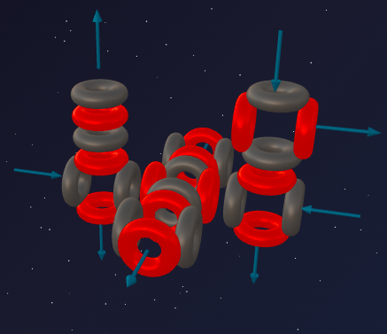
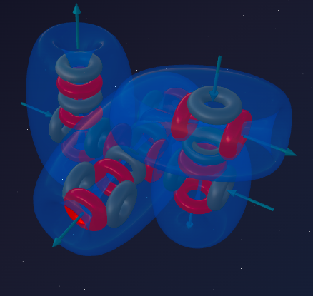

> *"Compromise is the art of dividing a pie so that everyone is sure they got the bigger piece."*
>
> — Ludwig Erhard

In the previous part we saw how Magnesium (6α) continued the construction of the "second floor" above the Neon foundation. That monolithic 3D framework gave us a rigid, stable metal with two polar active vortices.

But the evolution of matter does not stop there. What happens when the familiar "lockbreaker" — the triton (1p + 2n) — attacks this rigid magnesium framework?

Meet **Aluminium** — the element that learned to play by other people's rules. A metal that can behave like a non-metal. The key to this paradox lies, once again, in the geometry of its nucleus.

---

## 📐 Engineering Analysis of the Nucleus

**Aluminium-27** is the only stable isotope of Aluminium (100% in nature).

**Composition:** 13 protons + 14 neutrons = 27 nucleons.

**Block decomposition:**
- 24 nucleons = **6 alpha particles** (Magnesium base);
- Remainder: 3 nucleons = 1 proton + 2 neutrons = **triton**.

**Formula:** **²⁷Al = 6α + t**

Recognise the pattern?
- Sodium (5α + t) — is breached Neon (5α).
- **Aluminium (6α + t) — is breached Magnesium (6α).**

The triton disrupts the symmetry once again.

---

## 🔬 Building the Model: Breaching Magnesium

### Step 1: Magnesium's base structure

Magnesium-24 is 6 alpha particles. Its defining feature is a distinct vertical axis at whose poles **two fountains** operate. These fountains serve as stable bonding ports, making Magnesium a divalent donor metal.

### Step 2: Adding the triton

The triton (1p + 2n) docks onto the magnesium framework. Just as with Sodium, the proton from the triton latches onto one of the equatorial alpha particles and **forces it to rotate 90°**.

**What changes in the construction?**

1. Magnesium's two polar fountains remain in position — open and ready for stable flow release.
2. The rotated alpha particle turns its vortex outward.
3. A local pressure imbalance arises in the nucleus: the construction wants to shed the excess ether flow through a third, non-equilibrium fountain.

---

## 💥 Anatomy of Amphoterism

The aluminium nucleus is a hybrid:
- **From Magnesium:** 2 stable fountains (reliable donor ports).
- **From Sodium:** 1 unstable fountain, aggressively ejecting flow (the triton "tail").

Aluminium has **three active vortices**, but they are **different in nature**. Two can calmly operate as donor or acceptor; the third desperately pushes flow outward.

---

## 🔮 Model Predictions and Reality

### Prediction №1: valency 3

The number of active electron vortices determines the maximum number of bonds. Aluminium has exactly three: 2 polar magnesium fountains + 1 equatorial triton ejector.

**Reality:** Aluminium is strictly trivalent in almost all its compounds: AlCl₃, Al₂O₃, Al(OH)₃ — a perfect match with the model.

### Prediction №2: amphoterism (the double game)

School chemistry states: Aluminium reacts with both **acids** (as a metal) and **alkalis** (as a non-metal). Where does this flexibility come from?

Any active vortex is a loop — a fountain and a funnel at the same time. The trick of Aluminium's hybrid nucleus lies in how it manages these vortices:

- **Magnesium vortices (stable ports):** The two polar axes inherited from Magnesium are stable. They normally act as donors, but are **capable of switching**.
- **Sodium vortex (ejection pump):** The third vortex, opened by the triton-induced rotation, works exclusively as an ejector.

**How it plays out:**
- **Acid environment:** Aluminium activates all three vortices in "fountain mode." It releases the excess ether flow and dissolves as an active metal.
- **Alkali environment:** Aluminium encounters an excess external ether flow. The stable magnesium vortices **switch to intake mode** (funnel mode). It accepts electrons from the partner and transforms into the complex anion Al(OH)₄⁻.

**Reality:**
- Al + HCl → AlCl₃ + H₂↑ (reacts with acid) ✓
- Al + NaOH + H₂O → Na[Al(OH)₄] + H₂↑ (reacts with alkali) ✓

Chemical flexibility arises from the non-uniformity of ports in the hybrid 6α + t nucleus — a perfect match with the model.

### Prediction №3: plasticity (compared with Magnesium)

**Magnesium (6α):** a strictly symmetrical 3D lattice. Under a blow the lattice cracks (brittleness).
**Aluminium (6α + t):** the structure is breached. Three bonding points in different directions form a more complex, interwoven network of ether channels. Atoms can "slide" relative to each other under mechanical stress without breaking bonds.

**Reality:** Aluminium is highly ductile — it can be rolled into extremely thin foil. Magnesium at room temperature is considerably more brittle — a perfect match with the model.

---

## ⚔️ Sodium vs Magnesium vs Aluminium

| Parameter | Sodium (5α + t) | Magnesium (6α) | Aluminium (6α + t) |
|---|---|---|---|
| **Image** | Breached Neon | Solid foundation | Breached Magnesium |
| **Active vortices** | 1 | 2 | 3 |
| **Valency** | 1 | 2 | 3 |
| **Metal character** | Soft, extreme | Strong, moderate | Ductile, amphoteric |
| **2nd-period analogue** | Lithium | Beryllium | Boron |

---

## 🧪 Nuclear Alchemy: Proof of Structure

If Aluminium = **6α + t**, nuclear reactions must confirm it.

A proton completes the triton (1p + 2n) into a full alpha particle (2p + 2n), which flies off, exposing pure Magnesium:

> ²⁷Al + p → ²⁴Mg + α

An alpha particle collides with Magnesium, loses one proton on impact, and turns into a triton that "welds" itself onto the framework:

> ²⁴Mg + α → ²⁷Al + p

Both reactions directly confirm the formula **Al = 6α + t**.

---

## 🌟 Summary

Aluminium is a compromise between rigid metal and ductile material, between electron donor and electron acceptor.

Its nucleus is **Magnesium destabilised by the addition of one triton**. That triton rotates one of the alpha particles and opens a third active zone. The hybrid nature of the three vortices (two calm magnesium poles and one aggressive triton ejector) makes Aluminium an **amphoteric** element, able to switch between donor and acceptor depending on its partner.

But this compromise is only a temporary step. Just one proton separates Aluminium from a total reorganisation into a completely new form of matter…

---

## 🔮 What's Next?

In the next part — **Silicon (7α):**
- how the missing proton snaps the trap shut;
- why Silicon is sand, glass, and computer processors;
- why it is a semiconductor rather than a metal, even though it is built perfectly.

---

## 🛠️ Build Your Own Model!

Try building the Aluminium-27 nucleus in the online constructor:

👉 [3d-particles-pi.vercel.app](https://3d-particles-pi.vercel.app/)
