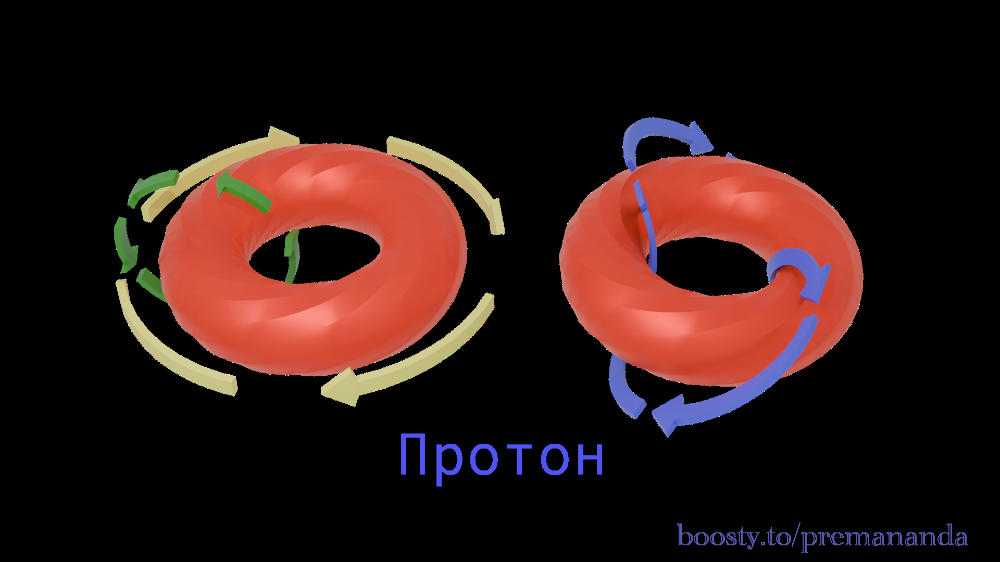
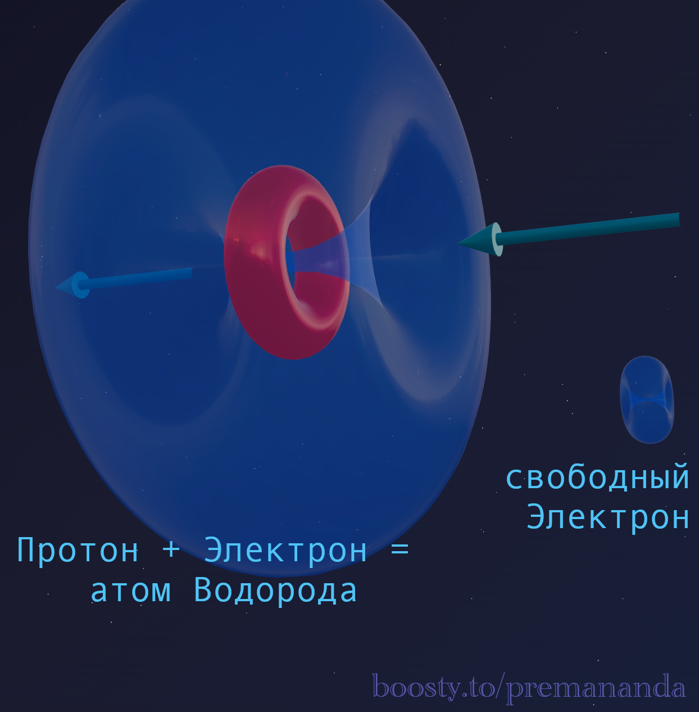
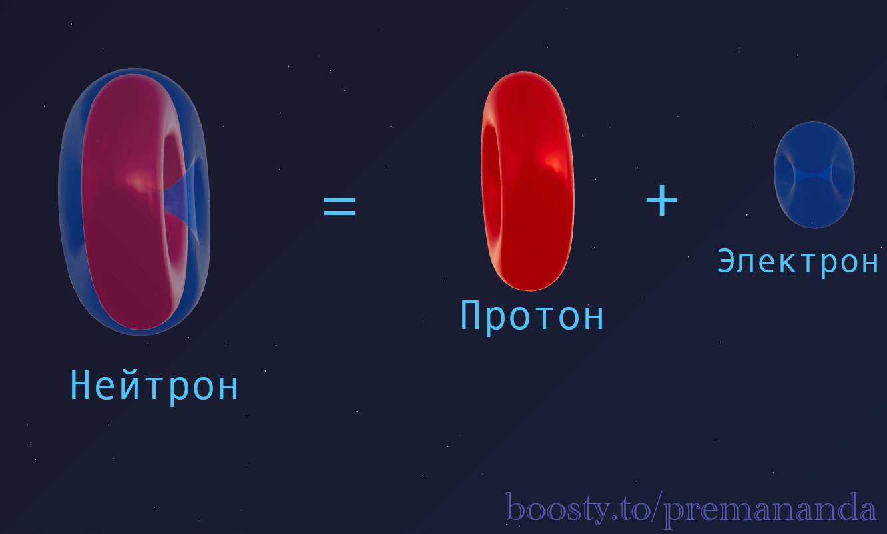

> "A particle is not an object. A particle is a process."
>
> — Etherdynamic approach

We are accustomed to physics textbooks drawing elementary particles as little spheres. The electron is a small sphere, the proton is a large sphere. But when you ask: "What is this sphere made of?", science responds: "It is a fundamental particle; it has no internal structure, only mathematical properties."

We are asked to believe in "spin," which rotates but rotates nothing. In "mass," which comes from nowhere. In "wave-particle duality," where an object is simultaneously a point and a wave.

Etherdynamics offers a different approach. **A particle is a stable vortex in a medium (the ether).** And the most surprising thing is that official science has already studied these vortices, it just calls them something else — **quantum vortices in a superfluid medium**.

Let's break down the "Trinity" of matter — Proton, Electron, and Neutron — from a mechanical perspective.

---

## 📊 What Official Science Says

A brief comparison of the three main particles that make up all matter:

| Characteristic | **Proton ($p^+$)** | **Neutron ($n^0$)** | **Electron ($e^-$)** |
| :--- | :--- | :--- | :--- |
| **Location** | In the atomic nucleus | In the atomic nucleus | Orbits the nucleus |
| **Electric Charge** | **$+1$** | **$0$** | **$-1$** |
| **Spin** | **$1/2$** | **$1/2$** | **$1/2$** |
| **Mass (Relative)** | $\approx 1$ amu | $\approx 1$ amu | $\approx 1/1836$ amu |
| **Internal Structure** | **Complex** (quarks) | **Complex** (quarks) | **Elementary** |

### Key Facts:

1.  **Mass Scale:** The proton and neutron are the "heavyweights." Almost all of the atom's mass (99.9%) is concentrated in the nucleus. The electron is incredibly light.
2.  **Charge:** The proton ($+$) and electron ($-$) attract each other — this holds the electrons around the nucleus. The neutron has no charge; its role is as "glue," helping protons stay together.
3.  **Spin 1/2** for all three makes them **fermions** — they make up solid matter and cannot occupy the same point in the same state (thanks to this, atoms have volume).

---

## 📐 Etherdynamic Perspective: The Proton

### The Proton — An Armored Torus

**The proton is a complex vortex torus.** Imagine that a vortex tube has not just closed into a torus but has a complex internal structure and has compacted to the limit.

- **Why is it stable?** A torus is a stable formation in a superfluid medium. Its topology protects the proton from decay. This is why protons live for billions of years.
- **Where does mass come from?** In hydrodynamics, mass is a measure of the medium's resistance. The proton is a super-dense formation that arose due to the complex internal topology of the vortex.

### Two Types of Rotation

Imagine a toroidal vortex (a donut). It has **two rotations** simultaneously:
- **Toroidal**: rotation of the ring like a wheel (around the central hole).
- **Poloidal**: rotation of the "skin" of the donut itself (turning inside out).

**Spin 1/2** means that the proton makes 2 rotations of the "skin" for 1 rotation of the "ring." This is a geometric ratio of flow velocities.

### The Proton is a Pump

The proton is obligated to "pump" ether through its internal opening. A **funnel** forms on one side, and a **fountain** of ether on the other. When these flows close into a long loop — the **electron** manifests.

---

## 📐 Etherdynamic Perspective: The Electron

### The Electron — A Shaking Donut

**The electron is a simple toroidal vortex (vortex ring).** Imagine an ideal smoke ring, but consisting of ether.

The electron has a simple structure — it is a torus that is 1836 times lighter than a proton.

*   **Why is the electron a wave?** A vortex ring is never perfectly rigid. Vibrations constantly travel along it — so-called **Kelvin waves**. The electron flies and shakes like a living spring. The frequency of this shaking is what physicists call the "de Broglie wave."
*   **The Size Paradox:** Why is the electron large within an atom but small in a free state? In the atom, its structure is "inflated" by the proton pump. In free flight, it compresses under the influence of external ether pressure.

---

## 📐 Etherdynamic Perspective: The Neutron

### The Neutron — A Trojan Horse

In our model, **Neutron = Proton + Electron (in a compressed state).**

Imagine a proton as a powerful pump. Under certain conditions, an electron can compress around the proton. The result is a neutron.

- **Charge Disappears:** Charge is the direction of ether movement. The "plus" of the proton is compensated by the "minus" of the electron. The system becomes neutral.
- **Mass Increases:** The neutron is heavier than the proton by exactly the mass of the electron + the mass of the additional ether set in motion.

### Why does the Neutron Decay (Beta Decay)?

The neutron is a compressed spring. Inside the nucleus, its neighbors hold it, but once pulled outside, the external "vices" disappear. Vibrations (Kelvin waves) loosen the structure, and a breakout occurs.

**BANG!**
1.  **The Electron** shoots outward (beta radiation).
2.  **The Proton** remains (the pump starts working openly).
3.  A **longitudinal wave** travels through the ether from the rupture — a disturbance in the medium's density. Science calls this wave a **neutrino**.

---

## 🔑 Summary

We do not live in a world of abstract formulas, but in a world of understandable mechanics:

- **The Proton** is a torus with complex topology (an armored pump).
- **The Electron** is a simple torus (a shaking donut).
- **The Neutron** is their temporary union (a Trojan horse).

All "quantum mysteries" — spin, wave nature, mass, charge — receive a clear mechanical explanation through the dynamics of vortices in the superfluid ether.

---

## 🔮 What's next?

In the next part — **Brownian Motion:**
- Why are molecules in constant chaotic motion?
- How does the ether explain heat and temperature?
