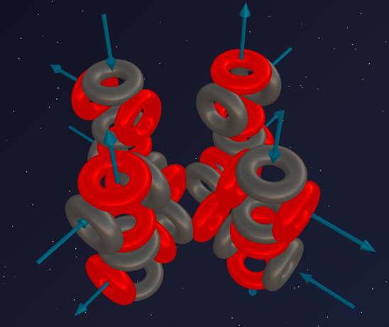

> “Perfection is attained, not when there is nothing more to add, but when there is nothing left to take away.”
>
> — Antoine de Saint-Exupéry

We have traversed a long and turbulent path through the third period of the Mendeleev Table. We saw how Sodium (5α + t) and Aluminum (6α + t) disrupted symmetry with their tritons, giving rise to active metals. We saw the monumental skeletons of Silicon (7α) and Sulfur (8α). And we have just studied the fury of the chemical predator — Chlorine (8α + t).

And now, finally, the last proton joins Chlorine. The triton closes, completing into a full 9th alpha particle. The asymmetry vanishes.

Meet **Argon** — an absolutely calm, serene, and invisible gas. This is the moment when the architecture reaches true, absolute symmetry, and the third period is slammed shut. Let's look inside this perfect aether capsule.

---

## 📐 Nuclear Engineering Analysis

**Argon-36** is the base stable isotope that forms the chemical architecture of the element (it is precisely what is synthesized in the depths of giant stars during silicon burning).

*Note: In Earth's atmosphere, 99% is the heavy Argon-40 (from the decay of potassium-40 in the Earth's crust). These 4 extra neutrons are just "ballast" clinging to the ideal frame, adding mass but not changing its chemical essence. The architect of the chemistry is Ar-36.*

**Ar-36 Composition:** 18 protons + 18 neutrons = 36 nucleons.

**Structural Breakdown:**
- 36 nucleons = exactly **9 alpha particles** (9 × 4 = 36).
- Remainder: **0** — no tritons, no "tails."

**Formula: ³⁶Ar = 9α**

---

## 🔬 Building the Model: Four Columns

How does nature assemble 9 alpha particles? We have seen that in the third period, the skeleton grew by attaching new "columns" to the central foundation:
- **Magnesium (6α)** — the first axis (base two-axis structure);
- **Silicon (7α)** — the second column;
- **Sulfur (8α)** — the third column.

**The architecture of Argon (9α) is a completed fourth column on a single central base.**

1. **Foundation (1α):** At the center lies one base alpha particle. It serves as the crossroads upon which the entire superstructure is held.
2. **Columns (8α):** Vertical "towers" are attached to all four ports of the central foundation. Each tower consists of two alpha particles (this is the development of the "second floor" started back in Magnesium).
   - 4 columns × 2 alpha particles = 8α.
   - **Total:** 1 central + 8 in columns = **9 alpha particles**.

The central base particle has no more free ports — all four of its directions (up, down, left, right) are occupied by two-story columns. All its internal nodes are 100% loaded. This is the limit of the current 3D matrix. The third period is over — there is nowhere else to build; the base will have to be expanded only in the 4th period.

---

## 💥 The Main Mystery: Zero Valency

Looking at the model of 4 two-story columns, a question arises: *“If the foundation is occupied, shouldn't there be open ports at the ends of the columns? Why is Argon inert?”*

This is where aether dynamics demonstrates its most stunning geometric beauty — **aether self-locking**.

### The Aether Cocoon

The open ports (fountains and funnels) at the ends of the columns do indeed exist. But they don't stick out into the void — they are **looped back onto each other**.

1. The aether flow ejected from the fountains at the tops of some columns does not go into infinity.
2. Under the pressure of the sucking funnels of adjacent columns, the aether flow lines curve along the shortest arc and are instantly pulled into the open funnels of the same atom.
3. A continuous, rotating, toroidal aether shield forms around the Argon atom.

The Argon atom is completely self-contained. An outside element (even a predator like Fluorine) lacks the strength to pierce this dense, looped-back protective screen. It is impossible to catch onto Argon.

**Valency 0** is not the magic of a "full electronic octet," but simple **geometric self-locking** of aether flows within an ideally symmetrical 9α-matrix.

---

## 🧪 Nuclear Alchemy: Proof of Structure

Nuclear reactions confirm the formula **Ar = 9α**.

Knocking out an alpha particle from Argon returns it to the Sulfur skeleton:
> ³⁶Ar → ³²S + α

A proton strike on Argon ejects an alpha particle, transforming it into Chlorine (through mass loss):
> ³⁶Ar + p → ³⁵Cl + d (or ³³Cl + α)

All reactions show Argon as a monolithic construction of nine blocks.

---

## 🔮 Predictions and Reality

### Prediction №1: Why is Argon a Gas?

Heavy Sulfur (8α) forms solid stones. Massive Silicon (7α) forms diamond lattices. Why is Argon, with a nucleus (9α) heavier and more massive than all of them, a monatomic **gas**?

The answer lies in the same aether cocoon. Argon has an ideally smooth, locked aether shell. Argon atoms collide with their elastic magnetic shields and bounce off each other like perfectly smooth billiard balls. There are no "anchors," "hooks," or "pits" to catch onto neighbors — a perfect match with the model.

### Prediction №2: The Limits of Inertness

In 2000, chemists obtained the first-ever artificial compound of argon — Argon Fluorohydride (HArF), by freezing argon to -265 °C and irradiating a mixture with hydrogen fluoride with UV.

**Explanation:** At temperatures close to absolute zero, aether vibrations (heat) almost disappear. The aether shield "cools down," its elasticity drops, and at that moment, the super-predator Fluorine gets a chance to pierce Argon's "armor."

---

## 💡 Table Patterns: The Great Circle is Complete

The aether-dynamic model shows us a striking architectural fractal similarity between periods:

1. **Sealed Foundations (Noble Gases):**
   - Period 1: **Helium (1α)** — a foundation-ball.
   - Period 2: **Neon (5α)** — a sealed "first floor."
   - Period 3: **Argon (9α)** — a sealed "second floor."

2. **Symmetry Breakers (Alkali Metals):**
   - Period 2: **Lithium (1α + t)** — breaking the ball.
   - Period 3: **Sodium (5α + t)** — breaking the Neon lock.
   - Period 4: **Potassium (9α + t)** — breaking the Argon cocoon!

Nature has gone through every combination on the foundation of a single base particle, building upon it everything that could fit. The Argon lock is slammed shut.

---

## 🌟 Summary

Argon is a masterpiece of absolute symmetry. The architecture of 9 alpha particles (foundation and 4 two-story columns) completely closes all growth possibilities on the current basis.

The nucleus places itself inside an impenetrable aether cocoon. Thus, a noble gas is born (valency 0). A smooth, non-interacting sphere. The third period of the Mendeleev Table is closed.

But in the heart of a star, a new proton is already ripening, which will strike this ideal cocoon to begin the new — Fourth period...

---

## 🔮 What's Next?

The third period is complete! We have revealed the secrets of ideal constructions (Carbon, Neon, Silicon, Argon) and solved the mysteries of hacker elements (asymmetric tritons like Chlorine and Sodium).

Ahead is the **Fourth Period**: the appearance of heavy transition metals (Iron, Copper), where nature will begin to build outer layers and magnetic domains...

---

## 🛠️ Build Your Model!

Try building an Argon-36 nucleus (9α) in the online constructor:

👉 [3d-particles-pi.vercel.app](https://3d-particles-pi.vercel.app/)
