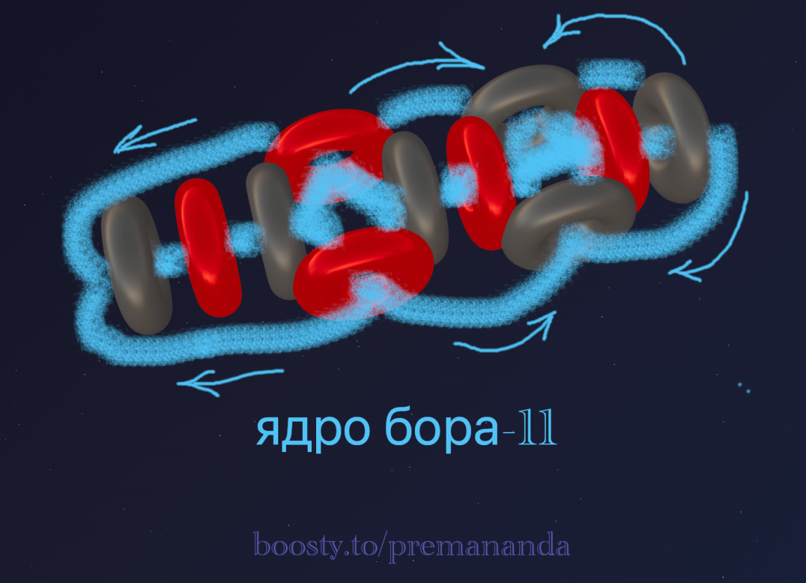

> *"Nature is simple and does not indulge in the luxury of superfluous causes."*
>
> — Isaac Newton

---

## 🔬 Boron: The Fifth Element

Having examined the alpha particle and the lightest elements, we now turn to boron.

Boron (B, atomic number 5) occupies a special place in the periodic table. It is a metalloid with unique properties, combining characteristics of both metals and non-metals.

### ⚛️ Isotopes of Boron

Boron has two stable isotopes:

**Boron-10 (¹⁰B)** — stable
- Composition: 5 protons + 5 neutrons
- Abundance: ~19.9% of natural boron
- Notable: Extremely high thermal neutron absorption cross-section (~3,840 barns)

**Boron-11 (¹¹B)** — stable
- Composition: 5 protons + 6 neutrons
- Abundance: ~80.1% of natural boron
- Notable: The more stable isotope
- Neutron absorption cross-section: ~0.005 barns (~770 times lower than ¹⁰B!)

---

## 🌀 The Nuclear Structure of Boron-11

Let's examine the most abundant isotope — boron-11. The key question: how can 5 protons and 6 neutrons form a stable configuration?

### Structural Hypothesis

Based on the principles of aether dynamics and accounting for the stability of boron-11, the following model is proposed:

**Key features of the configuration:**

1. **Linear-spiral arrangement**: Protons (red) and neutrons (gray) alternate along the central axis.
2. **Asymmetric configuration**: Unlike the symmetric helium, the boron structure is asymmetric.
3. **Aether flows (blue arrows)**: Form a closed circulation system, creating a "hydrodynamic tie" that holds the structure together.

---

## ⚡ Why Does Boron-10 Absorb Neutrons So Readily?

This is one of the most fascinating questions! Boron-10 acts like a "neutron sponge."

**Reaction:**
> ¹⁰B + n → ⁷Li + ⁴He (α) + 2.79 MeV

When a neutron enters ¹⁰B, the structure is destabilized and splits into lithium-7 and an alpha particle, releasing energy.

### 🧲 Nuclear Spin and Magnetic Properties

| Isotope | Spin | Magnetic moment |
|---|---|---|
| **Boron-10** | 3 | 1.8006 μₙ |
| **Boron-11** | 3/2 | 2.6886 μₙ |

---

## 🎨 Electron Shell

Boron has the electron configuration: **1s² 2s² 2p¹**. Its three outer electrons define its chemical properties:
- Forms covalent bonds (B₂O₃, BF₃)
- Typical valence of 3
- Exhibits non-metallic properties

### Aether Dynamics Interpretation

According to the aether dynamics model, electrons are generated by the nucleus itself — as vortex shells arising from the circulation of aether. This mechanism is discussed in detail in [Part 1 of the series](/blog/atom-structure-part-1). As applied to boron:

- **First shell (1s²):** 2 electrons form in the near aether flows around the nucleus.
- **Second shell (2s² 2p¹):** 3 electrons arise in more distant circulation zones.

The outermost electron (2p¹) is the least bound to the nucleus and readily participates in chemical bonding.

---

## 🛠️ Build Your Own Model!

Want to experiment with boron's nuclear configuration? Try the online atom constructor:

👉 [3d-particles-pi.vercel.app](https://3d-particles-pi.vercel.app/)

Try:
1. Building an alternative model of boron-10.
2. Comparing the stability of different configurations.

---

## 🤔 Open Questions

1. **Why did nature "prefer" boron-11?** Why is 80% of natural boron ¹¹B rather than the symmetric ¹⁰B?
2. **The transition to carbon.** How will adding one more proton and neutron change the configuration?
3. **Formation of electron shells.** How exactly does the geometry of the nucleus determine how many electron shells it generates, and what shape they take?