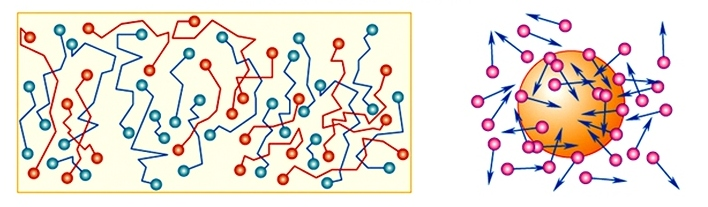
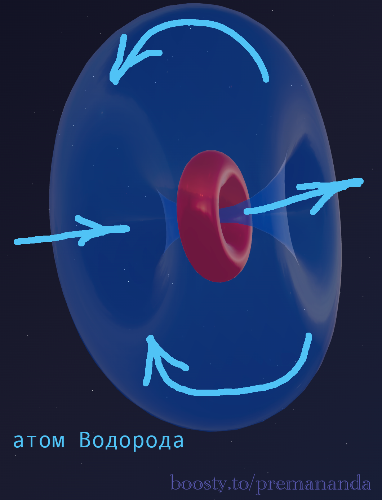
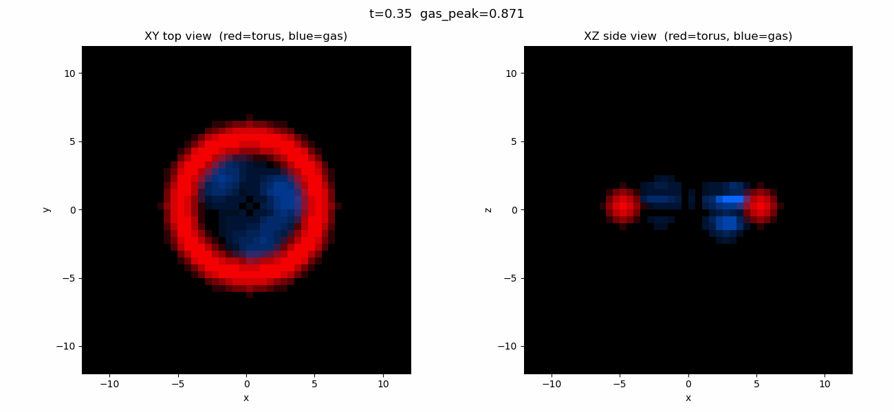

> *"I am never content until I have constructed a mechanical model of the object. If I succeed in making one, I understand it. If I cannot, I do not understand it."*
>
> — William Thomson (Lord Kelvin)

We are used to hearing: "Heat is the motion of molecules." But have you ever asked the childlike question: **who is pushing them?**

Why does a pollen particle in water dance forever (Brownian motion)? Where does the energy for this endless dance come from? Academic physics answers: "Molecular collisions." But molecules also move forever. This looks like a perpetual motion machine — which science forbids, yet uses as the very foundation of thermodynamics.

Let's examine exactly what mainstream science says — and where its explanation has a gaping hole.

---

## 📊 What Mainstream Science Says

The molecular-kinetic theory (MKT) is the foundation of modern thermodynamics. Here is its essence:

1. **All particles are in continuous chaotic motion** — at any temperature above absolute zero.
2. **Temperature is a measure of the average kinetic energy** of particles.
3. **Brownian motion** is explained by the uncompensated impacts of medium molecules on a microparticle.

The theoretical explanation of Brownian motion was given by Einstein in 1905. Everything sounds logical — until we ask about the root cause.

---

## ⚠️ Where Is the Flaw Hidden?

### The Tautology of First Cause

— Why do atoms move?
— Because they have kinetic energy.
— Where does kinetic energy come from?
— It is proportional to temperature.
— And where does temperature come from?
— Temperature is a measure of kinetic energy.

A circular argument. The theory does not explain the **source** of motion. It simply postulates that particles have always been moving.

### Zero-Point Oscillations: A Quantum Patch

Experiments show that atoms vibrate even at absolute zero (T = 0 K). Quantum mechanics explains this via the uncertainty principle: "They are forbidden from stopping." But this is not an explanation of the mechanism — it is simply a ban on asking the question.

---

## 📐 The Aether Dynamics Answer: The Atom Is a Jet Engine

Aether dynamics gives a simple engineering answer: **an atom is not a billiard ball. An atom is a jet engine.**

### The Mechanism

A proton is a toroidal aether vortex. It works as a pump: drawing aether in on one side and expelling it on the other.

A molecule consists of many atoms with different orientations. Aether is simultaneously expelled and drawn in across all sides of the molecule in different directions. The net vector of these flows is random at any given moment — and it is precisely this that delivers a chaotic push to the molecule in an arbitrary direction.

**What we observe as the chaotic motion of molecules is the work of billions of microscopic jet engines.**

It is the continuous, multidirectional operation of these aether pumps inside each molecule that generates its constant motion.

---

## 🔬 Zero-Point Oscillations — Without Quantum Magic

Now it is clear why atoms vibrate even at absolute zero.

- A proton is a **pump with no off switch**. It cannot stop pumping aether, because it itself is that pumping vortex. To stop a proton is to destroy it.
- Even at T = 0 K, the proton keeps working. This work produces a minimum vibration — the very zero-point oscillations we observe.

It is like a diesel engine at idle — it vibrates even when the car is going nowhere. There is no state of "running but completely still."

---

## 🌟 Summary

- A **proton** draws in and expels aether — generating reactive thrust.
- Aether is simultaneously expelled and drawn in across all sides of the molecule in different directions, producing a random net push.
- Billions of atoms delivering chaotic pushes — this is **thermal motion**.

**Brownian motion** is the visible result of trillions of atomic jet engines continuously bombarding a dust particle from all sides.

An atom does not "have" motion. An atom **produces** motion.

---

## 🔮 What's Next?

In the next part — **aether and relativism:**
- gravity — attraction or flow?
- time dilation through hydrodynamics;