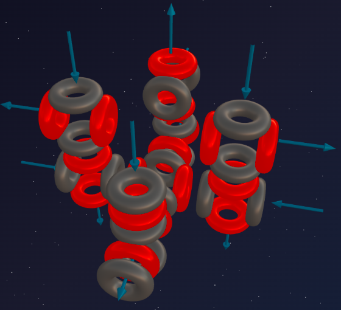
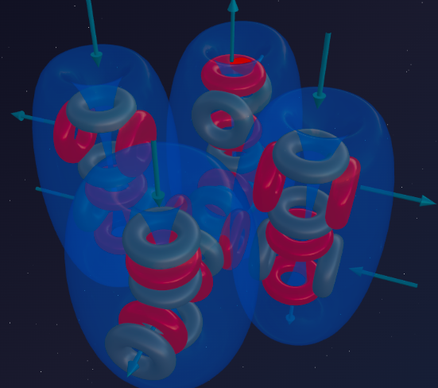

> “Nothing is so contagious as violence.”
>
> — Victor Hugo

Sulfur (8α) demonstrated a powerful 3D monolith with a steady set of 6 funnels. This even-numbered mathematics seemed stable.

But, as we have already seen, Nature does not tolerate statics. As soon as a construction gets rid of its triton tail, a new "disturber of the peace" wedges in.

Meet **Chlorine** — an element that sowed death with its suffocating green breath in the gas attacks of World War I, and which saves millions of lives every day by purifying water. Chlorine is the chemical apex predator of the third period. And its irrepressible rage follows directly from the asymmetry of a single triton.

---

## 📐 Nuclear Engineering Analysis

**Chlorine-35** is the primary isotope of Chlorine (about 76% in nature).

**Composition:** 17 protons + 18 neutrons = 35 nucleons.

**Structural Breakdown:**
- 32 nucleons = **8 alpha particles** (Sulfur base);
- Remainder: 3 nucleons = 1 proton + 2 neutrons = **triton**.

**Formula: ³⁵Cl = 8α + t**

Do you recognize an old acquaintance?
- **Fluorine (4α + t)** — disrupted Oxygen's symmetry, spawning the super-predator of the second period.
- **Chlorine (8α + t)** — disrupted Sulfur's symmetry, spawning the super-predator of the third period.

Both elements are halogens. Both are deadly gases. Both are governed by an asymmetric triton on a massive alpha-base.

---

## 🔬 Building the Model: Capturing the Port

### Step 1: The Sulfur Basis

Sulfur (8α) has a massive 8α-skeleton with 6 funnels, divided into two groups by their spatial positioning.

### Step 2: The Triton Attack

The triton (1p + 2n) attaches to one of the outer alpha particles of the heavy 8α-skeleton. The proton forces this alpha particle to rotate by 90°.

**What happens to the geometry:**

1. The massive 8α-construction receives a local imbalance.
2. The rotated alpha particle **exposes its funnel outward**, breaking the closed internal circuit of the base.
3. This protruding funnel becomes the "predatory maw" of the atom.

---

## 💥 Anatomy of a Predator

Let's compare the two predators:
- **Fluorine (4α + t):** A protruding funnel on the light skeleton of Oxygen — a nimble and venomous killer.
- **Chlorine (8α + t):** An identical protruding funnel, but its base is **twice as massive** (8α versus 4α).

The huge Sulfur base works like a giant aether pump. All this power is focused into a single open asymmetric funnel. Chlorine is no longer a bumblebee; it is a bear with a chainsaw.

Its suction power is so great that it aggressively tears aether flows from other atoms. Entering the respiratory tract as a gas (Cl₂), it violently rips Hydrogen from the moist tissue of the lungs, forming hydrochloric acid (HCl). Tissues burn without fire. This is the essence of a halogen: a massive base focused into a single open valve provided by the triton disturber.

---

## 🔮 Predictions and Reality

### Prediction №1: Valency 7

Let's count Chlorine's funnels:
- **6 funnels** are fixed in the 8α-skeleton of Sulfur;
- **1 funnel** protrudes outward due to the block rotated by the triton.

Total: 6 + 1 = **7 funnels**.

**Reality:**
- HClO₄ (perchloric acid) — 7 chemical bonds — a perfect match with the model;
- Cl₂O₇ (dichlorine heptoxide) — each Chlorine atom uses 7 ports — a perfect match.

### Prediction №2: The Magic of Odd Valencies (1, 3, 5, 7)

Chlorine exhibits valencies only in odd numbers. Aether dynamics provides a simple geometric explanation:

- **Valency 1 (The Start):** Chlorine is a predator. It counts on its single huge "maw" from the triton to capture a neighbor's flow (NaCl, HCl). The 6 base funnels remain "dormant" in their symmetrical closed state.
- **Step +2:** If Chlorine encounters a strong partner (like Oxygen), it begins to "unpack" it. But the base funnels of the 8α-skeleton are coupled in pairs — they cannot open one by one, only in pairs.
- **Total series:** 1 ("maw") + 1 open pair of the base = **3** (HClO₂); 1 + 2 pairs = **5** (HClO₃); 1 + all 3 pairs = **7** bonds (HClO₄).

The odd series is the sum of "1 asymmetric start" + "paired opening of the symmetrical base" — a perfect match with the model.

### Prediction №3: Why is Chlorine a Gas?

Sulfur and Phosphorus are solids. Chlorine is heavier, yet under room conditions, it is a **gas** (Cl₂). Why?

The answer lies in the power of the triton's "maw." This funnel is so aggressive that when two Chlorine atoms meet, they instantly "suck" into each other via these open ports. The two maws lock into a super-strong bond (Cl–Cl). The force of this tightening redistributes internal flows so that the remaining 6 funnels are "locked" inside. The Cl₂ molecule becomes a smooth, self-sufficient capsule with nothing left to catch onto neighbors. The molecules simply fly apart in space — a perfect match with the model.

---

## 🧪 Nuclear Alchemy: Proof of Structure

Nuclear reactions confirm the formula **Cl = 8α + t**.

Exposing the Sulfur skeleton by knocking out the triton:
> ³⁵Cl + p → ³²S + α

Completing Chlorine's triton by adding one proton results in the perfectly symmetrical Argon:
> ³⁵Cl + p → ³⁶Ar

Both reactions confirm the formula: **Cl = 8α + t**.

---

## 🌟 Summary

Chlorine is massive Sulfur (8α) unbalanced by a triton. The rotation of a single alpha particle on the 8α-skeleton turns the atom into a pump of monstrous power, giving rise to its legendary aggressiveness.

The funnel mathematics (6 base + 1 protruding) perfectly describes valency 7 and elegantly untangles the odd series (1, 3, 5, 7) — proving that spatial geometry is primary.

---

## 🔮 What's Next?

In the next part, we will close the third period — **Argon:**
- What happens if Chlorine's triton is finally completed into a full alpha particle?
- Why does adding one proton transform the most poisonous gas into one that is absolutely inert?
- The architectural magic of 9α.

---

## 🛠️ Build Your Model!

Try building a Chlorine-35 nucleus in the online constructor:

👉 [3d-particles-pi.vercel.app](https://3d-particles-pi.vercel.app/)
