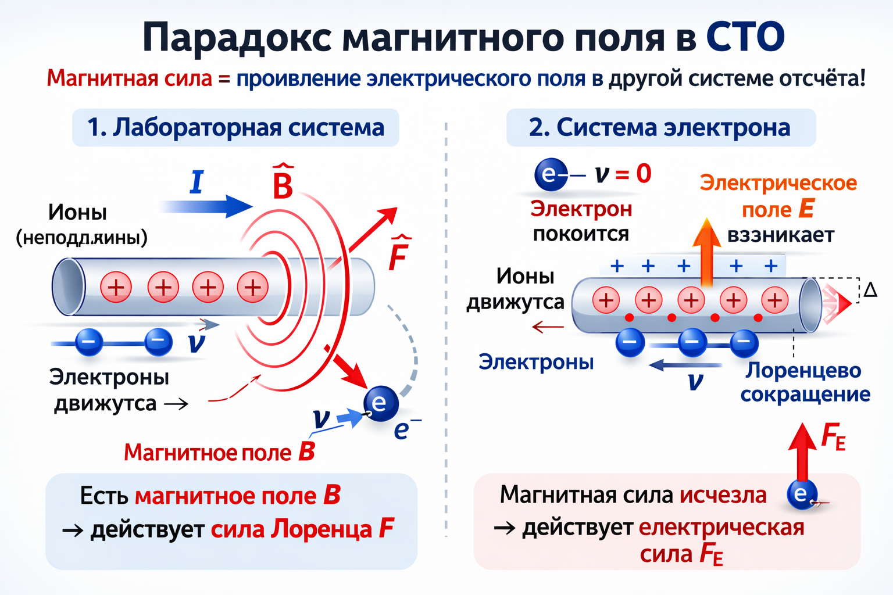
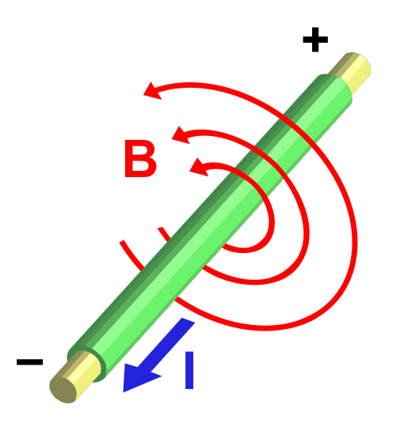
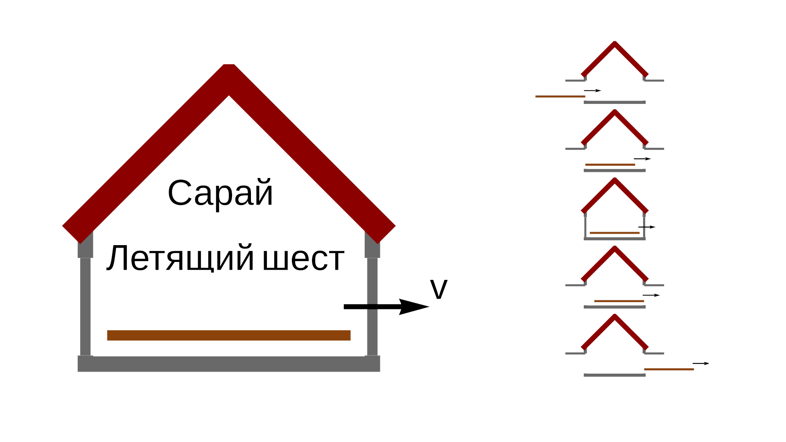
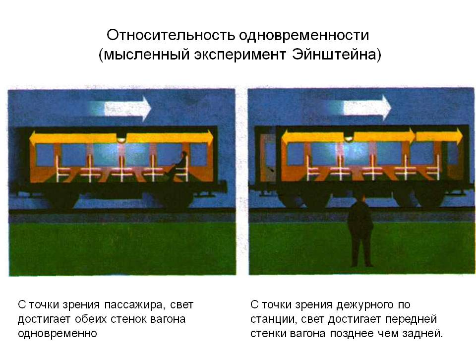
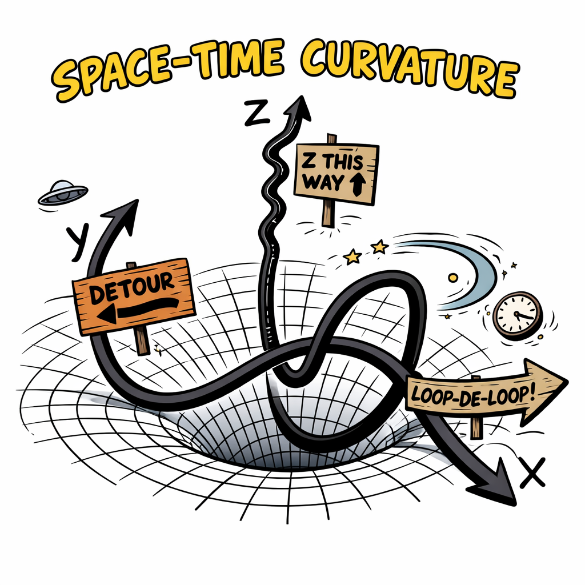

> "Today's scientists have substituted mathematics for experiments, and they wander off through equation after equation, and eventually build a structure which has no relation to reality."
>
> — Nikola Tesla

We are accustomed to believing that we live in an objective reality. If a chair stands in the middle of a room, it exists for everyone. This is the foundation of common sense: **material objects and physical fields either exist, or they do not.**

However, modern physics claims otherwise. Open any electromagnetism textbook, and you will encounter a statement that seems absurd upon closer inspection: **the existence of a magnetic field depends on the observer's velocity.**

---

## 🧲 The Magnetic Field Paradox

Consider a classic experiment: a wire carrying a current and an electron flying nearby.

- **An observer in the laboratory** sees that the current creates a **magnetic field**. The Lorentz force acts on the flying electron, and it is attracted to the wire. The cause is magnetism.
- **An observer flying with the electron** sees the electron as stationary. The magnetic force for them is zero. But the electron is still attracted! Relativism explains this by claiming that due to length contraction, the charge density in the wire has changed, and an **electric field** has arisen.

**The Problem:** A fundamental physical entity (a field) turns out not to be a real object, but an effect of perception. In etherdynamics, everything is simpler: both magnetic and electric fields are simply **different forms of motion of the same material medium (the ether)**.

---

## 📏 The Pole-and-Barn Paradox

A 10-meter pole flies toward an 8-meter barn at relativistic speed.
- In the barn's frame, the pole contracts and **fits** inside.
- In the pole's frame, the barn contracts and the pole **does not fit**.

**The Ether Solution:** Lorentz contraction is a real physical effect of atoms interacting with the medium. If the pole moves relative to the ether, it is **actually contracted** and physically fits into the barn. The paradox disappears because there is a preferred frame of reference — the stationary ether.

---

## 🔄 The Twin Paradox

One twin stays on Earth, while the other travels into space at extreme speed and returns. Who will be younger? SR says the situation is symmetrical, but "acceleration changes everything."

**The Ether Solution:** Ether is a material medium. Movement through it causes resistance at the atomic level, which **slows down all physical processes** (atomic vibrations, clock rates). The traveling twin actually moved through the medium faster, their processes slowed down, and they are **objectively younger**.

---

## ⚡ The Simultaneity Paradox

A lamp flashes in the center of a moving train.
- For a passenger on the train, the light reaches the walls simultaneously.
- For an observer on the platform, it does not, as the walls move toward or away from the light.

**The Ether Solution:** The speed of light is invariant relative to the medium, not the observer. There is objective simultaneity (or lack thereof) within the ether medium.

---

## ✅ Advantages of the Ether Model

1.  **Return of Common Sense:** There is an objective reality that exists independently of the observer.
2.  **Unified Nature of Forces:** All interactions are the dynamics of a single medium.
3.  **Physical Clarity:** Light is a wave in a medium, not an abstract "geodesic in spacetime."

---

## 🔬 Why the Michelson-Morley Experiment Was Not the End?

Official science believes that the ether was debunked by Michelson in 1887. However, that experiment was conducted in a basement, where the ether is entrained by the Earth. Later, Dayton Miller conducted experiments on a mountain (1800m) and **detected anisotropy** in the speed of light (~10 km/s). His results confirmed the existence of an ether wind but were ignored due to the mathematical elegance of Relativism.

## 🔑 Summary

SR and GR provide correct calculations, but they are "mathematical magic" that works without explaining the nature of phenomena. Etherdynamics returns a material foundation to physics.

Our approach is not just about formulas, but about understanding the mechanics of the Universe. 🌌
