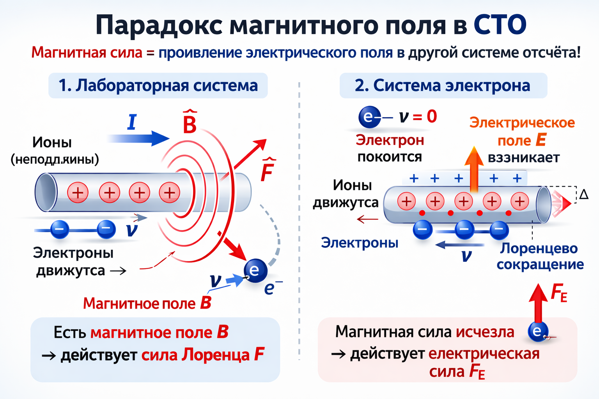
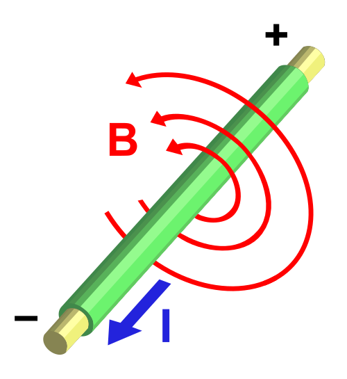
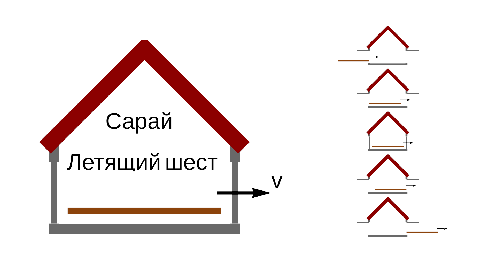
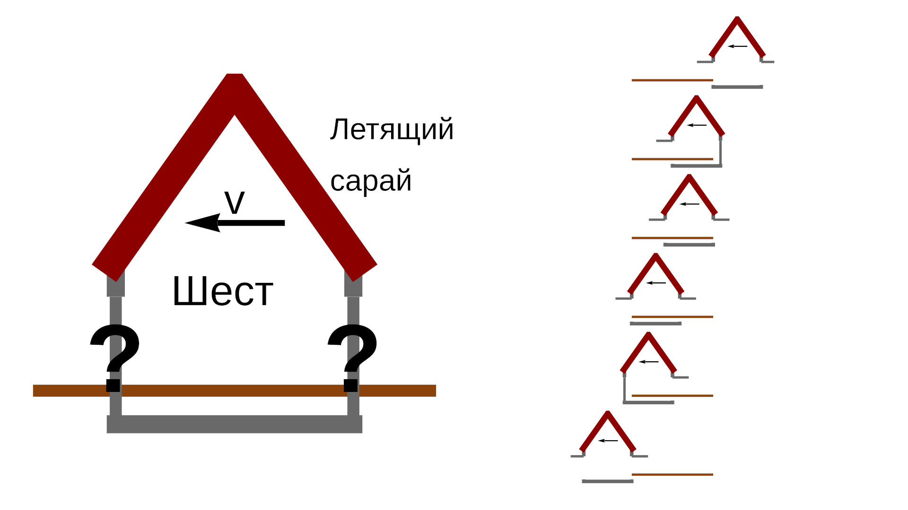
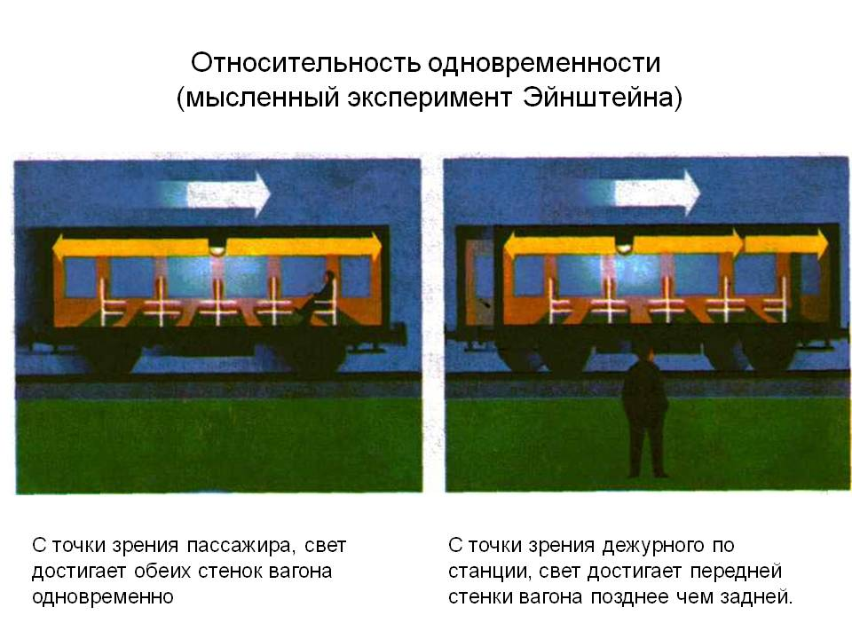
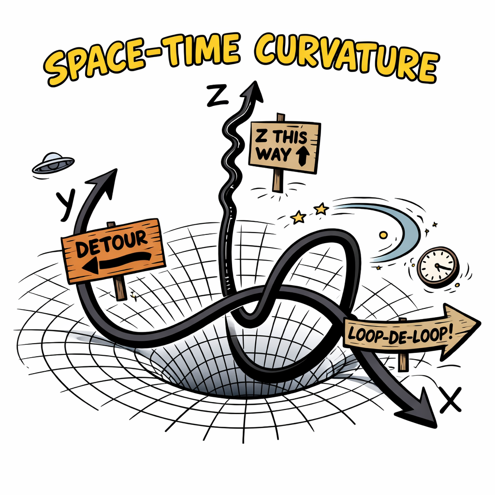

> *"Today's scientists have substituted mathematics for experiments, and they wander off through equation after equation, and eventually build a structure which has no relation to reality."*
>
> — Nikola Tesla

> *"According to the general theory of relativity, space is unthinkable without aether..."*
>
> — Albert Einstein (Leiden Lecture, 1920)

---

## 🌍 Restoring Common Sense to Our Understanding of Reality

We are used to thinking that we live in an objective reality. If a chair stands in the middle of a room, it exists for everyone — for the person sitting in an armchair, for someone running past, and for a cosmonaut in orbit. The chair does not disappear or turn into a table just because you are moving. This is the foundation of common sense: **material objects and physical fields either exist or they do not.**

Yet modern physics claims the opposite. Open any textbook on electrodynamics and you will encounter a statement that, on closer inspection, seems absurd: **the existence of a magnetic field depends on the speed of the observer.**

---

## 🧲 The Magnetic Field Paradox

### Setting Up the Experiment

Consider a classic experiment. We have a wire carrying a current I, and an electron flying alongside it at velocity v.

### The Laboratory Frame (Observer at Rest)

- current flows through the wire — conduction electrons are moving;
- the moving charges create a magnetic field around the wire: B = μ₀I/(2πr);
- the Lorentz force acts on the flying electron: F = qvB;
- the electron is attracted to the wire.

The cause of attraction is magnetic interaction. The field is real, measurable, and acts on the charge.

### The Electron's Frame (Moving with the Electron)

- the electron is at rest for us (v = 0), so the magnetic force F = qvB is zero;
- yet the electron is still attracted;
- due to relativistic effects, the charge density in the wire has changed — the wire has acquired an electric charge;
- an electric field E = λ/(2πε₀r) has appeared, which acts on the electron.

The attractive force is the same, but **the nature of the force has radically changed**.

### Where the Problem Lies

We are asked to believe that a fundamental physical entity — the magnetic field — is not a real object, but an effect of perception that depends on the choice of reference frame:

- you stop — the field is magnetic;
- you run — the field is electric;
- you fly even faster — the field changes again.

**The river analogy:** imagine you are standing on the bank of a river. The water flows and turns a turbine. You get into a boat and float downstream. Did the turbine stop turning for you? Did the river disappear? No. You simply changed your speed relative to the current. The medium — the water — stayed where it was. But in modern physics there is no medium (no aether) — and therefore no "river." There are only formulas that adjust the answer to fit the observer.

Modern physics has replaced physical understanding with mathematical formalism: an abstract "spacetime" has been introduced as an independent entity, fields are described by tensors that "transform" when coordinates change, and when you ask "what is really happening?" the answer is "look at the equations." This works for calculations, but kills understanding.

### The Aether Solution

In aether dynamics, everything is simpler. Magnetic and electric fields are **different forms of motion of the same material medium**:

1. the magnetic field is the vortex motion of aether around a current-carrying wire;
2. the electric field is the laminar motion of aether;
3. these are two forms of motion of a single substance.

The current creates vortex motion in the aether. The electron flies through this vortex. The vortex acts on the electron with a force — analogous to the Magnus effect in hydrodynamics. There is no "change in the nature of the force" — simply the same aether flow perceived from different angles.

---

## 📏 The Pole and Barn Paradox

A pole 10 meters long moves at relativistic speed toward a barn 8 meters long.

- **From the barn observer's point of view:** the pole has contracted to 6 meters due to relativistic compression — it fits entirely inside the barn.
- **From the pole observer's point of view:** the barn has contracted to 5 meters — the pole does not fit.

Special relativity explains this through the relativity of simultaneity — but this is sophistry. Either at some moment the pole was inside with both doors closed, or it was not. This is an objective fact.

**The aether solution:** Lorentz contraction is a real physical effect of atomic interaction with the medium. Aether permeates all matter and acts on every atom — unlike air, which only pushes on the surface. Therefore an object is compressed uniformly throughout its entire volume.

In the aether model there is a privileged frame of reference — the medium itself: if the barn is at rest in it and the pole is moving, the pole is really contracted and fits inside. If the pole is at rest and the barn is moving, the barn is really contracted. The paradox disappears because there is an objective reality.

---

## 🔄 The Twin Paradox

One twin stays on Earth, the other flies off at near-light speed and returns. According to special relativity the situation is symmetric, but "acceleration changes everything" — and debates about this paradox continue to this day.

**The aether solution:** aether is a material medium that permeates all matter. As an object moves through it, every atom interacts with the medium — this interaction slows all physical processes (atomic oscillations, the ticking of clocks). The faster the motion, the stronger the effect. The traveling twin really moved through the medium faster, his atoms interacted more intensely, all his processes ran more slowly — he is objectively younger. The asymmetry is real. There is no paradox.

---

## ⚡ The Simultaneity Paradox

A lamp flashes in the center of a moving train car.

- **Observer on the train:** light reached both walls simultaneously.
- **Observer on the platform:** while the light was traveling, the train moved — light reached the rear wall sooner and the front wall later.

Special relativity concludes: simultaneity is relative, there is no absolute time. But this destroys the very concept of causality.

**The aether solution:** the speed of light is determined by the medium, not the observer. If the train moves relative to the aether at speed v, then the speed of light toward the rear is c + v and toward the front is c − v relative to the train. The events are objectively non-simultaneous. There is an objective reality — there is no paradox.

---

## 🔬 The Michelson-Morley Experiment and the Detection of the Aether Wind

### Why the Michelson Experiment Does Not Disprove Aether

The Michelson-Morley experiment (1887) is commonly regarded as the "refutation" of aether. The logic is simple: if the Earth moves through a stationary aether at ~30 km/s, an interferometer should detect a difference in the speed of light in different directions. No difference was found — conclusion: there is no aether.

But this conclusion rests on the assumption of a stationary aether. If aether is carried along by the Earth, the instrument, the Earth, and the aether move as a single whole — no difference is detected, for the same reason that a passenger inside an airplane feels no wind. Michelson conducted his experiment in a basement — the zone of maximum entrainment. The conclusion about the absence of aether was premature.

### Experiments That Detected Anisotropy

After Michelson, the experiment was repeated many times, and several researchers found what he had been looking for:

- **1925–1926, Dayton Miller.** Interferometer on Mount Wilson (1,800 m). Anisotropy ~10 km/s, direction — the constellation Leo.
- **1984, Stefan Marinov.** Mechanical rotating disks ("coupled shutters"). After reanalysis, results matched Miller.
- **1984, Torr and Kolen.** One-way speed of light measurement. Anisotropy detected.
- **1991, Roland DeWitte.** RF cables, Belgium. Results consistent with Miller.
- **2002, Yuri Galaev.** Millimeter-wave radio + optical interferometer, Kharkov. Anisotropy detected, aether viscosity measured.

All these experiments point in the same direction — toward the constellation Leo — consistent with the motion of the Solar System in a global aether flow. The weakness of the effect (~10 km/s instead of the expected ~30 km/s) indicates that the Earth is entrained by the flow, but not completely — which is precisely why Miller on the mountain "felt" the incoming galactic aether, while Michelson in the basement did not.

---

## ✅ Advantages of the Aether Model

**Objective reality.** In special relativity, simultaneity is relative, the flow of time depends on the observer, there is no objective reality. In the aether model there is a material medium: events occur within it independently of who is watching.

**The unified nature of forces.** In SR/GR, the electromagnetic field and gravity are two different entities. In the aether model, all interactions are the dynamics of a single medium.

**Physical clarity.** SR: "Light propagates along geodesics in curved spacetime" — this is mathematics. The aether model: "Light is a wave in aether; near the Sun the aether is denser, the wave refracts as in glass." A complete analogy with familiar phenomena from optics and hydrodynamics — intuitively clear.

**Resolution of all paradoxes.** The magnetic field paradox, the twin paradox, the pole and barn paradox, the simultaneity paradox — all of them cease to be paradoxes once there is a material medium.

---

## 🌟 Summary

SR and GR give correct calculations — but they are mathematical magic that works without explaining the nature of phenomena. Quantum field theory has already effectively brought aether back under the name "quantum vacuum": it is not empty, it is filled with virtual particles, possesses energy, and can oscillate (Casimir effect). Fields are excitations of the vacuum.

Aether has returned. It is time to call things by their proper names and build physics on the foundation of a material medium rather than abstract geometry.

Our approach is not just formulas — it is an understanding of what lies behind them.

---

## 🔮 What's Next?

In the next part — **neon: the chemical fortress:**
- when symmetry seals every gate;
- why noble gases do not react.