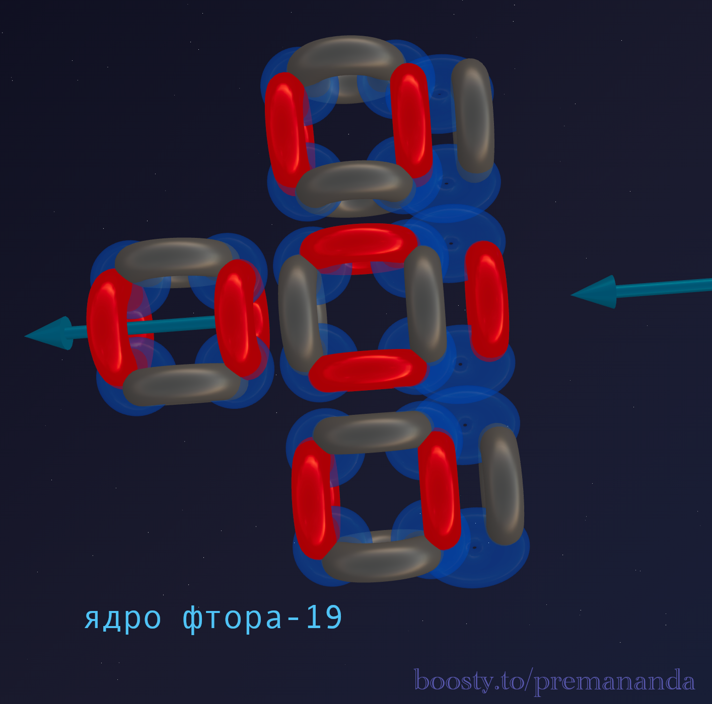
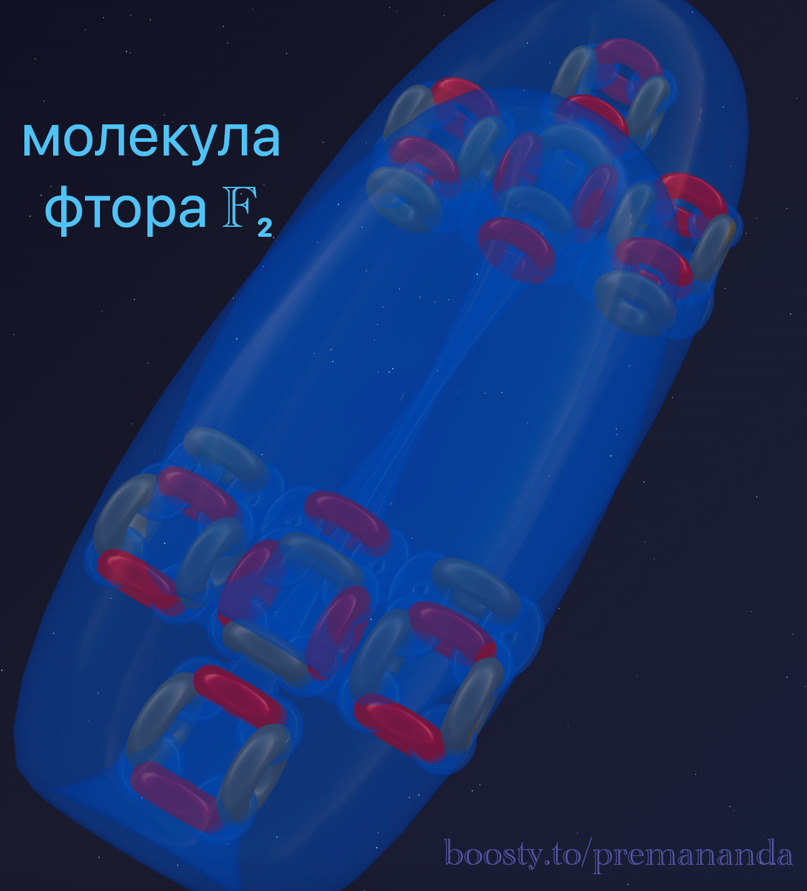
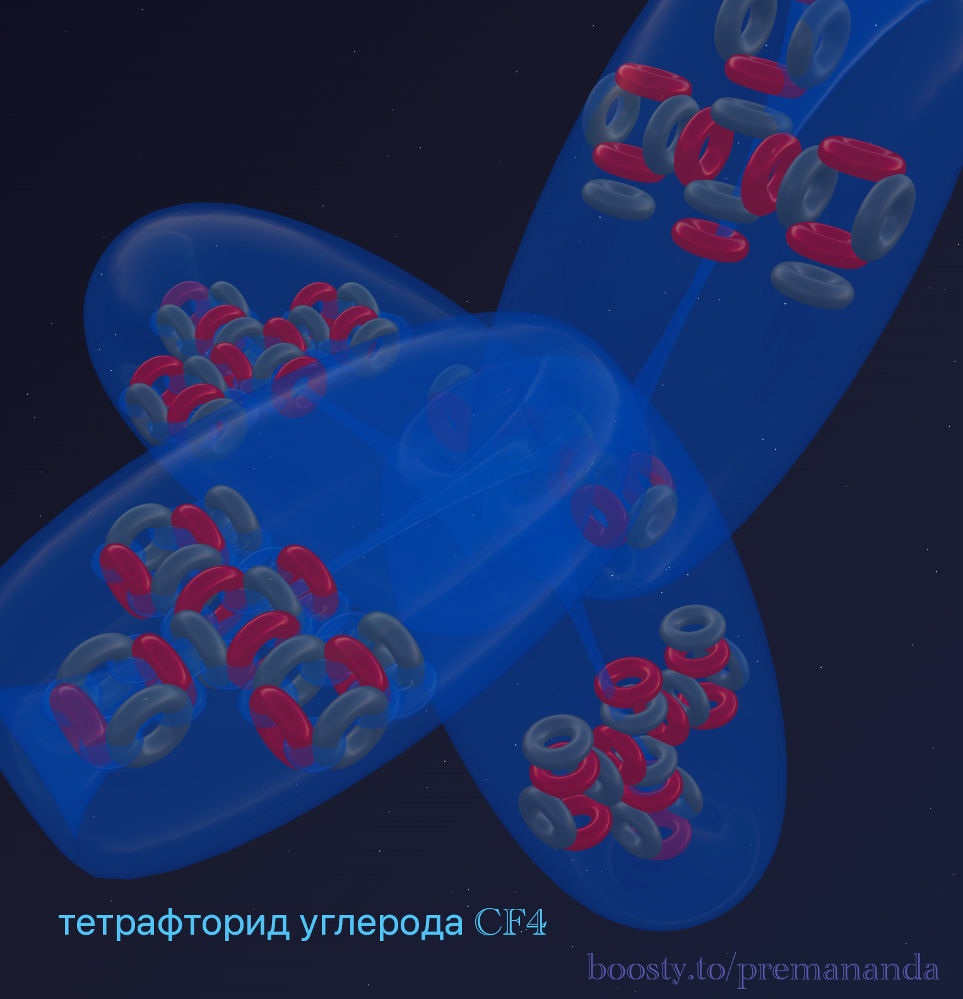

> "The most dangerous predators are not the biggest, but the hungriest."
>
> — Folk wisdom

We have journeyed from the symmetrical Carbon through the asymmetrical Nitrogen to the powerful oxidizer Oxygen. Now we approach the pinnacle of chemical aggression — **Fluorine**.

It is not just a "very active element". It is a substance that eats through glass, explodes on contact with water, and forms compounds with almost all elements of the periodic table. And we will explain why — simply by looking at the architecture of its nucleus.

---

## 📐 Engineering Analysis of the Nucleus

**Fluorine-19** is the only stable isotope of fluorine.

**Composition**: 9 protons + 10 neutrons = 19 nucleons.

**Division into blocks**:
- 16 nucleons = 4 alpha particles (like Oxygen).
- Remainder: 3 nucleons = 1 proton + 2 neutrons (**triton**).

**Formula**: **¹⁹F = 4α + t**

---

## 🔬 Building the Model

### Step 1: Basic Oxygen Structure
Let's start with what we already know. Oxygen-16 consists of 4 alpha particles in a T-shaped configuration: 3 alpha particles form a linear chain, and the 4th attaches to the top center.

### Step 2: Adding the Triton (Tail)
A triton (1p + 2n) is added to this structure — an asymmetrical superstructure.

**Key question**: Where does this tail attach?

**Hypothesis**: The triton splits into a proton and two neutrons. The two neutrons are distributed on the sides of the central axis, while the proton attaches to the central funnel, reinforcing it.

---

## 💀 Anatomy of a Predator: What do we see in the blueprint?

### 1. One Super-Powerful Funnel
Unlike Oxygen, where two funnels work symmetrically, in Fluorine, one active central funnel is reinforced by a proton, which most effectively sucks ether into the nucleus.

### 2. Excess Neutrons
10 neutrons to 9 protons is an unusual ratio for light elements. The excess neutrons create additional nucleon ties, but they also increase the internal pressure within the nucleus.

---

## 🔮 Model Forecasts and Reality

### Forecast #1: Valency of 1
Looking at the model, we see that only one active funnel is available for full-fledged bond formation. The rest are significantly weaker.
**In reality**: HF, CF₄, F₂ — in all compounds, Fluorine is strictly monovalent. ✓

### Forecast #2: Record Electronegativity
The central proton "sitting" right inside the funnel turns the atom into a super-powerful vacuum cleaner.
**In reality**: Fluorine is the absolute champion of electronegativity (4.0 on the Pauling scale). ✓

### Forecast #3: Monstrous Reactivity
Fluorine doesn't just "want" to form a bond — it **needs** to do so to stabilize its asymmetrical, highly tense structure. This explains why it reacts even with concrete and noble gases (like xenon). ✓

### Forecast #4: Weak Bond in the F₂ Molecule
When two such "predators" meet, they start a tug-of-war for the ether. The bond turns out extremely tense and is easily broken.
**In reality**: The F-F bond energy is anomalously low compared to other halogens. ✓

### Forecast #5: Anomalously Strong HF Bond
Hydrogen is too weak to compete with Fluorine. It simply "gives up" its flow, and Fluorine completely dominates, creating an incredibly strong bond.
**In reality**: The H-F bond is one of the strongest in chemistry. ✓

---

## ⚔️ Fluorine vs Oxygen: Comparing the Predators

| Parameter | Oxygen O (4α) | Fluorine F (4α + t) |
|-----------|----------------|---------------------|
| **Active funnels** | 2 symmetrical | 1 reinforced |
| **Structure** | Stable | Tense (asymmetry) |
| **Valency** | 2 (rarely 3) | 1 (strictly) |
| **Electronegativity** | 3.5 (2nd place) | 4.0 (1st place) |

---

## 🧪 Nuclear Alchemy: Proof of Structure

If our hypothesis **Fluorine = Oxygen + Triton** is correct, nuclear physics should confirm it.

**Reaction in stars**:
`¹⁹F + p → ¹⁶O + α`

**Engineering breakdown**:
1. We have Fluorine (Oxygen + Triton).
2. A proton enters the nucleus.
3. The proton completes the triton (1p + 2n) into a full-fledged alpha particle (2p + 2n).
4. The alpha particle detaches and flies away.
5. A pure Oxygen-16 framework remains.

This reaction acts as an excellent proof by contradiction, confirming our structural formula perfectly.

---

## 🌟 Summary

Fluorine is not just a "very active element." It is the result of nature's engineering design: an asymmetrical structure and a concentrated flow at a single point create the most effective chemical predator in the Universe.

**Conclusion**: We are not fitting facts to theory — we see the logic of nature through the architecture of its nuclei.

---

## 🔮 What's next?

In the next part — **Neon**:
- A return to perfect symmetry.
- Why does a noble gas react with absolutely nothing?
- How to "seal" all funnels and create a chemical fortress.