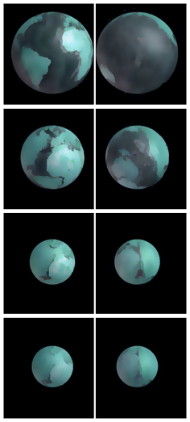

> "Nature abhors a vacuum."
>
> — Aristotle

I recently came across an interesting [video](https://www.youtube.com/watch?v=RKppebg_Uh0&t=6s), in which the author reflects on the nature of gravity. He asks the right questions: why did the dinosaurs die? Where did the dense atmosphere go? Why don't modern animals grow to sauropod sizes?

But the answer he proposes raises serious questions. Let's examine his theory, and then offer an ether-dynamic alternative — no mysticism, no operators, just the physics of flows.

---

## ⚙️⚙️⚙️ The "Gravitational Machine" Theory

The video's author proposes the following picture:

- At Earth's core lies a **"gravitational machine"** — a special object that creates gravity.
- This machine is **controlled by an external operator** who adjusts its power.
- Gravity in the age of dinosaurs was **10 times stronger** than today.
- Catastrophes (extinction of dinosaurs, megafauna) are the result of **switching the machine's settings**.
- The dense atmosphere created buoyancy, and dinosaurs "swam" in the air.

### What's Wrong with This Theory?

1. **Who is the operator?** The theory requires external intelligent control but doesn't explain its nature. This isn't physics — it's mythology with buttons.

2. **10g is a catastrophe for all life.** At tenfold gravity, a 90-ton Argentinosaurus would weigh 900 tons. No atmospheric buoyancy could save it from such a load — that would require an atmosphere as dense as water.

3. **There is no mechanism.** What is a "gravitational machine"? What is it made of? Why do its settings change? There are no answers to these questions.

The video's author senses the right problem: the standard model of gravity doesn't explain the sizes of ancient animals. But his solution is **replacing physics with mythology**.

---

## 📐 Ether Dynamics: Gravity = Ether Flow

In ether dynamics, gravity has a simple and visual mechanism that requires neither operators nor machines.

### The Principle

At the core of every planet operates a **natural synthesis reactor**. It draws in ether — a superfluid medium filling the entire Universe — and synthesizes protons (matter) from it.

This process creates a **radial ether flow** directed from all sides of space toward the planet's center. Any body caught in this flow is carried toward the center — this is gravity.

**Key difference from the standard model:** gravity is created not by mass, but by the synthesis process.

**Key difference from the "gravitational machine":** there is no operator here. The reactor obeys the laws of thermodynamics — pressure, temperature, feedback. It's as natural a process as the burning of a star.

---

## 🦕 Biomechanics: What Gravity Do Dinosaurs Need?

Let's do the math. This is the most important test of any gravitational theory.

### The Square-Cube Law

When an animal increases in size, its mass grows as the **cube** of its length (L³), while the cross-sectional area of its bones grows only as the **square** (L²). This means the stress per unit area of bone increases linearly with size.

The ultimate strength of bone is approximately **150–200 MPa** (megapascals).

### Calculation

| Animal | Mass | Stress at 1g | Stress at 0.5g |
|---|---|---|---|
| African elephant | 6 t | ~50 MPa ✅ | ~25 MPa |
| **Argentinosaurus** | **90 t** | **~110 MPa ⚠️** | **~55 MPa ✅** |
| Theoretical limit | 120 t | 150 MPa | 75 MPa |

At current gravity (1g), Argentinosaurus sits **at the very edge** of bone strength limits. But at **0.5g**, the stress is only 55 MPa — the same as a modern elephant. A comfortable life.

### The Flight of Quetzalcoatlus

Quetzalcoatlus is the largest flying creature in Earth's history. Wingspan of 10–12 meters, mass ~250 kg.

Its wing loading (~72 N/m²) **exceeds that of any living bird**. A 2024 study by Nagoya University showed that even with increased atmospheric density, Quetzalcoatlus **could not soar** at 1g.

But at **0.5g + atmosphere of 3–5 atm**, flight becomes possible:
- The animal's weight is halved → wing loading drops to ~36 N/m².
- Dense atmosphere increases lift force 3–5 times.

### The Biomechanical Verdict

> **Gravity in the age of dinosaurs was approximately 0.5g, atmosphere — 3–5 atm.**

This means the reactor in Earth's core was operating at **half** its current power. Why? The "pressure cooker" model gives the answer.

---

## 🌍 A Smaller Earth

If Earth's core constantly synthesizes new matter, that means the planet is **growing**. In the age of dinosaurs, Earth was physically smaller.

A smaller planet means:
- **Less surface area** → a dense atmosphere is retained more easily (less "leakage area").
- **A single continent** (Pangaea) — on a small sphere, all continents form one continuous shell.
- **A dense, warm atmosphere** (3–5 atm) — greenhouse effect, abundant oxygen, giant flora.

It was in precisely these conditions that dinosaurs thrived: low gravity, dense air, warm climate.

---

## 💥 The "Pressure Cooker" — The Catastrophe Mechanism

And now the most interesting question: **what killed the dinosaurs?**

Standard science says: an asteroid. The video's author says: the operator switched the settings. Ether dynamics says: **thermodynamics**.

### The Pressure Cooker Principle

Recall that the crust was holding back **matter** (magma), NOT ether. This is the key distinction.

**Ether** is a superfluid. For ether, the electron shells of rock atoms are empty space. Ether flies through 100 kilometers of solid rock as easily as through 100 kilometers of outer space. Therefore, the crust **did not impede the gravitational flow**.

But the crust **restrained expansion**. The reactor in the core continuously produced new protons → the mantle grew in volume → pressure inside the sealed shell grew.

By the laws of plasma physics: when the pressure of synthesis products in a sealed volume reaches a critical limit, **the reaction itself slows down** — there's nowhere for the core to put new protons. The reactor runs on "idle," drawing in ether weakly. A weak ether flow = **weak gravity (~0.5g)**.

### The Moment of Fracture

1. **The crust cracks:** Magma pressure exceeded the strength limit. Pangaea split at the seams.
2. **Pressure release:** The planet's volume could suddenly expand. Magma rushed into the fractures, pushing continents apart.
3. **Synthesis flare:** Like opening a bottle of soda — the pressure dropped, the reaction flared with doubled force. The reactor got "free space" for new protons.
4. **Gravity spike:** The reactor demanded a colossal volume of new ether. The ether flow **from all directions** (not just through the cracks!) accelerated. Gravity jumped to approximately 1g.

### Why from All Directions?

Because the reactor is at the **center of a sphere**. It needs ether from all 360 degrees. And for ether, there's no difference between flying through an ocean crack or through solid Eurasian granite. It is **transparent** to the superfluid ether.

Dinosaurs, peacefully grazing in the center of a vast continent, suddenly felt the invisible ether flow rushing through them toward the core become twice as fast and dense. They were pressed to the ground by their doubled weight. And on top of that, the crustal fractures triggered volcanic eruptions that drastically altered the planet's ecological conditions.

**The age of giants was over.**

---

## 🌟 Summary

| | "Gravitational Machine" | Ether Reactor |
|---|---|---|
| **Source of gravity** | Unknown machine | Natural proton synthesis |
| **Control** | External operator | Thermodynamics (pressure) |
| **Gravity before catastrophe** | 10g (error) | ~0.5g (confirmed by biomechanics) |
| **Cause of the spike** | "Switching settings" | Crustal fracture → pressure release |

Gravity is not a machine with buttons. It is an **ether flow toward a reactor**, whose power is regulated by simple pressure physics.

The solid crust of young Earth worked like a pressure cooker lid: it restrained expansion, slowed synthesis, and reduced gravity to ~0.5g. In these conditions, giants thrived.

When the lid was blown off — the reactor flared, gravity surged, and the world of giants collapsed. Not an asteroid. Not an operator. **Thermodynamics.**