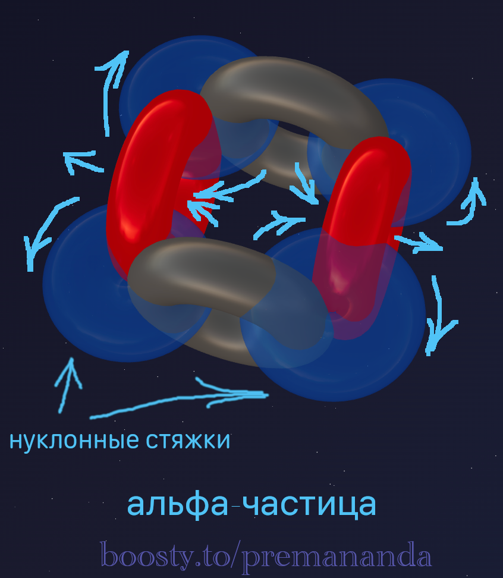
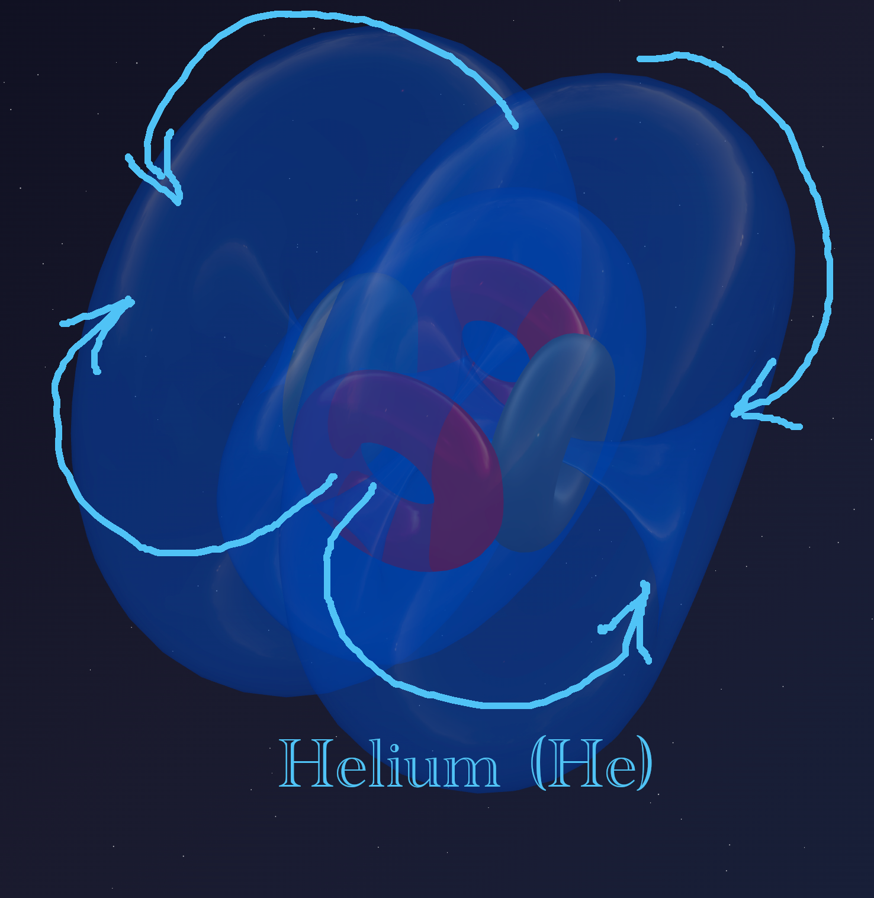
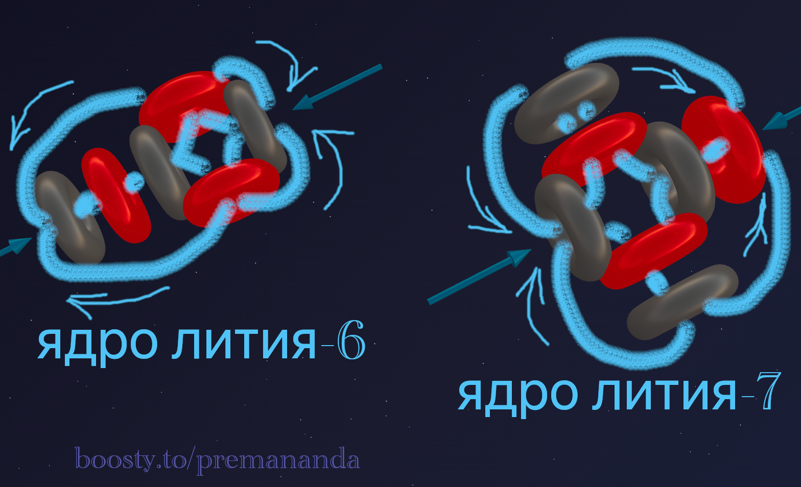
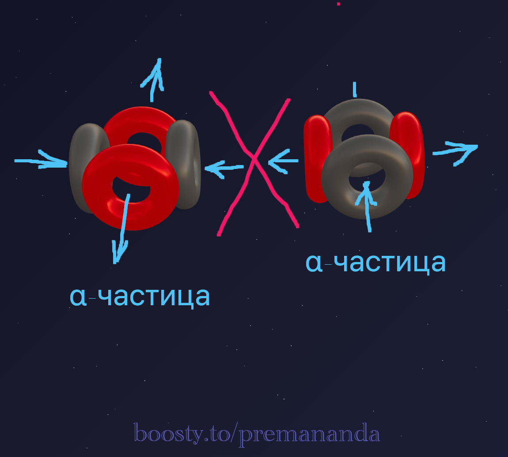
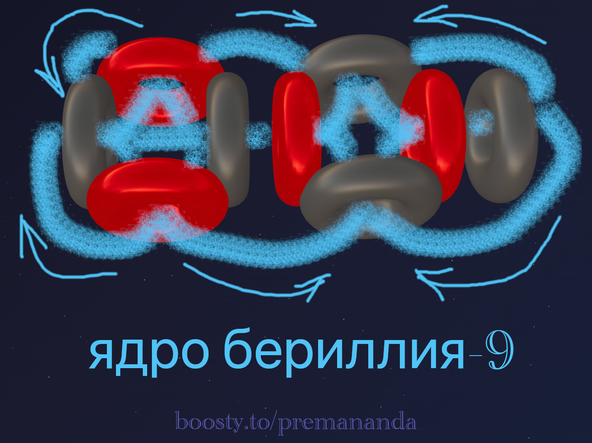
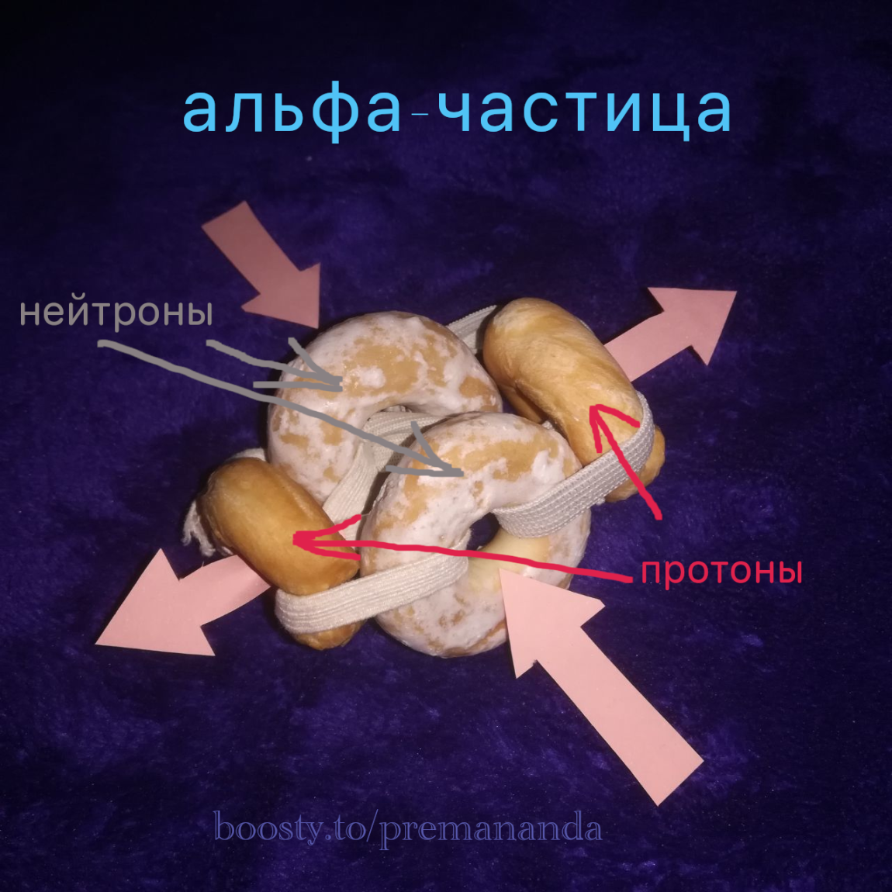

> *"The highest task of the physicist is to search for those universal laws… from which a picture of the world can be obtained by pure deduction."*
>
> — Albert Einstein

---

## 🔬 The Alpha Particle: The Secret of Its Strength

Let's try to understand why the alpha particle is one of the most robust vortex structures.

As is well known, it consists of two protons and two neutrons, and must be as compact as possible. The most plausible configuration, in my view, is one in which:

- the protons are aligned on a single axis and rotate in **opposite directions**;
- the neutrons lie on an axis oriented at **90° to the proton axis**.

---

## 🌀 The Stabilization Mechanism

The protons pump ether out of the central region, creating a zone of reduced pressure there. The ether expelled by the protons is spun in opposite directions and drawn back into the alpha particle through the neutrons — forming **"ties"** that hold the entire structure together.

These "ties" act as a flexible container or hydrodynamic wall, keeping the inner tori together.

### 💡 Hydrodynamic Explanation

In hydrodynamics, this effect is explained by a pressure difference — the **"corset" effect** (pressure gradient):

**Result:** the surrounding ether ("tie") presses forcefully on the proton and neutron flows from all sides, compressing them. The "tie" acts as a hydrodynamic prison — it prevents the tori from drifting apart, rigidly focusing their flows and forcing them to stay together.

---

## ⚛️ From Alpha Particle to Helium

When the alpha particle generates (or captures) two electrons, it becomes a **helium atom**. Helium is a noble gas, which is explained by its high degree of symmetry.

---

## 🧪 Lithium: The Next Element

Now let's move on to the next element — **lithium**.

Lithium has three protons. Its most common isotopes are:

- **Lithium-6 (⁶Li)** — stable. Composition: 3 protons + 3 neutrons. Abundance: ~7.5%.
- **Lithium-7 (⁷Li)** — stable. Composition: 3 protons + 4 neutrons. Abundance: ~92.5% of natural lithium.

### Nuclear Properties of Lithium

**Nuclear structure:**
⁶Li has a symmetric nucleus (3 protons + 3 neutrons), while ⁷Li contains one "extra" neutron.

**Binding energy:**
⁷Li is more tightly bound — its binding energy per nucleon is higher. ⁶Li is less stable at the nuclear level, though it is not radioactive.

**Nuclear spin:**
⁶Li has spin 1, while ⁷Li has spin 3/2. This affects the magnetic properties of the isotopes.

### ⚡ Interaction with Neutrons (The Key Difference!)

**Lithium-6** is a very strong absorber of thermal neutrons:

> ⁶Li + n → ⁴He (α) + ³H (tritium) + energy

Neutron capture cross-section: **~940 barns** (extremely high!).

**Lithium-7** interacts weakly with thermal neutrons. Capture cross-section: **~0.045 barns** — roughly 20,000 times smaller.

---

## 🔮 Beryllium: The Fourth Element

Now let's turn to **beryllium** (Be, atomic number 4). It has several isotopes, but only one is stable.

| Isotope | Composition | Half-life | Notes |
|---|---|---|---|
| **⁹Be** | 4p + 5n | stable | 100% of natural beryllium |
| **⁷Be** | 4p + 3n | ~53 days | decays to ⁷Li via electron capture |
| **⁸Be** | 4p + 4n | ~10⁻¹⁶ s | instantly decays into 2 α-particles |
| **¹⁰Be** | 4p + 6n | ~1.36 million years | decays to ¹⁰B via beta decay |

### ⚠️ A Special Case: Beryllium-8

Beryllium-8 is an exceptional case: it decays almost instantaneously. Apparently, in this configuration an ether "tie" capable of binding two α-particles together cannot form.

### 📐 A Model of Beryllium-9

Let's try to construct a model of the **beryllium-9** nucleus. We note that the most likely end products when ⁹Be is split are two alpha particles (⁴He) plus lighter particles. For now, let's assume the nucleus looks like this:

---

## 🛠️ Build Your Own Model!

If you'd like to create similar models yourself, try the online atom constructor: [3d-particles-pi.vercel.app](https://3d-particles-pi.vercel.app/)

Or build a model from whatever you have at hand:

---

*To be continued. In Part 3, we will look at heavier elements and the patterns that allow us to predict nuclear structure.*