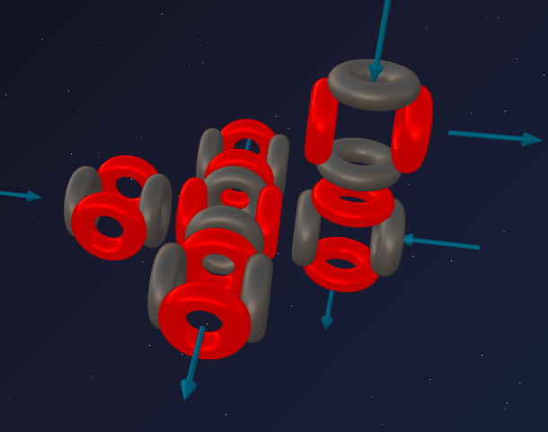
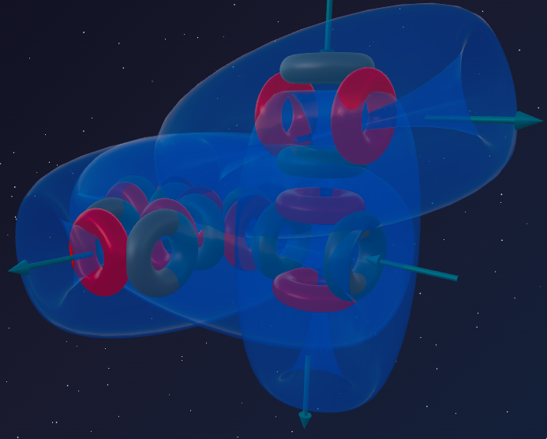

> *"Architecture begins where two bricks are carefully joined together."*
>
> — Ludwig Mies van der Rohe

In the previous part we witnessed true drama at the atomic level: how a single extra nucleon of Sodium broke open the perfect, airtight fortress of Neon. That nucleon forced an alpha particle to rotate 90°, opening one powerful ether fountain outward.

But nature does not tolerate imbalance for long. What happens if we add one more proton to Sodium?

We get **Magnesium** — the element in which a single proton completes the "dangling" triton of Sodium into a full sixth alpha particle, turning an unstable "interim" design into a symmetrical and incredibly strong construction.

---

## 📐 Engineering Analysis of the Nucleus

**Magnesium-24** is the main stable isotope of Magnesium (≈ 79% in nature).

**Composition:** 12 protons + 12 neutrons = 24 nucleons.

**Block decomposition:**
- 24 nucleons = exactly **6 alpha particles** (6 × 4 = 24);
- Remainder: **0** — again, just like Neon, not a single extra nucleon!

**Formula:** **²⁴Mg = 6α**

Magnesium is the second element in our series after Neon whose nucleus consists entirely of alpha particles with no "tails." But if Neon (5α) is a sealed gas fortress, why is Magnesium (6α) a sturdy metal?

---

## 🔬 Building the Model: "The Second Floor"

### Step 1: Sodium's legacy

Recall the configuration of Sodium (5α + t). The base "cross" of Neon (5α) is the first floor. The triton, latching onto a lateral alpha particle and rotating it, began construction of a **second floor** above the main plane.

### Step 2: Completing the sixth alpha particle

In Magnesium, one more proton joins that same triton — and a complete **sixth alpha particle** forms.

**Where does it go?**

The principle of symmetry demands that the new block balance the system. The sixth alpha particle completes the "second floor," and the construction arranges itself in space so that the nucleon ties (ether flows between α-particles) are as rigid as possible.

**The crucial difference from Neon:**
In Neon (5α) all funnels are closed inward into the cross-shaped structure. In Magnesium the sixth alpha particle, forming a new vertical axis, directs its main funnels **outward** — because there is no free closing node for them inside the construction. At the ends of this axis **two dominant fountains prevail** — ether-release zones. Magnesium acts as a donor on both poles.

---

## 🏗️ Anatomy of Strength

### 1. Two polar "fountains"

The sixth alpha particle creates a distinct vertical axis. Due to the density of the framework the nucleus pushes ether outward — at the ends of the axis two dominant fountains act, ready to transfer the vortex flow to a neighboring atom.

### 2. The return of symmetry

Unlike the "lopsided" Sodium with its protruding triton, the Magnesium nucleus is once again **symmetrical**. The internal ether flows are stabilized; there are no local pressure conflicts.

### 3. A powerful spatial framework

Six alpha particles create a multitude of cross-bracing nucleon ties. The construction is as rigid as a spatial bridge truss. This is no longer a flat cross — it is a full 3D part.

---

## 🔮 Model Predictions and Reality

### Prediction №1: valency 2

The construction projects **two fountains** outward at the ends of the vertical axis — exactly two exchange points for the ether flow.

**Reality:** Magnesium is strictly divalent in all its compounds:
- MgCl₂, MgO, Mg(OH)₂ — all contain exactly two bonds.
- MgO is an especially beautiful case: 2 fountains of Magnesium perfectly mate with 2 funnels of Oxygen — a perfect match with the model.

### Prediction №2: high metal strength

The double axis of bonds forms a **direct, rigid network of ether highways** between atoms. Unlike soft Sodium (one asymmetric bond-"tail"), Magnesium builds bonds along two axes.

**Reality:** Magnesium is a structural metal with high strength at low weight. Magnesium alloys are used in aviation and aerospace — a perfect match with the model.

### Prediction №3: moderate reactivity

Sodium is an "overfilled vessel" with an internal imbalance that explodes in water. Magnesium is a symmetrical 6α construction: the nucleus is stable, there is no internal "panic." The two fountains are ready to work but do not create critical pressure.

**Reality:** Magnesium readily oxidizes in air, forming a protective MgO film (passivation). A piece of Magnesium can be held in the hand without danger — but when ignited, it burns with a blindingly bright white flame — a perfect match with the model.

### Prediction №4: good electrical conductivity

Direct, unbent ether channels along the two axes allow the flow to move freely.

**Reality:** Magnesium is a good electrical conductor — a perfect match.

---

## ⚔️ Sodium vs Magnesium: Chaos and Order

| Parameter | Sodium Na (5α + t) | Magnesium Mg (6α) |
|---|---|---|
| **Image** | Breached fortress | Completed foundation |
| **Structure** | Asymmetric (triton tail) | Symmetrical, 3D framework |
| **Active fountains** | 1 (due to rotation) | 2 (poles of the new axis) |
| **Valency** | 1 | 2 |
| **Hardness** | Soft (cut with a knife) | Strong structural metal |
| **Reactivity** | Extreme (explodes in water) | Moderate (protective film) |
| **2nd-period analogue** | Lithium | Beryllium |

---

## 🧪 Nuclear Alchemy: Proof of Structure

If Magnesium = **6 perfect alpha particles**, nuclear reactions must confirm it.

### Photodisintegration

A hard gamma-ray strikes the 6α construction. The weakest link is the outermost alpha particle of the new axis, which sticks out. It breaks off, exposing the clean Neon cross:

> ²⁴Mg + γ → ²⁰Ne + α

### Stellar synthesis (carbon burning)

How is Magnesium born in the cores of stars during supernova explosions? Carbon-12 (3α) is a sturdy chain. Two such chains collide at enormous speed and fold perfectly into the 6α framework of Magnesium:

> ¹²C + ¹²C → ²⁴Mg + energy

No fragments — just a powerful release of fusion energy from perfectly fitting pieces.

---

## 🌟 Summary

Magnesium is the **triumph of restored symmetry**. Taking the destabilised Sodium, nature adds a single proton to its triton — and the "dangling tail" becomes a complete sixth alpha particle, finishing the "second floor" into a rigid 6α framework.

This framework generates two fountains that allow Magnesium atoms to hold firmly onto each other. The result is a light yet incredibly strong metal that carries us into space.

**Chemistry is simply the macroscopic manifestation of the hydrodynamic architecture of the nucleus.**

---

## 🔮 What's Next?

In the next part — **Aluminium:**
- what happens when one more "wrong" piece is added to the solid 6α foundation;
- how Aluminium becomes a three-bond donor;
- the peculiarities of the transition from metal to semiconductor.

---

## 🛠️ Build Your Own Model!

Try building the Magnesium-24 nucleus in the online constructor:

👉 [3d-particles-pi.vercel.app](https://3d-particles-pi.vercel.app/)
