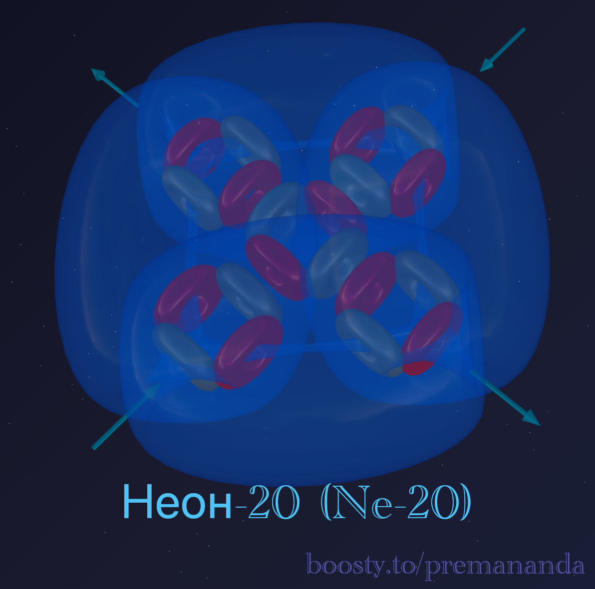
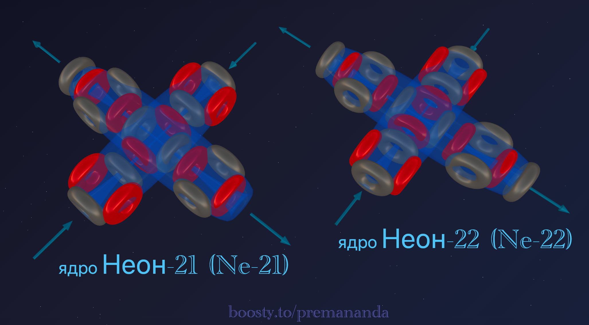

> *"Perfection is achieved not when there is nothing more to add, but when there is nothing left to take away."*
>
> — Antoine de Saint-Exupéry

We have traveled from stable carbon through aggressive oxygen to the chemical predator fluorine. Each successive element of the second period increased its reactivity, growing ever hungrier and more dangerous.

And now we have reached neon — the element that brings this race to a halt. **Complete silence.** No reactions. No bonds. No aggression.

Why? The answer lies in the architecture of its nucleus.

---

## 📐 Engineering Analysis of the Nucleus

**Neon-20** is the primary stable isotope of neon (90.48% in nature).

**Composition:** 10 protons + 10 neutrons = 20 nucleons.

**Block decomposition:**
- 20 nucleons = **5 alpha particles** (5 × 4 = 20);
- remainder: **0** — not a single extra nucleon.

**Formula:** **²⁰Ne = 5α**

All nucleons are perfectly packed into alpha particles. Not a single "tail," not a single extra proton or neutron. A clean, complete construction.

---

## 🔬 Building the Model

### Step 1: The base structure of oxygen

Oxygen-16 is 4 alpha particles in a T-shaped configuration: 3 alpha particles form a linear chain, and the 4th attaches to the center.

### Step 2: Adding the fifth alpha particle

A fifth alpha particle is added to the four of oxygen. Where does it go?

**The compactness principle:** nature always seeks minimum volume. The fifth alpha particle attaches **opposite the fourth**, forming a symmetric cross-shaped structure.

Result: if oxygen (4α) had a T-shape with one open side, then neon (5α) is a **closed cross** where every direction is filled.

---

## 🏰 Anatomy of the Fortress

### Complete symmetry

Unlike every element we have examined so far, neon has no preferred direction. The structure of 5 alpha particles has high symmetry: the central α-particle is surrounded by four lateral ones, and all internal "funnels" are closed.

### All funnels hidden

This is neon's key distinction. Oxygen has 2 open funnels, fluorine has 1 powerful one. In neon, every inlet and outlet is sealed inside the nucleus. The atom has become **airtight**. An external atom has nowhere to connect.

### Perfect pressure balance

The internal ether flows are locked into stable circuits. On the outside there are neither critically low-pressure zones nor high-pressure zones.

---

## 🔮 Model Predictions and Reality

### Prediction №1: valence 0

Since no active funnel opens to the outside, neon **forms no** chemical compounds. Even fluorine — the total predator — cannot form a bond with neon.

**Reality:** neon is absolutely inert — a perfect match with the model.

### Prediction №2: electronegativity undefined

The neon atom has nothing with which to "latch onto" another atom's electrons. It can neither donate nor accept an ether flow.

**Reality:** neon is not assigned a value on the Pauling scale — a perfect match.

### Prediction №3: monatomic gas

Neon has no open funnels, so two atoms simply fly past each other when they meet. There is no mechanism for bonding even with itself.

**Reality:** neon remains a monatomic gas down to extremely low temperatures — a perfect match.

### Prediction №4: record ionization potential

All 5 alpha particles function as a single closed circuit. To tear out an electron, the balance of the entire system must be broken — which requires enormous energy.

**Reality:** neon holds the absolute record for ionization energy in the second period — a perfect match.

---

## 🧪 Nuclear Alchemy: Proof of Structure

If neon = 5 alpha particles, nuclear reactions should confirm this.

> ²⁰Ne + α → ²⁴Mg

Adding a 6th alpha particle yields magnesium-24.

> ²⁰Ne + γ → ¹⁶O + α

A gamma ray breaks the structure into oxygen (4α) and an alpha particle.

These reactions directly confirm the formula: **Ne = O + α = 5α**.

---

## 💎 Isotopes of Neon

All stable isotopes of neon are built around the base framework of 5 alpha particles:

- **neon-21:** 5α + 1n (an extra neutron — a "spacer");
- **neon-22:** 5α + 2n (better symmetry than neon-21).

---

## 🌟 The Philosophy of Perfection

Chemical activity is the consequence of **structural incompleteness**. A noble gas is an element that has achieved architectural perfection.

- carbon (3α) — 4 bonds (base symmetry);
- nitrogen (3α + d) — 3–4 bonds (slight asymmetry);
- oxygen (4α) — 2 bonds (T-shape);
- fluorine (4α + t) — 1 bond (maximum aggression);
- **neon (5α) — 0 bonds (perfect cross).**

---

## 🔮 What's Next?

In the next part we move to the third period. What happens when an extra block is added to neon's perfect fortress? How does a single "extra" proton transform an inert gas into a hyperactive alkali metal — **sodium**.