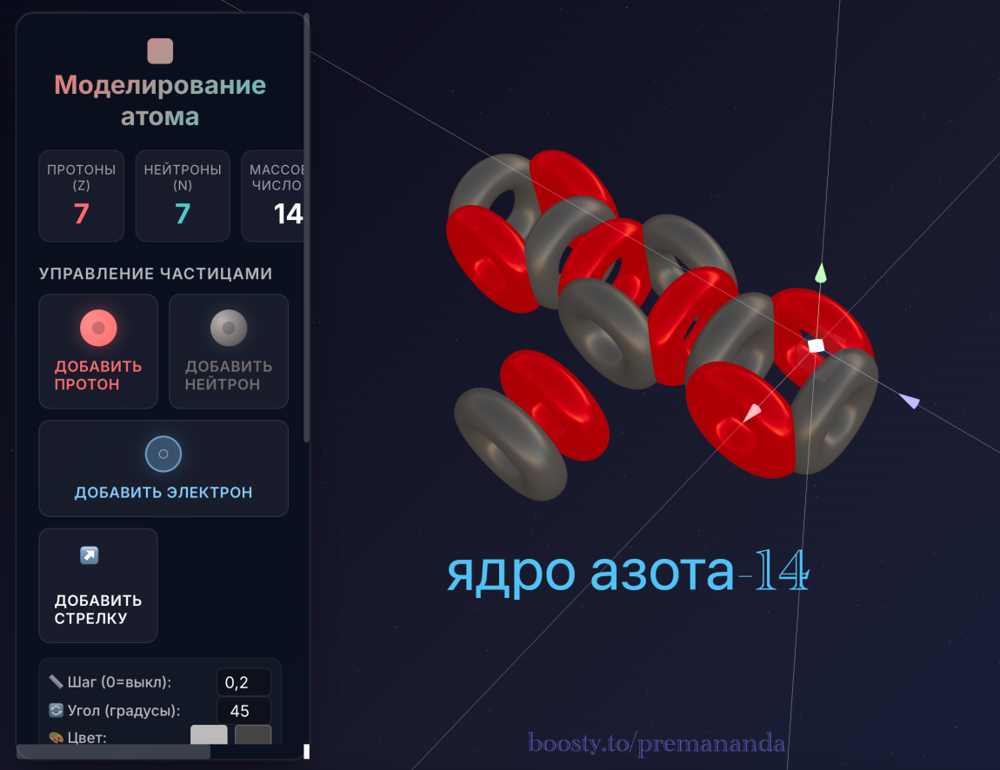
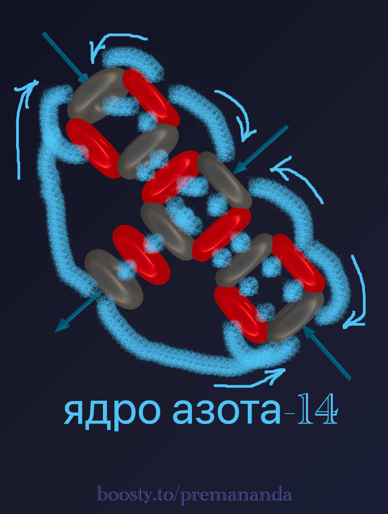
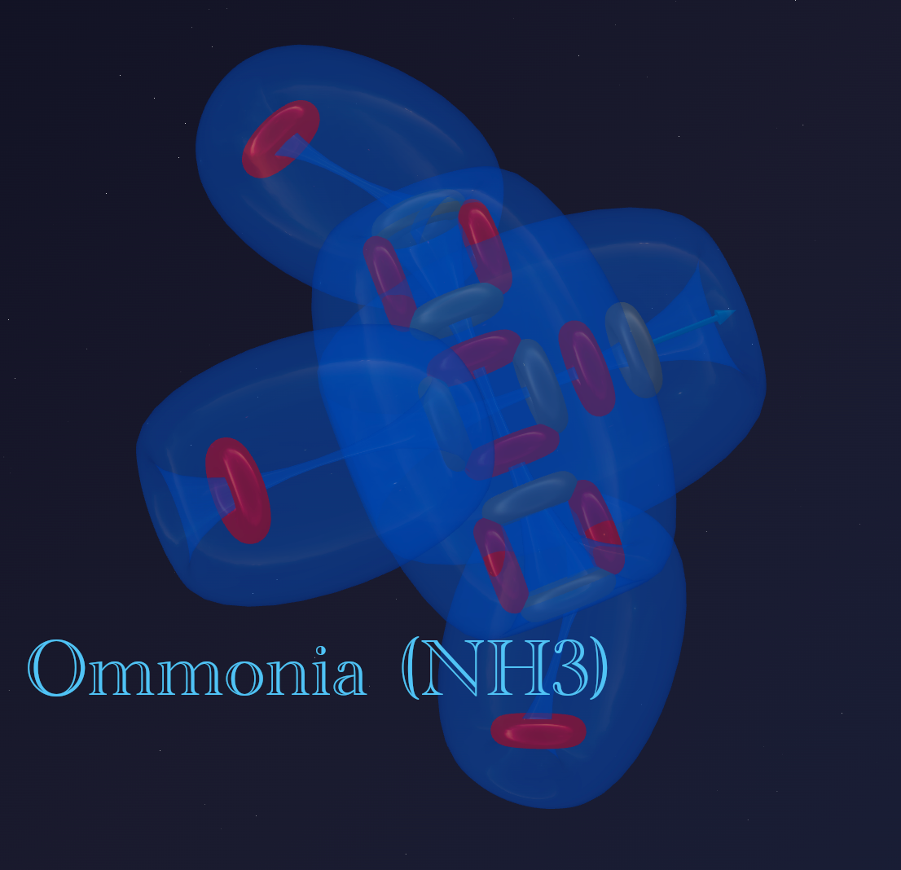
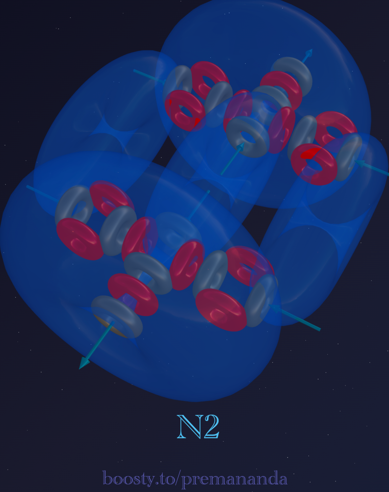

> *"We still do not know one thousandth of a percent of what nature has revealed to us."*
>
> — Albert Einstein

In the previous part, we explored the perfect symmetry of carbon-12. Three alpha particles arranged in a line, with the central one rotated 90 degrees, create a strong and harmonious structure with 4 active ports.

But nature does not stand still. The next step in the evolution of matter is **nitrogen-14**.

---

## 📐 Composition: Breaking Symmetry

Nitrogen is element number 7 in the periodic table. Its nucleus contains 7 protons and 7 neutrons.

If we try to assemble it from our favorite "building blocks" (alpha particles), we get:
- 3 alpha particles (that's carbon-12);
- and a "tail": 1 proton and 1 neutron.

This pair (proton + neutron) is called a **deuteron** (the nucleus of deuterium). It turns out that nitrogen is essentially **carbon + deuteron**.

Let's build a model of the nitrogen nucleus:

---

## 📐 Geometry: Carbon + "Backpack"

As seen in the model, the deuteron does not attach at the end of the chain, making the atom longer. Instead, it attaches to the side of the central alpha particle. This changes everything:

1. **The base:** we still have the rigid linear axis of three alpha particles (just like in carbon).
2. **The extension:** a perpendicular protrusion appears — the deuteron itself.

The side view clearly shows how the deuteron "sticks out" perpendicular to the main axis, creating asymmetry in the entire structure:

---

## ⚡ Aether Dynamics: Where Do the 4 Active Zones Come From?

In mainstream chemistry, nitrogen has a valence of **3** in most compounds (NH₃, amines) and **4** in the ammonium ion (NH₄⁺). Let's count the active zones in our model:

- **Ends (3 zones):** the tips of the linear base provide 3 active ports that participate in chemical bonds.
- **Center (1 zone):** the deuteron attached to the side is the fourth active zone. Its proton generates a powerful flow directed perpendicular to the main axis. In chemistry, this zone corresponds to the **"lone electron pair."**

**Total: 3 + 1 = 4 active zones**, which accurately reflects nitrogen's chemical behavior:
- Valence **3** — the three end zones participate in ordinary bonds (NH₃).
- Valence **4** — all four zones are engaged via the donor-acceptor mechanism (NH₄⁺).

---

## ⚓ Flexible Bonds and the Mystery of Ammonia (NH₃)

Nitrogen forms ammonia (NH₃), which has the shape of a triangular pyramid. Why? The **principle of flexible bonding** helps explain this.

A chemical bond is not a rigid stick. It is a vortex cord along which the attached atom (for example, hydrogen) can shift, seeking the position of lowest energy.

In the case of ammonia:

1. Three hydrogen atoms attach to the three active end zones of nitrogen.
2. The lateral deuteron (the "lone electron pair") generates a powerful aether flow that takes up a lot of space.
3. This flow pushes against the hydrogen atoms. Since the bonds are flexible, the hydrogens "drift" downward, away from the pressure.

As a result, they arrange themselves into a pyramid — not because the nucleus is a pyramid, but because they self-organize under the pressure of the nuclear flows, pulled tight on their "leashes."

---

## 🛡️ Nitrogen's Armor (N₂): The Secret of the Triple Bond

Why is gaseous nitrogen (N₂) so hard to break apart? Why is it an inert gas? The same principle of vortex cords is at work here.

When two nitrogen atoms meet, they extend their aether flows (electrons) toward each other. The three active end flows of each atom meet in the space between the nuclei and pair up. The lateral deuteron remains unused — it is precisely this that preserves the "lone pair" even within the N₂ molecule.

Think of this not as a rigid crossbar, but as a braided rope. Three vortex cords from one atom intertwine with three cords from the other. The result is an extraordinarily strong **triple bond**.

This is why nitrogen is inert: its "hands" are firmly occupied with each other. Breaking this triple aether rope and forcing nitrogen to react with something else requires enormous energy — for example, a lightning strike.

---

## 🌟 Summary

Nitrogen-14 demonstrates how nuclear structure determines elemental properties:

- **Asymmetry:** attaching the deuteron to the side creates unique properties and a "lone pair."
- **Four active zones:** 3 at the ends + 1 on the lateral deuteron = valence 3 (ordinary) or 4 (donor-acceptor).
- **Flexible bonds:** electrons are flows that can bend.
- **Triple bond:** in the N₂ molecule, three vortex flows powerfully hold two nitrogen nuclei together, while the lone pair remains free.

**Conclusion:** nature creates complexity not by piling up particles, but through the intelligent geometry of their arrangement.

---

## 🔮 What's Next?

In the next part, we will explore:
- the structure of **oxygen-16**;
- how two deuterons around a nucleus change the geometry — from a "backpack" to a "crown";
- why oxygen is such a reactive element.