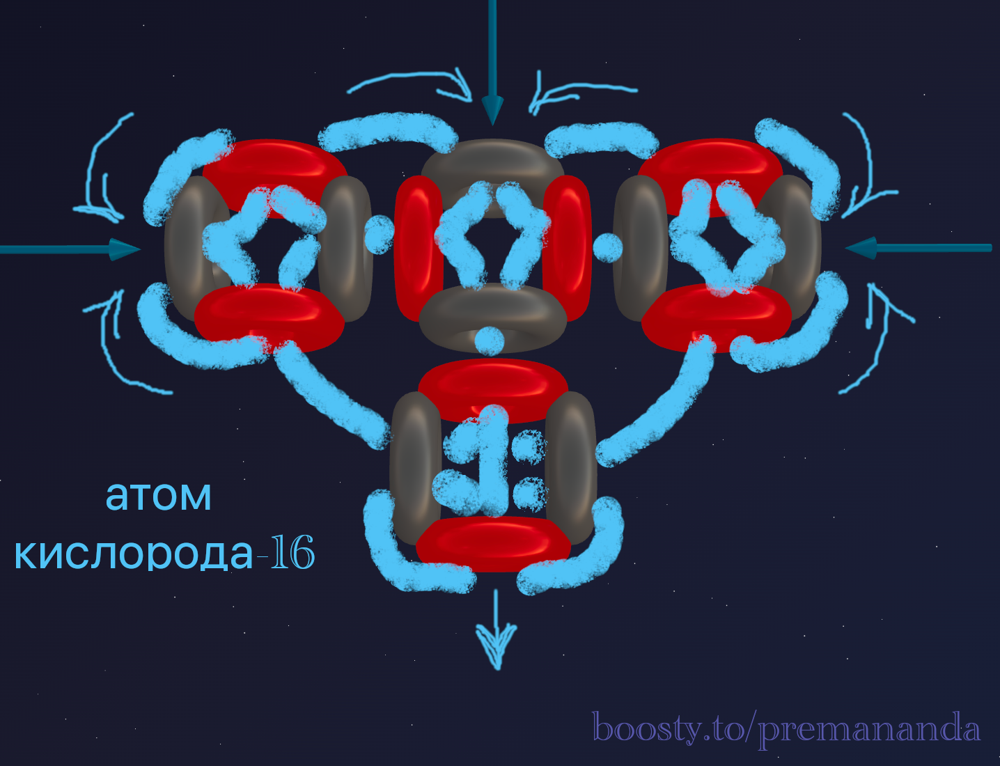
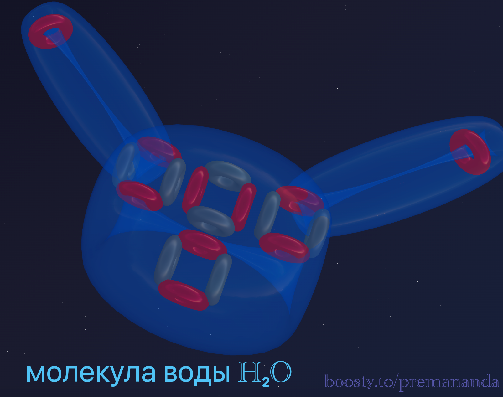
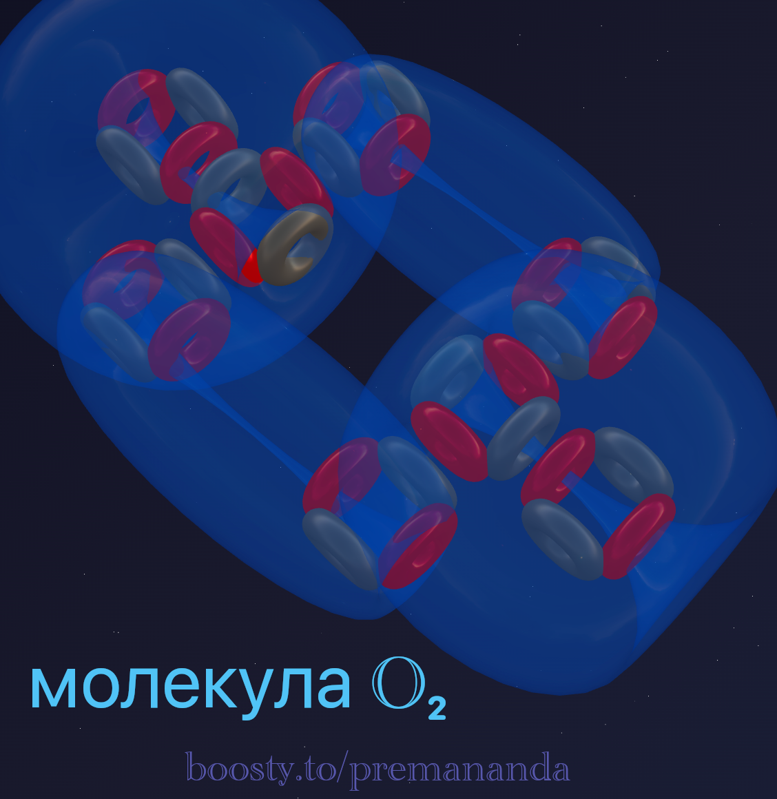

> "Truth is ever to be found in simplicity, and not in the multiplicity and confusion of things."
>
> — Isaac Newton

We continue our investigation. In previous parts, we saw how linear Carbon creates life, and asymmetrical Nitrogen creates tension.

Now we move on to **Oxygen-16**.

And here we won't just describe the structure. We will do what real science should do: we will predict the chemical properties of the element simply by looking at the blueprint of its nucleus.

---

## 📐 Engineering Analysis of the Nucleus

Oxygen-16 consists of 8 protons and 8 neutrons. This is exactly 4 alpha particles. Let's recall our model:
- Carbon is a chain of 3 alpha particles.
- Oxygen is Carbon + 1 alpha particle.

Where will the fourth block go? Nature always seeks compactness. The fourth alpha particle attaches to the top of the center of the carbon chain, forming a T-shaped structure.

Let's create a model of the Oxygen nucleus:

What do we see in the blueprint?
1. At the top — two powerful funnels pointing sideways, and one pointing up.
2. At the bottom — one powerful fountain (outgoing flow).

---

## 🔮 Forecast #1: Valency of 2 or 3

Looking at the T-shape, we can immediately tell how many bonds this atom will form. The most active are the two funnels pointing sideways. The top funnel can also occasionally participate in reactions.

**Conclusion:** Oxygen should most often connect with two and, in some cases, three bonds.

**Reality:** Two bonds in water (H₂O) and oxygen difluoride (OF₂) molecules. Three bonds in H₃O⁺ (hydronium ion). Our model predicted this perfectly.

---

## 🔮 Forecast #2: Electronegativity (Suction Power)

In chemistry, there is the concept of "electronegativity" — the ability of an atom to attract electrons to itself. Oxygen is a champion at this (second only to fluorine). Why?

Official science introduces coefficients. Etherdynamics explains the mechanics. Look at the Oxygen nucleus. These are 4 powerful pumps (alpha particles). Unlike the Carbon chain, there is an asymmetry here that exposes the incoming flows.

**Conclusion:** This atom will work like a powerful vacuum cleaner, aggressively tearing ether flows (electrons) away from its neighbors.

**Reality:** Oxygen is a powerful oxidizer that supports combustion.

---

## 💧 Forecast #3: The Geometry of Water (H₂O)

We have two active ports on the sides. Two Hydrogen atoms attach to them. Recall the principle of flexible bonds: the hydrogens are tied to the funnels but repel each other.

However, unlike Carbon, Oxygen has a massive "Crown" on top. This vortex presses down on the hydrogen atoms, preventing them from straightening into a line (at 180 degrees). It pushes them down. The balance between the "crown pressure" and the "hydrogen repulsion" creates that exact 104.5-degree angle.

---

## 🔗 Forecast #4: The O₂ Molecule (Double Bond)

What happens if two Oxygen atoms meet? Each of them has 2 active ports. They face each other and connect:
1. The left vortex of the first atom engages with the right vortex of the second.
2. The right vortex of the first — with the left vortex of the second.

**A double bond is formed.**

This is exactly why oxygen (O₂) is chemically active: a double bond is easier to break than the triple bond of nitrogen, and our "vacuum cleaner" is always ready to switch to something tastier (to oxidize someone).

---

## 🌟 The Predictive Power of Etherdynamics

The structure of the nucleus is the blueprint by which chemistry is built. The T-shaped form of the Oxygen nucleus (4 alpha particles) explains:
- Why it is divalent (2 open funnels).
- Why it is a powerful oxidizer.
- Why water has an angle of 104.5° (the impact of the 4th alpha particle on the attached nuclei).
- Why it forms double bonds (2 active funnels).

**Conclusion:** We are not just fitting facts to a theory — we see the logic of nature and can predict the properties of elements by looking at the architecture of their nuclei!

---

## 🔮 What's next?

In the next part — **Fluorine**:
- The most aggressive substance in the Universe.
- How asymmetry turns an element into a chemical predator.