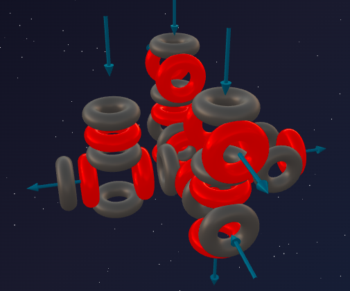
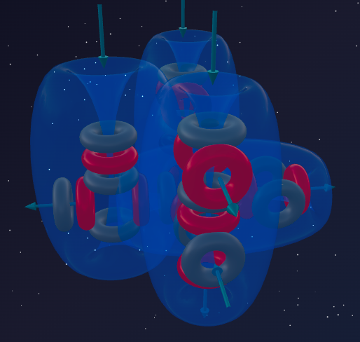

> *"He who lights a flame must be prepared to burn himself."*
>
> — Victor Hugo

Silicon (7α) demonstrated the absolute triumph of rigid 3D architecture: a perfectly balanced monolith with four outward-facing ports. Its symmetry made it a hard stone.

But nature does not like to stay frozen in stone forever. To move forward, it must once again reach for its proven tool of evolution — **the breach**.

And once again our old acquaintance steps onto the stage — the triton (1p + 2n). It attacks the monolithic fortress of Silicon, giving birth to **Phosphorus** — the element whose name means "light-bearer."

---

## 📐 Engineering Analysis of the Nucleus

**Phosphorus-31** is the only stable isotope of Phosphorus (100% in nature).

**Composition:** 15 protons + 16 neutrons = 31 nucleons.

**Block decomposition:**
- 28 nucleons = **7 alpha particles** (Silicon's base);
- remainder: 3 nucleons = 1 proton + 2 neutrons = **triton**.

**Formula:** **³¹P = 7α + t**

Do you recognize the third-period pattern?
- Sodium (5α + t) — the symmetry-breaker of Neon.
- Aluminum (6α + t) — the symmetry-breaker of Magnesium.
- **Phosphorus (7α + t) — the symmetry-breaker of Silicon.**

Phosphorus is the third element in the period whose nucleus carries a triton "tail."

---

## 🔬 Building the Model: The Triton on a Silicon Base

### Step 1: The perfect Silicon base

Silicon (7α) is a massive construction: a base (5α) with two lateral α-particles. It projects **4 active ports** outward, rigidly locking atoms into a diamond lattice. The internal nodes are overloaded — there is no room for new bonds.

### Step 2: The triton's strike on the "column"

The triton cannot squeeze into the center — that is a monolith. It finds a place on one of the outer lateral alpha particles. The proton from the triton latches onto it and **forces it to rotate 90°**.

**What happens to the architecture?**

1. Silicon's perfect symmetry is **destroyed**.
2. The rotated vortex, which previously participated in the internal tie, now **swings outward as a fountain**.
3. A powerful local pressure imbalance arises. The enormous mass of the 7α monolith presses against this single rotated point, forcing an "excess" aether flow through it.

---

## 💥 The Anatomy of Flammability

### 1. Five active vortices

Unlike Silicon with its four stable ports, Phosphorus has **five active vortices**:
- **4 base ports** — inherited from the Silicon framework (stable bonds);
- **1 asymmetric high-pressure discharge fountain** — created by the rotated alpha particle.

### 2. The overloaded boiler effect

Sodium (5α + t) also had one discharge fountain, but its base was light. Phosphorus's base is far heavier and more rigid (7α). The aether pressure inside this framework is enormous. The fifth fountain acts like a pressure relief valve on an overheated steam boiler. The Phosphorus atom continuously bleeds aether through this fountain, attempting to return to Silicon's perfect symmetry.

---

## 🔮 Model Predictions and Reality

### Prediction №1: valence 5 (and 3)

The number of outward-facing active vortices determines the possible bonds. Phosphorus has 5 (4 base ports + 1 discharge fountain).

**Reality:** Phosphorus forms five bonds:
- PCl₅ — 5 bonds — a perfect match;
- P₂O₅ — 5 bonds per atom — a perfect match;
- H₃PO₄ (phosphoric acid) — 5 bonds — a perfect match.

Furthermore, when the 4 base ports are not engaged, Phosphorus can exhibit **valence 3** (PCl₃, phosphine PH₃) — a perfect match with the model.

### Prediction №2: luminescence and flammability (the secret of white Phosphorus)

Where does the famous eerie pale-green glow of white Phosphorus in the dark come from? Where does its tendency toward spontaneous ignition come from?

**Luminescence (chemiluminescence):**
Due to the enormous internal pressure of the heavy 7α monolith, the aether flow is torn from the fifth fountain so sharply and under such tremendous pressure that it acts like a quantum whistle — causing the surrounding aether medium to vibrate at high frequency. We perceive this vibration as visible light. Phosphorus literally glows from its own geometric asymmetry.

**Red Phosphorus and matches:**
Because of this tension, white Phosphorus is unstable and toxic. When gently heated in a sealed vessel, the atoms rearrange into long polymer chains — **red Phosphorus**: the discharge fountains latch onto each other, mutually relieving the pressure. The glow ceases.

But strike a match against a rough surface — friction breaks the compensating chain, the fifth fountain is exposed to Oxygen in the atmosphere, and a **flash of fire** occurs instantly — a perfect match with the model.

### Prediction №3: Nitrogen vs Phosphorus (gas vs solid)

Both are in group 5, both form 5 bonds. Yet Nitrogen is an inert gas while Phosphorus is a combustible solid. Why?

- **Nitrogen (3α + d):** light base (3α) — a linear chain. Two atoms easily approach and hide all vortices inside a triple bond N₂. Smooth on the outside → **gas**.
- **Phosphorus (7α + t):** bulky base (7α) — a heavy 3D monolith. Two such giants cannot physically get close enough to close off with a triple bond. Phosphorus is forced to build P₄ pyramids or polymer chains → **solid**.

**Reality:** N₂ is a gas at room temperature. P₄ is a solid with a melting point of 44°C — a perfect match with the model.

---

## ⚔️ The Triton-Element Pattern of the Third Period

| Element | Formula | Base | Active vortices | Valence |
|---|---|---|---|---|
| Sodium | 5α + t | Neon (5α) | 1 | 1 |
| Aluminum | 6α + t | Magnesium (6α) | 3 | 3 |
| **Phosphorus** | **7α + t** | **Silicon (7α)** | **5** | **5** |

---

## 🧪 Nuclear Alchemy: Proof of Structure

Phosphorus (7α + t) is a springboard to the next perfect alpha-element.

A proton completes the triton (1p + 2n) into a full alpha particle (2p + 2n), which flies off, exposing the Silicon framework:

> ³¹P + p → ²⁸Si + α

An alpha particle collides with Silicon, loses one proton on impact, and turns into a triton that "welds" itself onto the framework:

> ²⁸Si + α → ³¹P + p

Both reactions confirm the formula **P = 7α + t**.

---

## 🌱 The Philosophy of Life: Phosphorus as a Battery

Life is built on a Carbon framework (3α). Nitrogen (3α + d) used its asymmetry to "bend" Carbon chains, causing proteins to fold into 3D helices.

But to transfer **energy** (ATP) and build the rigid backbone of DNA, Phosphorus (7α + t) was needed. With its enormous donor fountain, it acts inside the living cell like a tiny spring. Breaking the phosphate bond in an ATP molecule releases the energy stored in the discharge fountain, powering our muscles and brain.

**The glowing element turned out to be the perfect battery for carbon-based life.**

---

## 🌟 Summary

Phosphorus is Silicon knocked out of equilibrium.

A triton latched onto one of the lateral alpha particles of the symmetric 7α monolith and rotated its vortex outward. The conflict between the enormous internal pressure of the 7α base and the narrow open fifth fountain produces the famous luminescence (an aether "whistle"), toxicity, and flammability.

Five active vortices explain the valence of 5 and reveal Phosphorus's role as the energy accumulator for all life on the planet.

---

## 🔮 What's Next?

In the next part — **Sulfur (8α):**
- how the 8th alpha particle restores symmetry (partially);
- why Sulfur burns with a blue flame but does not glow in the dark;
- where the mysterious valences of 2, 4, and 6 in a single element come from.

---

## 🛠️ Build Your Own Model!

Try building the Phosphorus-31 nucleus in the online constructor:

👉 [3d-particles-pi.vercel.app](https://3d-particles-pi.vercel.app/)