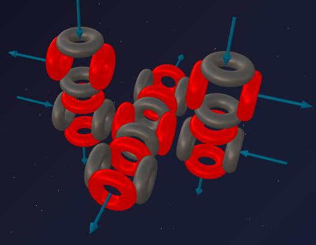
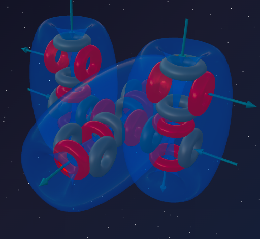

> *"A crystal is frozen mathematics."*
>
> — Johannes Kepler

We have reached the midpoint of the third period. Sodium (5α + t) and Aluminium (6α + t) played the role of "lockbreakers," destabilising stable constructions with an asymmetric triton.

But what happens if we add just one proton to asymmetric Aluminium? The triton immediately completes into a full alpha particle. The trap snaps shut. The asymmetry vanishes.

Before us stands **Silicon** — an architectural masterpiece of symmetry. The element that became the solid foundation of our planet and the brain of all modern civilisation.

---

## 📐 Engineering Analysis of the Nucleus

**Silicon-28** is the main stable isotope of Silicon (92.2% in nature).

**Composition:** 14 protons + 14 neutrons = 28 nucleons.

**Block decomposition:**
- 28 nucleons = exactly **7 alpha particles** (7 × 4 = 28);
- Remainder: **0** — no unfinished scaffolding!

**Formula:** **²⁸Si = 7α**

Silicon, like Carbon (3α), Magnesium (6α), and Neon (5α), consists exclusively of whole alpha blocks. But its shape is unique.

---

## 🔬 Building the Model: The Symmetrical Monolith

Let us trace the spatial evolution:
- **Carbon (3α)** — a linear structure: two alpha particles on either side of the central one.
- **Magnesium (6α)** — a base (5α) to which one alpha particle attached, beginning the construction of the "second floor."

How does Silicon (7α) form?

If 7 alpha particles formed a spatial cross (one central and 6 around it), the atom would be chemically inert. Moreover, a central alpha particle can physically hold **at most 4** neighbours, not 6.

Therefore the seventh alpha particle attaches on the **opposite side** from where the "second floor" construction began in Magnesium. The atom balances out: at the centre — a powerful base (5α), with two α-particles attached symmetrically on either side.

---

## 🏛️ The Architecture of Rigidity

### 1. Perfect balance: 4 funnels and 4 fountains

Carbon (3α) had 4 stable bonds. Silicon (7α) repeats that pattern at a new level. The seventh alpha particle balances the entire structure, and the massive construction projects outward **4 active funnels and 4 releasing fountains**, optimally spread through space. This 50/50 balance forms 4 complete vortex loops — the foundation of a strong tetrahedral lattice.

### 2. Ultra-rigid grip

Unlike asymmetric Aluminium (6α + t), where the aether channels were prone to bending, Silicon (7α) has perfectly balanced ports. Silicon atoms lock onto each other in a "death grip," forming a diamond lattice.

---

## 🔮 Model Predictions and Reality

### Prediction №1: valency 4

The symmetrical monolithic base 7α projects outward 4 pairs of ports (4 funnels and 4 fountains), forming 4 ultra-strong bidirectional chemical bonds.

**Reality:** Silicon is tetravalent in most of its compounds:
- SiCl₄ — 4 bonds ✓
- SiO₂ (sand, quartz) — each Si atom is bonded to 4 oxygen atoms in a 3D polymer network ✓
- SiC (carborundum) — 4 bonds ✓

A perfect match with the model.

### Prediction №1a: why valency 6 is possible (and why Carbon cannot do it)

Silicon sometimes forms **6 bonds** — for example, SiF₆²⁻ (the hexafluorosilicate ion), widely used in industry.

In the 7α model this is explicable. The massive monolith is built more complexly than the light chain of Carbon (3α). Four primary ports handle external bonds, but inside the dense construction there are **secondary funnels** that normally participate in internal ties between alpha particles. When attacked by the most aggressive predator — Fluorine (the absolute champion in electronegativity) — these secondary ports can be forced open, providing two additional bonds.

Carbon (3α) has no such reserve — the light linear construction has no hidden internal ports. Therefore Carbon is **strictly** limited to 4 bonds, while Silicon can yield 6 under extreme conditions.

**Reality:** SiF₆²⁻ exists and is stable. CF₆²⁻ — never exists — a perfect match with the model.

### Prediction №2: the semiconductor phenomenon

Why is Aluminium a flexible metal and an excellent conductor, while Silicon (just one proton more) is a brittle non-metal and insulator that only conducts at elevated temperature?

- **In metals (Aluminium):** Due to the asymmetry of the triton, fountains dominate over funnels. Atoms form wide, flexible channels through which aether flows like water through a broad pipe.
- **In Silicon (7α):** Symmetrical blocks lock onto each other perfectly. 4 fountains fit precisely into 4 funnels of neighbours. Aether is trapped inside the death grip. No current flows. At low temperatures Silicon is an **insulator**.

**How to switch on conductivity?** The crystal must be **heated**. Heat is the vibration of aether. When Silicon's frameworks begin to vibrate, the rigid grip loosens slightly and aether starts seeping through the channels.

**Reality:**
- When heated, the resistance of metals *rises*.
- The resistance of Silicon when heated **drops sharply**.
- All transistors in your computer are built on this principle — a perfect match with the model.

### Prediction №3: high melting point and the foundation of the rocky world

- **Carbon (3α):** linear, agile base — easily forms double bonds (C=C). Ideal for DNA, proteins, and flexible organic chemistry.
- **Silicon (7α):** massive monolith of three "columns." It is physically almost impossible to bend for a double bond (Si=Si bonds are exceedingly rare). It builds reliable, rigid 3D networks of single bonds.

**Reality:**
- Earth's crust is 27% Silicon (sand, quartz, granite, basalt).
- Melting point of Silicon: **1414°C** — breaking the rigid 7α grip is extraordinarily difficult — a perfect match with the model.

---

## ⚔️ Carbon vs Silicon: Two Architects

| Parameter | Carbon C (3α) | Silicon Si (7α) |
|---|---|---|
| **Shape** | Linear chain | Symmetrical monolith |
| **Bonds** | 4 (flexible, incl. double) | 4 (rigid, single only) |
| **Role** | Basis of life | Basis of the rocky world |
| **Conductivity** | No (diamond) / Yes (graphite) | Semiconductor |

---

## 🧪 Nuclear Alchemy: Proof of Structure

The Silicon nucleus (7α) is so perfect that we can verify its block structure from both directions.

### Photodisintegration

A gamma-ray strikes the symmetrical monolith. One balancing alpha particle breaks off, exposing the Magnesium-24 framework:

> ²⁸Si + γ → ²⁴Mg + α

### Stellar synthesis (oxygen burning)

Why is there so much Silicon in the universe? From the cores of massive stars. Oxygen-16 is a T-shaped structure (4α). Two oxygen atoms collide at tremendous speed:

> ¹⁶O + ¹⁶O → ²⁸Si + α

4α + 4α = 8α. The nucleus instantly rearranges into the robust 7α framework of Silicon-28, while the extra alpha particle flies off carrying the excess energy.

Both reactions confirm the formula **Si = 7α**.

---

## 🌟 Summary

Silicon is the analogue of Carbon in the third period.

It took asymmetric Aluminium (6α + t) and, by adding one proton, completed the triton into the 7th alpha particle, anchoring it symmetrically on the opposite side of the nucleus. This mirror balancing gave Silicon 4 funnels and 4 fountains at the edges — an enhanced chemical analogue of Carbon (3α).

But because of the massive "column" structure, the ports became fixed and the bonds incredibly rigid. Aether flows ended up locked in the grip of the crystal lattice, halting free conductivity and giving birth to the phenomenon of the **semiconductor**.

Flexible, agile Carbon created us. Rigid, unwieldy Silicon created the ground we walk on and the computers we write on.

---

## 🔮 What's Next?

In the next part — **Phosphorus:**
- what happens when an extra proton is added to the monolith (7α);
- how the first "lockbreaker" of the new level produces glow and flammability;
- where Phosphorus's 5 bonds come from.

---

## 🛠️ Build Your Own Model!

Try building the Silicon-28 nucleus in the online constructor:

👉 [3d-particles-pi.vercel.app](https://3d-particles-pi.vercel.app/)
