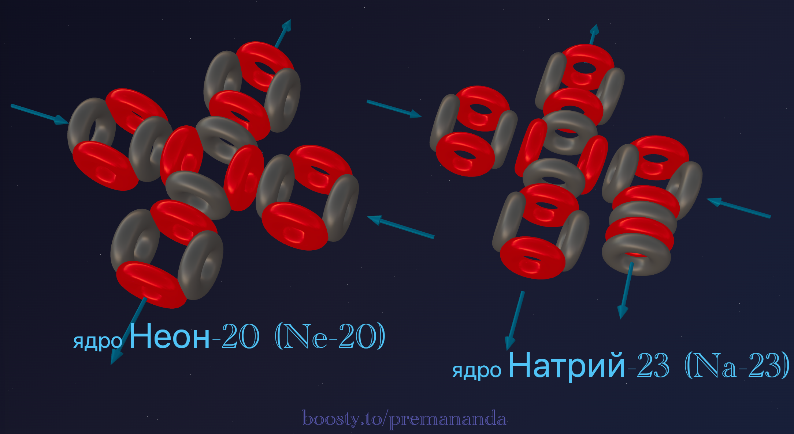
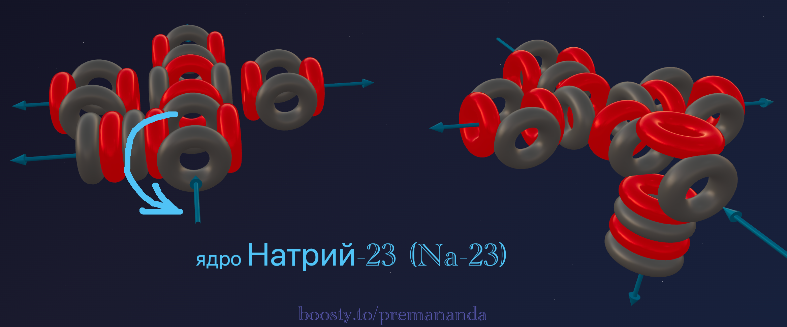
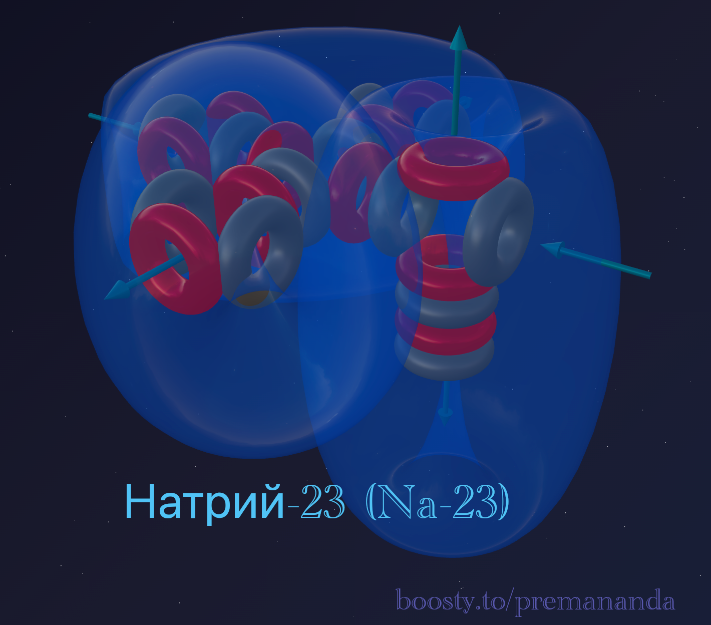

> *"One stone is enough to break a dam."*
>
> — Folk wisdom

In the previous article we admired Neon — an architectural masterpiece of symmetry. Five alpha particles, perfectly packed into a "cross," created an airtight fortress that no chemical reagent could penetrate.

But what happens if we try to add one more brick to this perfect form?

Welcome to the third period. **Sodium** takes the stage.

---

## 📐 Engineering Analysis of the Nucleus

**Sodium-23** is the only stable isotope of Sodium.

**Composition:** 11 protons + 12 neutrons = 23 nucleons.

**Block decomposition:**
- 20 nucleons = **5 alpha particles** (same as Neon);
- remainder: 3 nucleons = 1 proton + 2 neutrons (**triton**).

**Formula:** **²³Na = 5α + t**

The triton plays the role of a "lockbreaker" here — it disrupts the perfect symmetry of the base Neon structure.

---

## 🔬 Building the Model: "Breaking Open the Fortress"

### Step 1: The Neon nucleus as the foundation

The base of Sodium is the closed cross of 5 alpha particles. Inside this framework the aether flows are looped and stable.

### Step 2: Adding the triton and rotating an α-particle

The triton (1p + 2n) does not simply attach to the outside. To hold onto the dense structure, it latches onto one of the lateral alpha particles.

In accepting the extra nucleon, this alpha particle **rotates 90° around its axis**. This is the critical moment:

1. the closed circuit is broken;
2. one "fountain" (outgoing flow) now points **outward**;
3. a **breach** appears in Neon's airtight fortress.

---

## 🌪️ The Mechanics of the Metallic State

Why is Sodium a metal while Neon is a gas? The answer lies in the outward-facing "fountain."

### Open flows

In Neon all flows are closed inside — the atoms do not "see" each other and fly apart. In Sodium, every atom projects one beating fountain outward. When atoms come together, these fountains form shared channels — an **electron gas** that binds the atoms into a soft metallic crystal.

### Conductivity

Aether flows freely through these open channels, which is what gives Sodium its high electrical conductivity.

---

## ⚔️ Sodium vs Fluorine: Mirror Twins

Fluorine (4α + t) and Sodium (5α + t) share the same "tail" (triton), yet they are complete opposites:

- **Fluorine (the predator):** its nucleus (4α) is an incomplete T-shape. The triton there tries to close a gap, creating an aether pull **inward**. Fluorine wants to take from others.
- **Sodium (the donor):** its nucleus (5α) is already complete. The triton is **excess ballast**. The rotated alpha particle creates overpressure that Sodium strives to **release**.

**Analogy:** Fluorine is a hungry predator (a vacuum cleaner). Sodium is an overfilled vessel (an open tap).

---

## 🧪 Nuclear Alchemy: Proof of Structure

Nuclear reactions confirm the formula **Na = 5α + t**.

A proton completes the triton (1p + 2n) into a full alpha particle (2p + 2n), which flies off, exposing pure Neon:

> ²³Na + p → ²⁰Ne + α

An alpha particle collides with Neon, loses one proton on impact, and turns into a triton that "welds" itself onto the framework:

> ²⁰Ne + α → ²³Na + p

---

## 🔮 Model Predictions and Reality

### Prediction №1: valency 1

Only one "fountain" points outward — only one point through which an aether-flow exchange with a neighboring atom is possible.

**Reality:** Sodium is strictly monovalent in all its compounds: NaCl, NaOH, Na₂O — a perfect match with the model.

### Prediction №2: extreme softness

Atoms hold onto each other only through weak "tails" — the metallic lattice is very flexible.

**Reality:** Sodium can be cut with an ordinary knife — a perfect match with the model.

### Prediction №3: low ionization potential

The "extra" electron from the rotated alpha is pushed out by the full force of the Neon framework.

**Reality:** it takes 4 times less energy to remove an electron from Sodium than from Neon — a perfect match.

### Prediction №4: low melting point

The weak bond between nuclei is easily broken by thermal motion.

**Reality:** Sodium melts at just 97.8°C — below the boiling point of water — a perfect match.

---

## 💣 Why Does Sodium Explode in Water?

This is the meeting of an "overfilled vessel" (Sodium) with a "powerful vacuum cleaner" (Oxygen in water). Sodium instantly dumps its excess flow into Oxygen's funnels. This avalanche-like process releases energy that breaks the bonds in water and liberates Hydrogen.

---

## 🌟 Summary

Sodium is a **breached fortress**. One extra nucleon rotates an entire section of the nucleus, turning noble inertness into fierce metallic activity.

---

## 🔮 What's Next?

In the next part — **Magnesium:**
- how symmetry returns through pairing;
- why Magnesium is divalent and where its strength comes from.

---

## 🛠️ Build Your Own Model!

Try building the Sodium-23 nucleus in the online constructor:

👉 [3d-particles-pi.vercel.app](https://3d-particles-pi.vercel.app/)