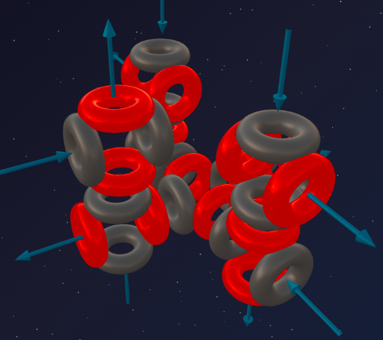
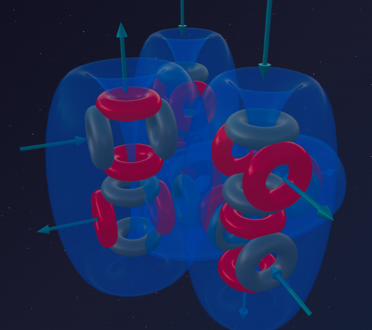

> *"Architecture is frozen music."*
>
> — Johann Wolfgang von Goethe

In the previous article we saw how Phosphorus (7α + t) became yet another element that disrupted symmetry in the period. The extra triton, latching onto Silicon's rigid monolith, rotated one alpha particle and created a local zone of extreme overpressure — and the famous phosphorescent glow.

But Nature always strives for balance. The tension must be released, the triton must be completed, and the asymmetry must be eliminated.

Meet **Sulfur** — the element that brings us back to the perfect, symmetric mathematics of pure alpha blocks. Let's see how this geometry elegantly solves one of chemistry's great puzzles: variable valence (2, 4, and 6).

---

## 📐 Engineering Analysis of the Nucleus

**Sulfur-32** is the primary stable isotope of Sulfur (95% in nature).

**Composition:** 16 protons + 16 neutrons = 32 nucleons.

**Block decomposition:**
- 32 nucleons = exactly **8 alpha particles** (8 × 4 = 32);
- remainder: **0** — no incomplete fragments.

**Formula:** **³²S = 8α**

We return to a clean architecture built exclusively from solid helium bricks. But true ideal symmetry is not here yet — **Argon will be the symmetric one.** Sulfur is an intermediate step: no triton "tail," yet its 8α framework is still asymmetric in form.

---

## 🔬 Building the Model: The Third Column

Let's trace the spatial evolution of the third period:

- **Magnesium (6α)** — base two-axis structure;
- **Silicon (7α)** — the second column added, a symmetric monolith with 4 funnels;
- **Sulfur (8α)** — the third column is added.

The eighth alpha particle attaches to the Silicon framework, opening new bonding planes. The structure becomes more massive, but not more symmetric — the internal pressure is distributed unevenly, and this determines Sulfur's chemical behavior.

---

## 🏢 The Architecture of Funnels

Let's trace the mathematical progression of open funnels:

- **Neon (5α)** — 0 funnels (sealed lock);
- **Magnesium (6α)** — 2 funnels (one axis opened);
- **Silicon (7α)** — 4 funnels (lateral columns activated);
- **Sulfur (8α)** — **6 funnels** (third column activated).

The structure projects 6 active ports outward, divided into two groups: **4 less protruding** (inherited from the Silicon base) and **2 more protruding** (introduced by the 8th alpha particle).

---

## 🧪 Nuclear Alchemy: Proof of Structure

Nuclear reactions confirm the formula **S = 8α**.

Adding an alpha particle to Sulfur yields the next alpha-element — Argon:

> ³²S + α → ³⁶Ar + γ

Stripping an alpha particle returns us to Silicon:

> ³²S → ²⁸Si + α

A proton strike completes the triton into a full alpha particle, which flies off, exposing Phosphorus:

> ³²S + p → ³¹P + d

All reactions confirm the formula: **S = 8α**.

---

## 🔮 Model Predictions and Reality

### Prediction №1: maximum valence 6

The number of outward-facing funnels determines the maximum number of chemical bonds. The 8α framework of Sulfur has exactly 6.

**Reality:**
- SF₆ (sulfur hexafluoride) — Sulfur bonds with exactly six Fluorine atoms — a perfect match with the model;
- H₂SO₄ (sulfuric acid) — Sulfur uses all 6 bonds to hold its oxygen environment — a perfect match.

### Prediction №2: solving the variable valence puzzle (2, 4, and 6)

School chemistry simply makes students memorize: "Sulfur exhibits valences of 2, 4, and 6." Why are the numbers even? Why do they change? Ether dynamics gives a geometric answer.

Depending on the strength of its partner, Sulfur activates its ports in stages:

- **Valence 2 (H₂S — hydrogen sulfide):** weak Hydrogen atoms latch only onto the two most outward-protruding funnels. The remaining four ports are not activated.
- **Valence 4 (SO₂ — sulfur dioxide):** powerful Oxygen activates the four less protruding ports. The two remaining funnels are closed onto themselves.
- **Valence 6 (SO₃, SF₆):** the most aggressive partners literally "throw open" the Sulfur atom, forcing all 6 ports into action.

Variable valence is the sequential activation of the functional nodes of a 3D structure. The even numbers arise from the symmetric, pairwise switching-on of funnels — a perfect match with the model.

### Prediction №3: polymerization into "crowns" (S₈)

Sulfur has 6 funnels, yet it does not form an ultra-strong monolithic solid like diamond. The two most outward-protruding funnels are ideal for linear bonding, but due to the bulkiness of the atoms the chain bends — and on the eighth atom it closes back on itself.

The molecule **S₈** forms — a molecular "crown." This is why Sulfur is a solid, but a brittle one (crowns are easy to separate from each other) and low-melting (melts at 115°C) — a perfect match with the model.

### Prediction №4: kinship with Oxygen

Sulfur sits directly below Oxygen in the periodic table. Their ether dynamics kinship is clear:

- **Oxygen = 4α** (2 funnels);
- **Sulfur = 8α** (6 funnels).

Where Oxygen forms oxides (H₂O, Fe₂O₃), Sulfur forms sulfides (H₂S, FeS₂ — pyrite). The heavy base of Sulfur (8α) makes its flow more inertial — Sulfur is a "slower" oxidizer than the light, aggressive Oxygen — a perfect match with the model.

---

## 🌟 Summary

Sulfur (8α) is the addition of the third column in the third period. No triton "tail," but no ideal symmetry either — that will come only with Argon.

The ether dynamics of the 8α framework brilliantly predicts exactly 6 chemical funnels divided into two functional groups. This allows us to explain **variable valence (2, 4, 6)** without quantum paradoxes — as the step-by-step activation of different ports depending on the strength of the chemical partner.

---

## 🔮 What's Next?

Symmetry is partially restored, but the period is not yet closed. In the next part — **Chlorine:**
- what happens when a triton is attached to Sulfur's 8α framework;
- why Chlorine (8α + t) became one of the most aggressive predators on the planet;
- how one proton turns a yellow stone into a suffocating green gas.

---

## 🛠️ Build Your Own Model!

Try building the Sulfur-32 nucleus in the online constructor:

👉 [3d-particles-pi.vercel.app](https://3d-particles-pi.vercel.app/)