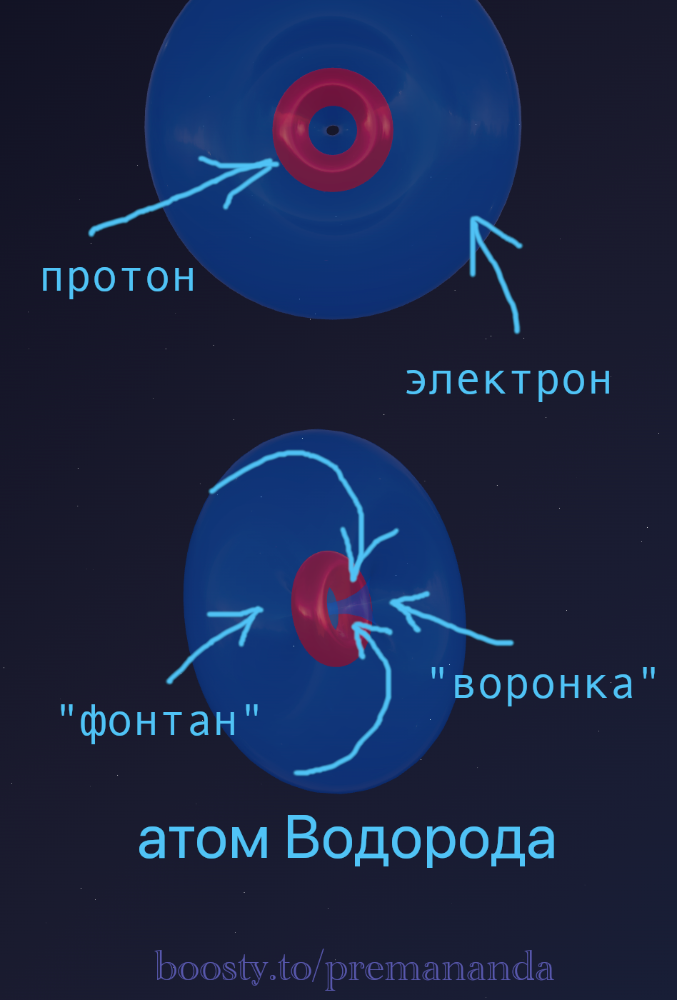

> "Truth never triumphs. Its opponents simply die out."
>
> — Max Planck

---

## 🤝 Acknowledgments

This article emerged as a result of a fascinating discussion on the **[OseniloForum](https://t.me/OseniloForum)**. I want to thank all the participants of the discussion, especially **Maxim** and **Costa**, for their valuable ideas and constructive criticism.

**Important note**: The model presented here is a **working hypothesis** that requires further reflection and verification. It does not claim to be the absolute truth, but offers a new perspective on the nature of the electron and electrical current.

I invite everyone interested to **join the discussion on the forum**, create their own articles, and share their thoughts. Together we can advance further in understanding nature!

---

What if our fundamental understanding of the electron is wrong? What if it is not a little sphere or a probability cloud, but a **vortex process** in an etheric medium?

## 🔍 The Paradox of Modern Science

Modern science finds itself in a strange position. If you ask a physicist what an electron in a metal is, they will say:

*"It is a free particle, part of an electron gas, randomly roaming the lattice."*

But if you ask a chemist, they will object:

*"Electrons are rigid bonds that hold atoms together, creating strong molecules and crystals."*

### The Main Contradiction:

How can the exact same thing be both a "disembodied gas" and a "super-strong glue"? Why do metals conduct electricity while diamonds do not, even though both contain electrons?

**Hypothesis**: The answer may lie in the fact that our fundamental visualization of the electron is flawed. Perhaps it is not a sphere or a probability cloud, but a **vortex process in the ether medium**.

---

## ⚛️ What is an electron? (Hypothesis)

Forget about the Bohr planetary model for a moment. Let's try to look at the atom differently.

**Assumption**: The atom is not a void with flying spheres, but a complex hydrodynamic mechanism operating in the ether medium.

### Two Key Zones of the Atom:

1. **🔴 "Fountain" (Ejection Zone)** — a high-pressure zone. The nucleus constantly generates and ejects a flow of ether outward.
2. **🔵 "Funnel" (Suction Zone)** — a low-pressure zone where the ether must return to complete the cycle.

### The Electron as a Flow of Ether

**Hypothesis**: The electron is not a sphere or a probability cloud, but a **toroidal vortex** that erupts from the high-density "Fountain", makes a loop in space, and returns to the low-pressure "Funnel".

Every vortex electron has **both a funnel (inlet) and a fountain (outlet)** — it is a single closed cycle. However, **which part of this vortex protrudes more beyond the atomic nucleus** determines the chemical properties of the element:

1. **The "Funnel" Dominates (Non-metals / Oxidizers):**
   Due to the incomplete internal structure of the nucleus, the low-pressure zone is exposed to the outside. The vortex loop is "pulled" inward. The atom works like a "vacuum cleaner" (e.g., Fluorine). It has high electronegativity and seeks to suck in foreign ether flows (electrons) to stabilize its own vortex.

2. **The "Fountain" Dominates (Metals / Donors):**
   In elements with dense, completed, or "hacked" noble gas nuclei (e.g., Sodium or Magnesium), internal pressure pushes the flow outward. The high-pressure zone prevails, and the electron vortex itself is pushed outside the dense nucleus. This atom has nothing to suck in foreign electrons with, but it easily gives away its protruding "fountain", acquiring metallic properties and low (sometimes zero) electronegativity.

> **Interesting fact**: In 2013, scientists used a photoionization microscope to capture the first direct images of a hydrogen atom. The images clearly show not a dot-like structure, but a ring shape with an empty center, highly reminiscent of the axis of a toroidal vortex.

---

## 🔗 The Anatomy of a Bond: The Piping System of Matter

The main question we discussed on the forum is: how do atoms connect to each other? In etherdynamics, atoms do not collide with solid shells. They intertwine their vortex flows.

When two atoms approach each other, their outer vortices (electrons) can merge. The vortices of neighboring atoms dock together, forming a single system. It is similar to welding pipes into a single framework.

This is where the secret to the strength of matter may lie: **the hardness of a material is provided by the rigidity of the ether vortex interlocking**. Spinning ether possesses gyroscopic properties — it is elastic and stable. By intertwining, the vortices form a rigid spatial lattice. Therefore, both metal and stone are solid — their atoms are "welded" by ether flows.

---

## 💡 The Mystery of Conductivity: Straight Highways vs. Winding Paths

If both metals and dielectrics (insulators) rely on the same principle of vortex interlocking, why do some conduct electricity while others do not?

**Hypothesis: Flow geometry is the deciding factor.** Conductivity is determined not by the presence or absence of channels, but by the turning angle of the ether flow as it passes from atom to atom.

### 🌊 How does ether flow in different materials?

#### ⚡ Metals: Straight Highways
Vortex tubes align almost rectilinearly from atom to atom. The flow moves practically in a straight line: **Atom → Atom → Atom → Atom**.
Result: minimal energy loss on turns, the ether flows freely.

#### 🔄 Semiconductors: Moderate Turns
Vortex tubes make slight turns when transitioning from atom to atom. The flow slows down at the bends, creating resistance.

#### 🚫 Dielectrics: A Maze of Dead Ends
Vortex tubes make sharp turns, forming closed loops and zigzags. The flow can even turn 180°, returning to the original atom. The external ether flow cannot pass through — every turn dampens its energy.

---

## 📊 The Principle of Rectilinearity

**Hypothesis**: The straighter the ether channels between atoms are aligned, the better the current flows.

Road analogy:
- **Autobahn (metals)** — flows rush at high speed.
- **Winding mountain road (semiconductors)** — movement is slowed down but possible.
- **Maze with dead ends (dielectrics)** — pass-through movement is practically impossible.

### ⚡ What is Electrical Current?

**Current is the movement of free ether through an already existing structure of bonds.**

Imagine a plumbing system. The pipes themselves (vortex electrons) remain in place; they are rigidly fixed and hold the shape of the building. But if we create a pressure difference (voltage), water (ether) will flow *through* these pipes.

- **The "electrons" themselves (as structural elements) do not run anywhere.** They serve as the riverbed.
- We do not break atomic bonds by applying current. We simply use them as a transport network.

---

## 🌟 Summary

1. The **electron** is not a particle, but a dynamic flow of ether.
2. The **solidity of matter** is the result of these flows intertwining into a rigid gyroscopic framework.
3. **Electrical current** is a directed flow of ether through the channels of this framework.
4. The **atom is not isolated** — it constantly breathes ether through its "Fountains" and "Funnels".

It is exactly this breath, perhaps, that binds all matter in the Universe into a single whole.

---

## 🔮 Open Questions

This model is just the beginning. Much requires further development:
- How exactly does the mechanism of vortex interlocking work on a geometric level?
- Is it possible to mathematically calculate conductivity knowing the turning angles of vortex electrons?
- How can we explain the properties of semiconductors (p-n junctions) within the framework of ether hydrodynamics?

---

## 💬 Join the Investigation!

We invite you to create your own articles, share your thoughts on the **[OseniloForum](https://t.me/OseniloForum)**, and help develop this hypothesis. Together we can advance further in understanding the nature of matter!