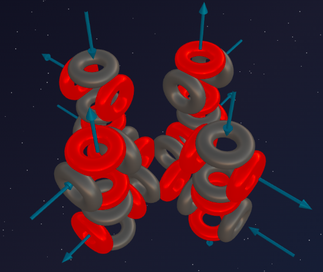

> «Совершенство достигнуто не тогда, когда нечего добавить, а тогда, когда нечего отнять»
>
> — Антуан де Сент-Экзюпери

Мы прошли долгий и бурный путь по третьему периоду Таблицы Менделеева. Мы видели, как Натрий (5α+t) и Алюминий (6α+t) нарушали симметрию своими тритонами, рождая активные металлы. Мы видели монументальные симметричные кресты Кремния (7α) и Серы (8α). И мы только что изучили ярость химического хищника — Хлора (8α+t).

И вот, наконец, к Хлору присоединяется последний протон. Тритон захлопывается, достраиваясь до полноценной 9-й альфа-частицы. Асимметрия исчезает.

Перед нами **Аргон** — абсолютно спокойный, безмятежный и невидимый газ. Третий период закрыт. Давайте заглянем внутрь этой совершенной эфирной капсулы.

---

## 📐 Инженерный анализ ядра

**Аргон-36** — базовый стабильный изотоп, формирующий архитектуру элемента (именно он синтезируется в недрах звёзд при горении кремния).

*Примечание: В земной атмосфере 99% составляет Аргон-40 (результат распада калия-40). Эти 4 лишних нейтрона — просто «балласт», налипший на идеальный каркас. Архитектором химии является Ar-36.*

**Состав Ar-36:** 18 протонов + 18 нейтронов = 36 нуклонов.

**Разложение на блоки:**
- 36 нуклонов = ровно **9 альфа-частиц** (9 × 4 = 36).
- Остаток: **0** — никаких тритонов или «хвостиков».

**Формула:** **³⁶Ar = 9α**

---

## 🔬 Построение модели: четыре колонны

Как природа складывает 9 альфа-частиц? Кремний (7α) и Сера (8α) росли вширь, формируя массивный крестообразный фундамент. В Аргоне этот фундамент уплотняется и достраивает вертикали.

**Архитектура Аргона (9α) — это 4 двухэтажные колонны на единой центральной базе.**

1. **Фундамент (1α):** В центре находится базовая альфа-частица. Она служит перекрёстком, на котором держится вся надстройка.
2. **Колонны (8α):** Ко всем четырём портам центрального фундамента прикрепляются вертикальные «башни». Каждая башня состоит из двух альфа-частиц (это развитие «второго этажа», начатого ещё в Магнии).
   - 4 колонны × 2 альфа-частицы = 8α.
   - **Итого:** 1 центральная + 8 в колоннах = **9 альфа-частиц**.

У центральной базовой частицы больше нет свободных портов. Все её внутренние узлы перегружены на 100%. Это предел текущей 3D-матрицы. Третий период окончен — строить дальше некуда, базу придётся расширять в 4-м периоде.

---

## 💥 Главная загадка: валентность ноль

Глядя на модель 4-х двухэтажных колонн, возникает вопрос: *«Если фундамент занят, то на концах колонн должны оставаться открытые порты? Почему же Аргон инертен?»*

Здесь эфиродинамика демонстрирует потрясающую геометрическую красоту — **эфирное самозамыкание**.

### Эфирный кокон

Открытые на концах колонн порты (фонтаны и воронки) действительно существуют. Но они не торчат в пустоту — они **закольцованы друг на друга**.

1. Поток эфира, вылетающий из фонтанов на вершинах одних колонн, не уходит в бесконечность.
2. Под действием давления всасывающих воронок соседних колонн линии эфирного потока изгибаются и замыкаются сами на себя.
3. Вокруг атома Аргона образуется сплошной, вращающийся тороидальный щит.

Атом Аргона полностью зациклен сам на себе. Внешнему элементу (даже Фтору) не хватает сил пробить этот плотный защитный экран. Зацепиться за Аргон невозможно.

**Валентность 0** — это не магия «заполненного октета», а банальное **геометрическое короткое замыкание** эфирных потоков внутри одной симметричной 9α-матрицы.

---

## 🔮 Прогнозы модели и реальность

### Прогноз №1: почему Аргон — газ?

Тяжёлая Сера (8α) — твёрдый камень. Монументальный Кремний (7α) — алмаз. Почему Аргон, который тяжелее их всех, является одноатомным **газом**?

Ответ в эфирном коконе. У Аргона идеально гладкая, запертая эфирная оболочка. Атомы аргона сталкиваются своими упругими магнитными щитами и отскакивают друг от друга, как абсолютно гладкие бильярдные шары. У них нет «якорей» или «крючков», чтобы зацепиться за соседей — полное совпадение с моделью.

### Прогноз №2: границы инертности

В 2000 году химики получили первое искусственное соединение — гидрофторид аргона (HArF), но только при температуре -265 °C и облучении ультрафиолетом.

**Объяснение:** При температурах, близких к абсолютному нулю, эфирные вибрации (тепло) почти исчезают. Эфирный щит «остывает», его упругость падает, и в этот момент суперхищник Фтор получает шанс пробить «броню» Аргона.

---

## 💡 Узоры Таблицы: большой круг пройден

Эфиродинамическая модель показывает поразительное архитектурное подобие периодов:

1. **Запечатанные фундаменты (инертные газы):**
   - Период 2: **Гелий (1α)** — фундамент-шарик.
   - Период 3: **Неон (5α)** — запечатанный «первый этаж».
   - Период 4: **Аргон (9α)** — запечатанный «второй этаж».

2. **Нарушители симметрии (щелочные металлы):**
   - Период 2: **Литий (1α + t)** — сломанный шарик.
   - Период 3: **Натрий (5α + t)** — взломанный замок Неона.
   - Период 4: **Калий (9α + t)** — Калий взламывает эфирный кокон Аргона.

Природа перебрала все комбинации на фундаменте одной базовой частицы, надстроив к ней всё, что могло уместиться. Замок Аргона захлопнут.

---

## 🔑 Итог

Аргон — это шедевр замкнутой геометрии. Архитектура из 9 альфа-частиц перегружает внутренние связи атома, но создаёт идеальный механизм самозамыкания потоков.

Ядро помещает само себя в непроницаемый эфирный кокон. Так рождается благородный газ (валентность 0). Гладкий, ни с чем не взаимодействующий шар. Третий период таблицы Менделеева закрыт.

Но в недрах звёзд уже зреет новый протон, который ударит по этому кокону, чтобы начать новый — четвёртый период.

---

## 🔮 Что дальше?

Мы раскрыли секреты идеальных конструкций (Углерод, Неон, Кремний, Аргон) и разгадали тайны элементов-нарушителей симметрии (Хлор, Натрий).

Впереди **Четвёртый период**: появление тяжёлых переходных металлов (Железо, Медь), где природа начнёт строить внешние слои и магнитные домены.

---

## 🛠️ Создайте свою модель!

Попробуйте построить ядро Аргона-36 (9α) в онлайн-конструкторе:

👉 [3d-particles-pi.vercel.app](https://3d-particles-pi.vercel.app/)
