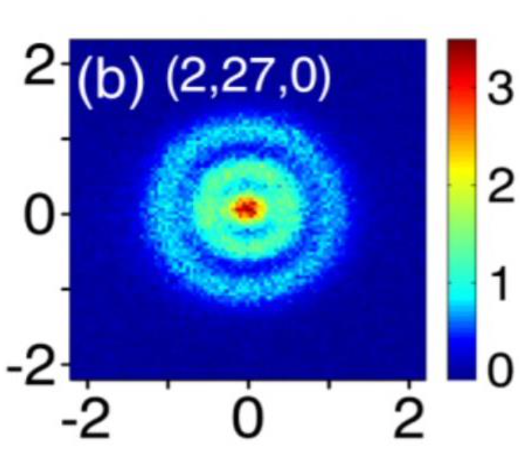
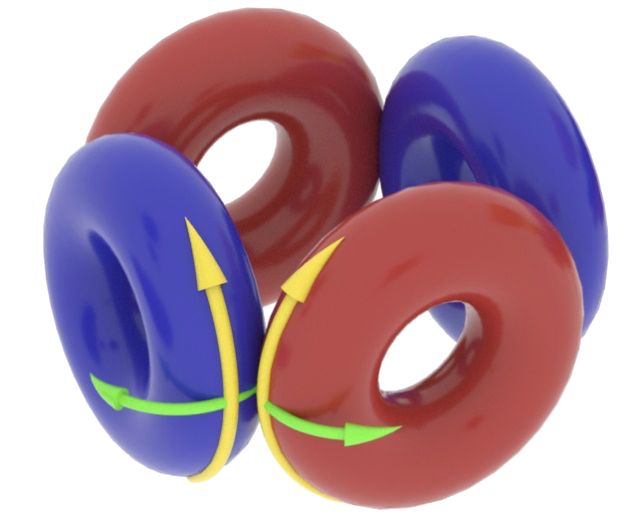

> **Это первая статья из серии.** Далее последуют материалы, в которых мы шаг за шагом будем развивать и уточнять модель строения вещества — от элементарных частиц до атомных ядер и молекул. Следите за продолжением.

---

## О серии статей

Данная серия посвящена развитию **теории эфиродинамики**, заложенной Владимиром Акимовичем Ацюковским (1930–2021) — российским инженером и исследователем, автором фундаментального труда «Общая эфиродинамика. Моделирование структур вещества и полей на основе представлений о газоподобном эфире». В своих работах Ацюковский рассматривал эфир как реальную вязкую сжимаемую газообразную среду, а элементарные частицы — как устойчивые вихревые образования в этой среде. Его идеи и сегодня продолжают вдохновлять исследователей по всему миру.

Видеолекции Владимира Акимовича доступны на его [YouTube-канале](https://www.youtube.com/@АцюковскийЭфиродинамика). Параллельно большую работу по популяризации и развитию этих идей ведёт Дмитрий Лосинец — его канал: [Эфиродинамика на YouTube](https://www.youtube.com/@OseniloEther).

Цель серии — не просто изложить существующие модели, но и критически осмыслить их, найти слабые места и предложить уточнения. Это живое исследование, а не учебник.

---

## Введение

Эта статья — попытка разобраться в том, как же на самом деле выглядят и функционируют атомы. В основе — исследования многих учёных, как признанных научным сообществом, так и пока малоизвестных широкой публике.

Особое внимание я уделил работам Дмитрия Лосинца, который проделал огромную работу — результатом стала правдоподобная «Теория Всего». Сам автор признаёт, что некоторые участки модели требуют дальнейшей проработки. К примеру, увидев, как в его представлении выглядит альфа-частица, я усомнился в стабильности такой конструкции. При этом многочисленные эксперименты показывают, что альфа-частица чрезвычайно устойчива и служит основным «строительным блоком» для более тяжёлых атомных ядер.

---

## 🌀 Основы эфиродинамики

Итак, начнём по порядку. Согласно эфиродинамической модели, протоны, нейтроны и электроны представляют собой тороидальные образования, состоящие из эфира.

> «Эфир — это почти сверхтекучая среда, в которой частицы, поля и силы возникают как вихревые структуры»
>
> — Д. Лосинец

Примерно так может выглядеть протон:

> «Предполагаемой физической моделью элементарной частицы в рамках эфиродинамической концепции является тороидальный вихрь эфира, обладающий кольцевым и тороидальным вращением, либо комбинация таких вихрей»
>
> — Д. Лосинец

Нейтрон отличается от протона наличием дополнительного слоя эфира, который существенно изменяет свойства частицы. Этот дополнительный слой прекращает самостоятельное всасывание эфира через внутреннее отверстие тора, что и обеспечивает электрическую нейтральность частицы. Но эфир через внутреннее отверстие нейтрона проходит, когда есть разность давлений между противоположными сторонами — по закону Бернулли. Это крайне важно для понимания того, как строятся атомы.

---

## 🔬 Прямое наблюдение электронной орбитали

Речь идёт о первом в истории «прямом наблюдении» электронной орбитали атома водорода.

### Кто и когда провёл эксперимент

Исследование было выполнено группой учёных из Института атомной и молекулярной физики (AMOLF) в Нидерландах. Результаты опубликованы в *Physical Review Letters* в 2013 году ([PhysRevLett.110.213001](https://doi.org/10.1103/PhysRevLett.110.213001)).

### Принцип работы
Учёные использовали **фотоионизационный микроскоп**. Методика эксперимента:

1. Атом водорода помещали в сильное электрическое поле.
2. Затем атом облучали лазерными импульсами для возбуждения электрона.
3. Возбуждённый электрон покидал атом и регистрировался детектором.

Красные области на полученном изображении соответствуют наибольшей вероятности выбить электрон, фиолетовые — наименьшей.

Традиционная наука интерпретирует полученные результаты с помощью квантовой механики.

### 💡 Эфиродинамическая интерпретация (Гипотеза)

В то время как квантовая механика описывает электрон как «облако вероятностей» или волновую функцию без чёткой пространственной структуры, **эфиродинамическая модель предлагает рассматривать его как реальный физический объект**, подчиняющийся законам газовой динамики.

#### Природа и происхождение электрона

В рамках данной гипотезы электрон представляет собой тороидальный вихрь эфира. Это не статичное образование, а динамический процесс: поток эфира непрерывно выбрасывается из нуклона (ядра), совершает петлеобразное движение и втягивается обратно.

При таком подходе меняется представление о формировании атома:

- **Генерация, а не захват.** Электрону не нужно прилетать извне, чтобы быть захваченным полем ядра. Он генерируется самим ядром.
- **Единая система.** Поскольку электрон — это поток эфира, он является прямым следствием внутренней структуры нуклона. Как только формируется ядро, оно неизбежно создаёт вокруг себя вихревые оболочки (электроны) как результат циркуляции среды.

Таким образом, электрон — это «дыхание» ядра, его неотъемлемая динамическая часть, имеющая значительно меньшую плотность и больший объём по сравнению с самим нуклоном.

#### Анализ эксперимента

Представленное учёными «фото» атома получает логичное объяснение через механику вихря:

- **Уязвимость центра.** На картинке видно, что разрушение структуры (выбивание электрона) происходит наиболее эффективно при воздействии на центральную область. В модели тороидального вихря центр — это ось циркуляции потока. Именно здесь проходит наиболее плотный и быстрый поток эфира, связывающий периферию вихря с ядром.
- **Устойчивость периферии.** Внешняя часть тора («тело» электрона) имеет низкую плотность. Энергетическое воздействие на эту область проходит сквозь разреженную среду, не нарушая общей стабильности системы.
- **Механизм разрушения.** Точечный удар в геометрический центр прерывает основной канал циркуляции (вход/выход потока), что приводит к мгновенному распаду всего вихревого образования.

Это подтверждает предположение, что электрон имеет сложную внутреннюю топологию с выраженным осевым каналом, а не является однородным вероятностным облаком.

---

## 🧩 Вопрос об альфа-частице

Теперь вернёмся к альфа-частице. В книге Дмитрия Лосинца «Вся физика на 100 листах» она изображена как комбинация нуклонов. Глядя на этот рисунок, я усомнился в механической прочности такой конструкции.

Это сомнение особенно усиливается, если учесть, что альфа-частица является **исключительно устойчивым образованием**. Именно она служит «кирпичиком», который активно используется для формирования более тяжёлых атомных ядер.

Как вы думаете, способна ли такая структура обеспечить необходимую стабильность? Этот вопрос станет отправной точкой для **второй части** серии.

---

*Продолжение следует. Во второй части мы разберём строение альфа-частицы подробнее и попробуем предложить более устойчивую конфигурацию.*