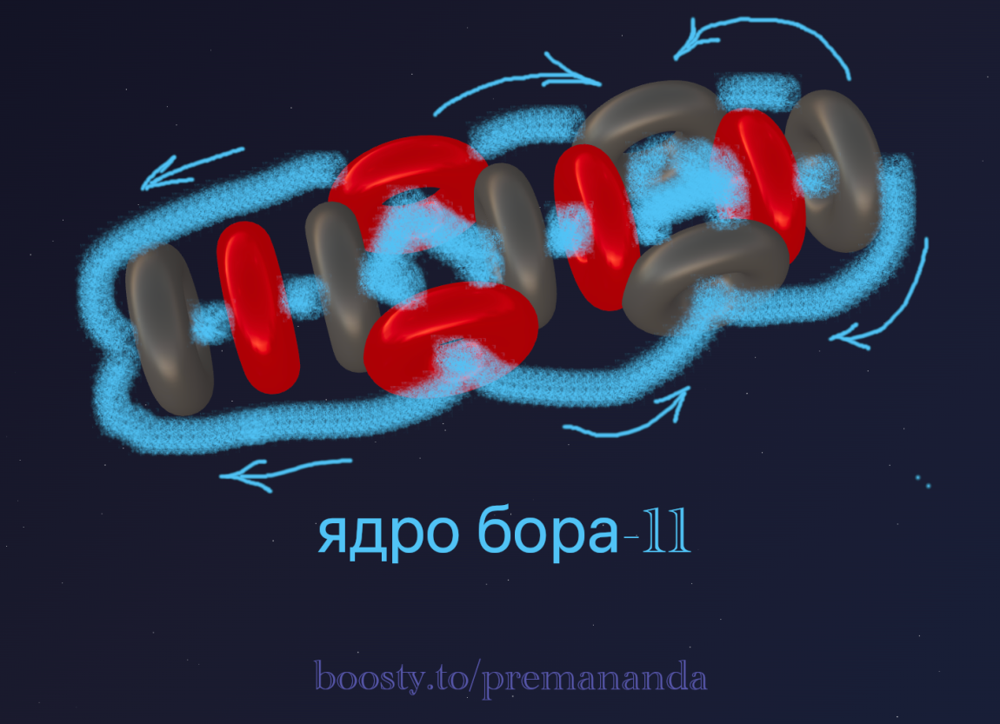

> «Природа проста и не роскошествует излишними причинами»
>
> — Исаак Ньютон

---

## 🔬 Бор: пятый элемент

После рассмотрения альфа-частицы и лёгких элементов переходим к бору.

Бор (B, атомный номер 5) занимает особое место в периодической системе элементов. Он обладает уникальными свойствами полуметалла, сочетая характеристики металлов и неметаллов.

### ⚛️ Изотопы бора

Бор имеет два стабильных изотопа:

**Бор-10 (¹⁰B)** — стабильный
- Состав: 5 протонов + 5 нейтронов
- Распространённость: ~19,9% природного бора
- Особенность: Очень высокое сечение поглощения тепловых нейтронов (~3840 барн)

**Бор-11 (¹¹B)** — стабильный
- Состав: 5 протонов + 6 нейтронов
- Распространённость: ~80,1% природного бора
- Особенность: Более стабильный изотоп
- Сечение поглощения нейтронов: ~0,005 барн (в ~770 раз меньше, чем у ¹⁰B!)

---

## 🌀 Структура ядра бора-11

Рассмотрим наиболее распространённый изотоп — бор-11. Ключевой вопрос: как 5 протонов и 6 нейтронов могут образовать устойчивую конфигурацию?

### Гипотеза структуры

Исходя из принципов эфиродинамики и учитывая стабильность бора-11, предлагается следующая модель:

**Ключевые особенности конфигурации:**

1. **Линейно-спиральное расположение**: Протоны (красные) и нейтроны (серые) чередуются вдоль центральной оси.
2. **Асимметрия конфигурации**: В отличие от симметричного гелия, структура бора асимметрична.
3. **Потоки эфира (синие стрелки)**: Образуют замкнутую систему циркуляции, создавая «гидродинамическую стяжку», удерживающую структуру.

---

## ⚡ Почему бор-10 так активно поглощает нейтроны?

Это один из самых интересных вопросов! Бор-10 работает как «нейтронная губка».

**Реакция:**
> ¹⁰B + n → ⁷Li + ⁴He (α) + 2,79 МэВ

При попадании нейтрона в ¹⁰B происходит дестабилизация структуры и распад на литий-7 и альфа-частицу с выделением энергии.

### 🧲 Ядерный спин и магнитные свойства

| Изотоп | Спин | Магнитный момент |
|---|---|---|
| **Бор-10** | 3 | 1,8006 μₙ |
| **Бор-11** | 3/2 | 2,6886 μₙ |

---

## 🎨 Электронная оболочка

Бор имеет электронную конфигурацию: **1s² 2s² 2p¹**. Три электрона на внешнем уровне определяют его химические свойства:
- Образует ковалентные связи (B₂O₃, BF₃)
- Валентность обычно 3
- Проявляет свойства неметалла

### Эфиродинамическая интерпретация

Согласно эфиродинамической модели, электроны генерируются самим ядром — как вихревые оболочки, возникающие в результате циркуляции эфира. Подробнее этот механизм рассмотрен в [первой части серии](/blog/atom-structure-part-1). Применительно к бору:

- **Первый слой (1s²):** 2 электрона формируются в ближних потоках эфира вокруг ядра.
- **Второй слой (2s² 2p¹):** 3 электрона возникают в более удалённых зонах циркуляции.

Внешний электрон (2p¹) наименее связан с ядром и легко участвует в химических связях.

---

## 🛠️ Создайте свою модель!

Хотите поэкспериментировать с конфигурацией ядра бора? Воспользуйтесь онлайн-конструктором:

👉 [3d-particles-pi.vercel.app](https://3d-particles-pi.vercel.app/)

Попробуйте:
1. Создать альтернативную модель бора-10.
2. Сравнить стабильность разных конфигураций.

---

## 🤔 Открытые вопросы

1. **Почему природа «предпочла» бор-11?** Почему 80% природного бора — это ¹¹B, а не симметричный ¹⁰B?
2. **Переход к углероду.** Как добавление ещё одного протона и нейтрона изменит конфигурацию?
3. **Формирование электронных оболочек.** Как именно геометрия ядра определяет, сколько электронных слоёв и какой формы оно порождает?