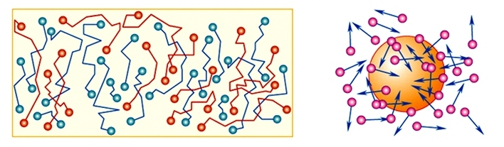
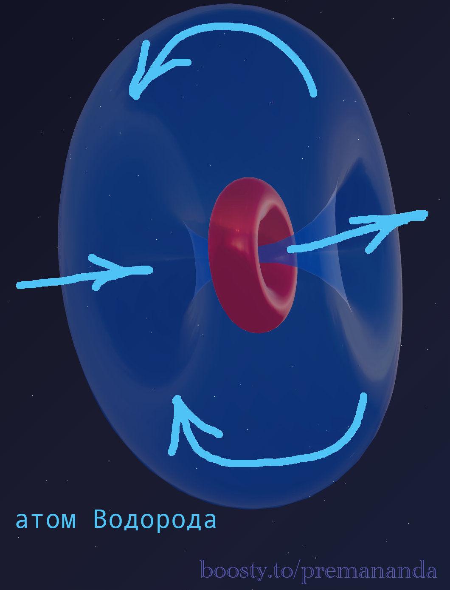
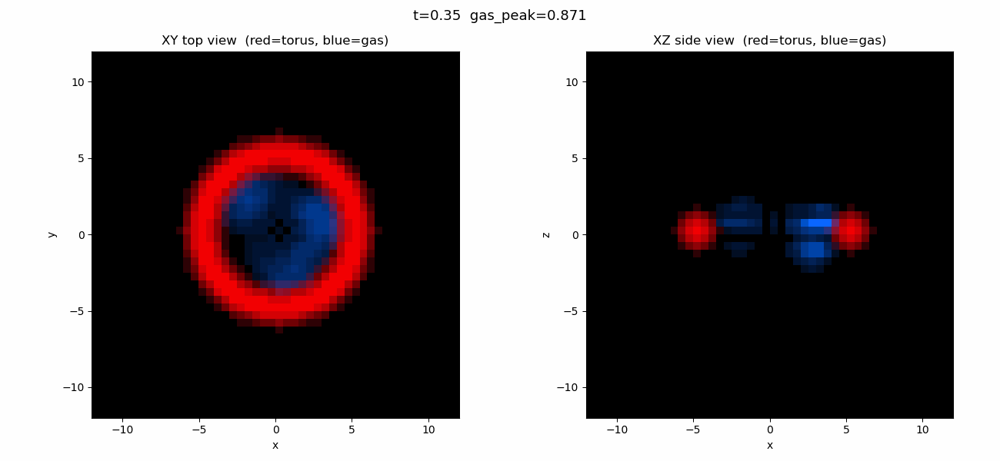

> «Я никогда не буду удовлетворён, пока не смогу сделать механическую модель объекта. Если я могу сделать механическую модель — я понимаю это. Если не могу — не понимаю».
>
> — Уильям Томсон (Лорд Кельвин)

Мы привыкли слышать: «Тепло — это движение молекул». Но задавали ли вы себе детский вопрос: **а кто их толкает?**

Почему частица пыльцы в воде вечно танцует (броуновское движение)? Откуда берётся энергия для этого бесконечного танца? Академическая физика объясняет: «Удары молекул». Но молекулы тоже движутся вечно. Это похоже на вечный двигатель, который наука запрещает, но сама же использует в основе термодинамики.

Давайте разберёмся, что именно говорит официальная наука — и где в её объяснении зияет дыра.

---

## 📊 Что говорит официальная наука

Молекулярно-кинетическая теория (МКТ) — фундамент современной термодинамики. Вот её суть:

1. **Все частицы находятся в непрерывном хаотическом движении** — при любой температуре выше абсолютного нуля.
2. **Температура — это мера средней кинетической энергии** частиц.
3. **Броуновское движение** объясняется нескомпенсированными ударами молекул среды по микрочастице.

Теоретическое объяснение броуновского движения дал Эйнштейн в 1905 году. Всё звучит логично, пока мы не спросим о первопричине.

---

## ⚠️ Где спрятан сбой?

### Тавтология первопричины

— Почему атомы движутся?
— Потому что у них есть кинетическая энергия.
— Откуда кинетическая энергия?
— Она пропорциональна температуре.
— А откуда температура?
— Температура — это мера кинетической энергии.

Замкнутый круг. Теория не объясняет **источник** движения. Она просто постулирует, что частицы всегда двигались.

### Нулевые колебания: квантовая заплатка

Эксперименты показывают, что атомы вибрируют даже при абсолютном нуле (T = 0 K). Квантовая механика объясняет это принципом неопределённости: «Им запрещено останавливаться». Но это не объяснение механизма, это просто запрет задавать вопрос.

---

## 📐 Эфиродинамический ответ: атом — это реактивный двигатель

Эфиродинамика даёт простой инженерный ответ: **атом — это не бильярдный шар. Атом — это реактивный двигатель.**

### Механизм

Протон — это тороидальный вихрь эфира. Он работает как насос: всасывает эфир с одной стороны и выбрасывает с другой.

Молекула состоит из множества атомов с разными ориентациями. Эфир одновременно выбрасывается и втягивается в разных направлениях со всех сторон молекулы. Суммарный вектор этих потоков в каждый момент времени случаен — именно он и придаёт молекуле хаотический толчок в произвольном направлении.

**То, что мы наблюдаем как хаотическое движение молекул — это работа миллиардов микроскопических реактивных двигателей.**

Именно непрерывная и разнонаправленная работа этих эфирных насосов внутри каждой молекулы порождает её постоянное движение.

---

## 🔬 Нулевые колебания — без квантовой магии

Теперь понятно, почему атомы вибрируют даже при абсолютном нуле.

- Протон — это **насос, у которого нет выключателя**. Он не может перестать перекачивать эфир, потому что он сам и есть этот перекачивающий вихрь. Остановить протон — значит уничтожить его.
- Даже при T = 0 K протон продолжает работать. Эта работа создаёт минимальную вибрацию — те самые нулевые колебания.

Это как дизельный двигатель на холостом ходу — он вибрирует, даже если машина никуда не едет. У него нет состояния «включён, но абсолютно неподвижен».

---

## 🌟 Итог

- **Протон** всасывает и выбрасывает эфир — создаётся реактивная тяга.
- Эфир выбрасывается и втягивается одновременно в разных направлениях со всех сторон молекулы, создавая случайный суммарный толчок.
- Миллиарды атомов с хаотическими толчками — это и есть **тепловое движение**.

**Броуновское движение** — это видимый результат работы триллионов атомных реактивных двигателей, непрерывно бомбардирующих пылинку со всех сторон.

Атом не «имеет» движение. Атом **производит** движение.

---

## 🔮 Что дальше?

В следующей части — **эфир и релятивизм:**
- гравитация — притяжение или поток?
- замедление времени через гидродинамику;