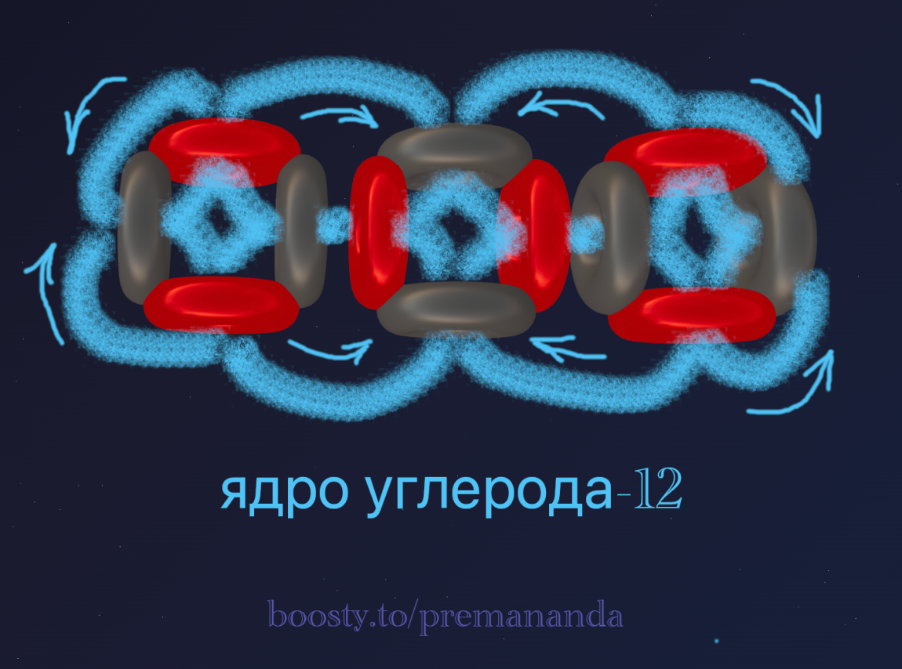

> «Простота — это высшая степень изысканности»
>
> — Леонардо да Винчи

В прошлых частях мы разобрали, почему гелий-4 является идеальным «кирпичиком» материи, и почему для стабильности ядра необходима не просто сумма протонов и нейтронов, а правильная геометрическая укладка торов, обеспечивающая замкнутость эфирных потоков.

Сегодня мы переходим к самому главному элементу для нашей жизни — **углероду-12**.

---

## 🧩 Загадка углерода

Углерод-12 состоит из трёх альфа-частиц (6 протонов, 6 нейтронов).

Ключевой вопрос: если две альфа-частицы не могут удержаться вместе (как в бериллии-8), почему три вдруг образуют стабильную структуру?

Существует гипотеза, что они образуют треугольник. Однако при детальном рассмотрении эфиродинамики становится ясно: жёсткие «крестовины» альфа-частиц крайне сложно состыковать в треугольник без конфликта потоков.

Решение, которое идеально вписывается в нашу модель — это **линейная структура с поворотом на 90 градусов**.

---

## 📐 Архитектура ядра углерода

Взгляните на модель ядра углерода-12:

Конструкция выглядит как цепочка из трёх звеньев:
- крайние альфа-частицы ориентированы вертикально;
- центральная альфа-частица повёрнута относительно них на 90 градусов (горизонтально).

### Почему эта конструкция сверхстабильна?

Здесь работает принцип **«шип-паз»** на уровне эфирных потоков:

1. **Прямое замыкание:** протоны («насосы») центральной частицы направлены точно в нейтроны («заборники») крайних частиц. Поток замыкается напрямую, без турбулентности.
2. **Жёсткая ось:** центральное звено буквально «держит» боковые звенья, создавая жёсткую ось.
3. **Эффект притяжения:** согласно принципу Бернулли, высокая скорость эфирных потоков между нуклонами создаёт зону пониженного давления, которая буквально «склеивает» структуру изнутри.

---

## ⚛️ Природа электрона

Прежде чем говорить о валентности, нужно уточнить, что такое электрон в нашей модели. Электрон — это не шарик, летающий вокруг ядра, и не облако вероятностей.

**Электрон — это поток эфира.**

Это вихревая петля, которая генерируется самим ядром. Протон (как насос высокого давления) выбрасывает струю эфира, которая делает петлю в пространстве и возвращается обратно. Эта петля и есть то, что мы называем электроном. Подробнее механизм генерации электронов разобран в [первой части серии](/blog/atom-structure-part-1).

### 💡 Эфиродинамическая интерпретация электронных оболочек

Официальная наука делит электроны углерода на две группы:
- **Внутренние (1s²):** 2 электрона, которые находятся близко к ядру, очень прочно связаны и не участвуют в реакциях.
- **Валентные (2s² 2p²):** 4 электрона, которые находятся дальше, слабее связаны и определяют химию элемента.

Как это объясняет наша линейная модель?

Взгляните на цепочку из трёх альфа-частиц ещё раз. У нас есть одна центральная и две крайние.

#### Внутренний слой (аналог 1s²)

Центральная альфа-частица «зажата» между двумя соседями. Её протоны (их как раз 2 штуки) работают на удержание структуры ядра. Потоки эфира от них короткие, плотные и замкнуты внутри конструкции. Они образуют тот самый «нерушимый остов», который не участвует в химии.

#### Валентный слой (аналог 2s² 2p²)

Две крайние альфа-частицы имеют открытые стороны, обращённые во внешний мир. В сумме это 4 протона (по 2 с каждого края). Их потоки эфира не заблокированы соседями, выбрасываются далеко наружу и образуют широкие петли. Именно эти 4 потока и являются теми «валентными электронами», которыми углерод цепляется за другие атомы.

---

## 🔌 Тайна валентности: 4 порта для жизни

Теперь понятно, откуда берётся валентность 4. Это не просто абстрактное число, а реальная геометрия:
- **Нагнетание:** 4 внешних протона создают активные вихри (валентные электроны).
- **Всасывание:** в ядре есть 6 нейтронов. 2 из них заняты внутренней связкой с центральной частицей, а 4 нейтрона на краях свободны и работают как «порты всасывания».

Именно эти 4 зоны всасывания и 4 зоны нагнетания создают уникальную способность углерода строить сложнейшие молекулы.

### Образование метана (CH₄)

Водород — это протон в «обёртке» из электрона-тора. Когда 4 атома водорода подлетают к углероду, они неизбежно притягиваются к зонам низкого давления — к нашим 4 свободным воронкам на краях цепочки.

Электроны водорода «втыкаются» в эти воронки и объединяются с электронами углерода в общую подвижную конструкцию. Так рождается молекула метана.

Скорее всего, ядра водорода располагаются в углах правильного тетраэдра, а ядро углерода — в его центре. Это объясняется стремлением системы к минимуму энергии: поскольку электрон в нашей модели — это гибкая вихревая структура, четыре электронных петли естественным образом распределяются в пространстве максимально равномерно, образуя тетраэдрическую геометрию.

---

## 🌟 Почему углерод — основа жизни?

Углерод-12 уникален не магией чисел, а своей геометрией:

1. **Цепочки:** линейная структура позволяет ему выстраиваться в длинные цепочки — основу органической химии.
2. **Разветвление:** 4 валентных порта дают возможность создавать разветвлённые структуры.
3. **Стабильность:** симметрия потоков обеспечивает стабильность при формировании сложных молекул.
4. **Универсальность:** может соединяться как с самим собой, так и с водородом, кислородом, азотом.

**Вывод:** жизнь основана на углероде не случайно, а потому что его геометрическая структура идеально подходит для создания сложных, стабильных и функциональных молекул.

---

## 🔮 Что дальше?

В следующей части мы рассмотрим:
- как устроен **азот-14**;
- откуда берётся валентность 3 и что такое «одинокая пара электронов»;
- почему азот образует тройные связи (N≡N);
- как азот участвует в формировании аминокислот — строительных блоков белков.