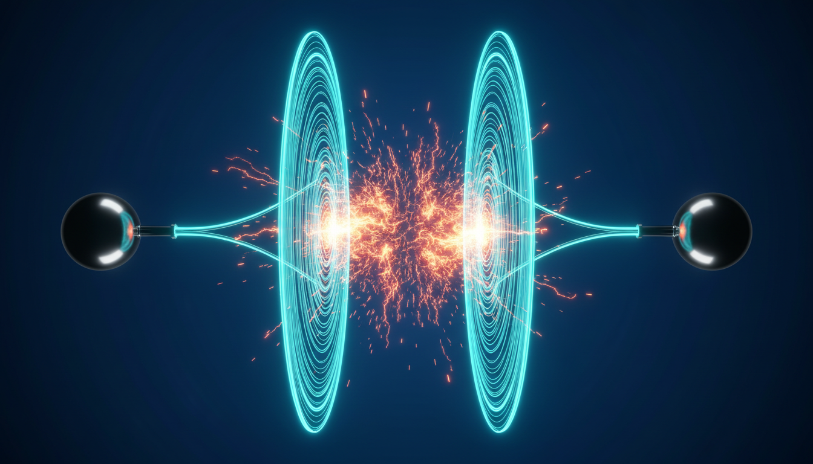
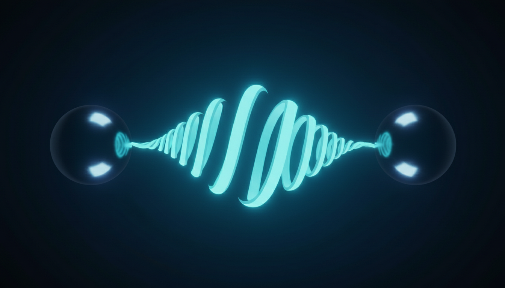
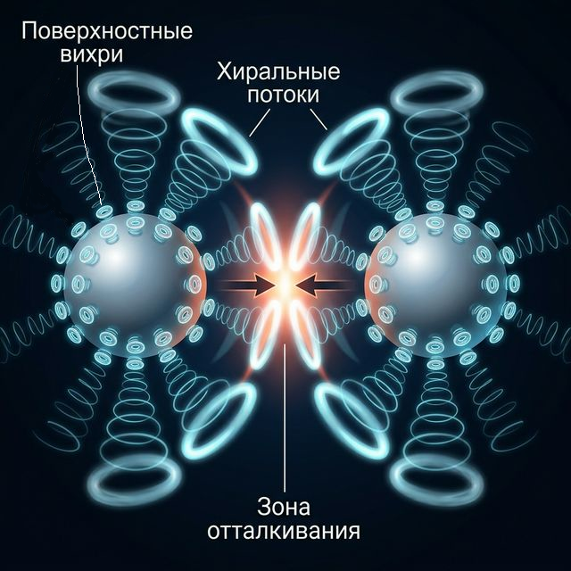
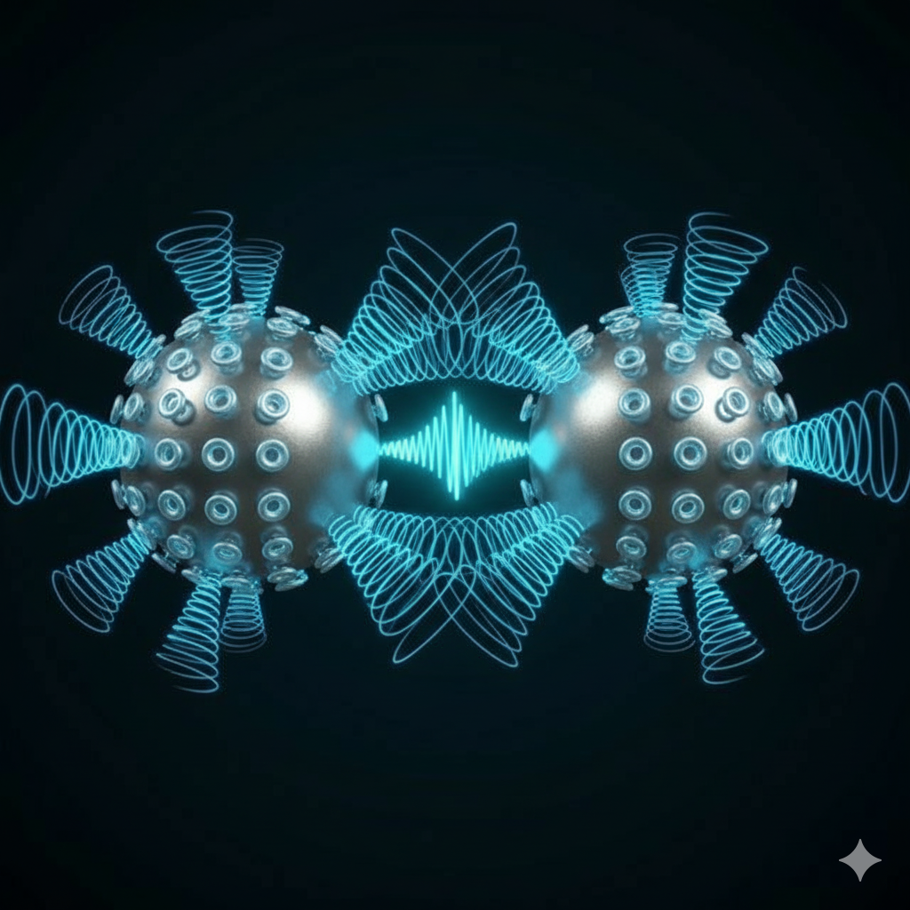
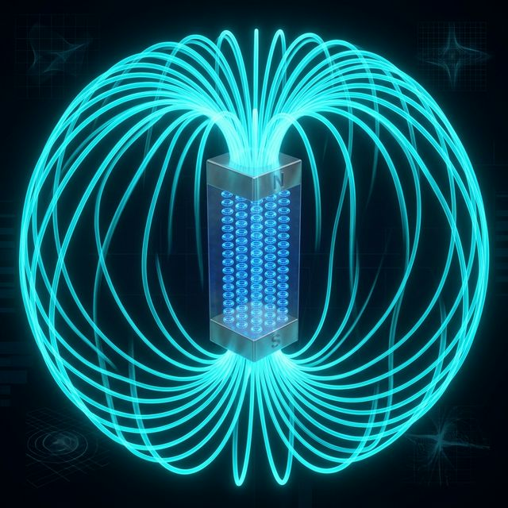

> «Электричество и магнетизм — не две силы, а две стороны одного явления»
>
> — Майкл Фарадей

---

## 🎯 Цель статьи

В предыдущих частях серии мы разобрали строение протона, электрона и нейтрона, построили модели атомных ядер и объяснили гравитацию как поток эфира. Но один из главных вопросов оставался открытым: **что такое электрический заряд?**

Стандартная физика говорит: «Заряд — это фундаментальное свойство частицы». Но это не ответ, а ярлык. Мы хотим понять **механизм**: почему одноимённые заряды отталкиваются, а разноимённые — притягиваются?

Сегодня мы:
1. Предложим **механическое объяснение** заряда.
2. Покажем, почему модель «источник/сток» **не работает**.
3. Разберём **рабочую модель**: заряд = хиральность (направление вращения) вихря.
4. Объясним **постоянные магниты** без привлечения квантовой механики.

---

## ⚠️ Ловушка: модель «Фонтан и Воронка»

Первое, что приходит в голову: положительный заряд — это «фонтан» (источник эфира), отрицательный — «воронка» (сток эфира). Детальнее в [Статье 7](/ru/blog/vortex-electron/):


Проверим эту идею на трёх случаях:

### Случай 1: Разноимённые заряды (+ и −)

```
   [+] ──эфир──►  ──эфир──► [−]
 фонтан                  воронка
```

Фонтан гонит эфир к воронке. Возникает направленный поток, который **увлекает** оба тела навстречу друг другу → **притяжение** ✅

### Случай 2: Два положительных (+ и +)

```
   [+] ──эфир──►  ◄──эфир── [+]
 фонтан          💥         фонтан
```

Два встречных фонтана сталкиваются, создавая «подушку» повышенного давления → **отталкивание** ✅

### Случай 3: Два отрицательных (− и −)

```
   [−] ◄──эфир──  ──эфир──► [−]
 воронка                  воронка
```

Две воронки рядом. Между ними давление понижается, обе тянут эфир на себя. Но ведь тогда **внешнее** давление эфира должно **сдавить** их друг к другу → **притяжение** ❌

**Проблема!** Модель «фонтан/воронка» предсказывает, что два отрицательных заряда должны притягиваться. Но эксперимент показывает обратное.

> Это классическая ловушка эфирных моделей заряда. Нам нужна другая идея.

---

## 💡 Рабочая модель: Заряд = хиральность вращения

Вернёмся к нашей модели протона. Он — **тороидальный вихрь** с двумя вращениями:
- **Тороидальное** — кольцо вращается вокруг центральной оси.
- **Полоидальное** — «кожа» бублика выворачивается наизнанку.

Эти вращения задают **направление спирали** потока эфира вокруг частицы. И это направление может быть **правым или левым**, как резьба на болте.

### Определение:

> **Положительный заряд (+)** — вихрь с **правой** спиральностью (правый «винт»).
>
> **Отрицательный заряд (−)** — вихрь с **левой** спиральностью (левый «винт»).

Заряд — это не «что-то выбрасывается» или «что-то всасывается». Заряд — это **в какую сторону крутится** эфирный вихрь. Плюс и минус — это право и лево.

---

## 🔬 Как хиральность и закон Бернулли объясняют заряды

Представим элементарные частицы как тороидальные вихри (бублики), которые сближаются друг с другом боками. Эфир — это газовая среда, а значит, здесь работают классические законы гидродинамики, в первую очередь — **закон Бернулли**: *там, где скорость потока выше, давление среды падает, и наоборот*.

Посмотрим, что происходит в зазоре между двумя сближающимися торами в зависимости от их хиральности (направления вращения).

### Случай 1: Одноимённые заряды (+ и +) или (− и −)
**Однонаправленное вращение → Встречные потоки → Отталкивание**

Если два вихря имеют одинаковую хиральность (оба правые или оба левые), они вращаются в одну сторону. Когда они сближаются боками, эфирные потоки на их внешних краях в зоне контакта направлены **навстречу друг другу**. 

Встречные потоки сталкиваются в узком зазоре. Скорость движения эфира здесь резко падает (потоки тормозят друг друга). По закону Бернулли, падение скорости приводит к **росту давления**. Между частицами возникает упругая эфирная подушка высокого давления, которая расталкивает их в стороны. **Это и есть кулоновское отталкивание.**



### Случай 2: Разноимённые заряды (+ и −)
**Встречное вращение → Согласованные потоки → Притяжение**

Если вихри имеют разную хиральность (один правый, другой левый), они вращаются в противоположные стороны. В зоне их сближения потоки эфира текут **в одном направлении**.

Потоки не сталкиваются, а сливаются, их скорости складываются. Эфир в зазоре начинает течь быстрее, чем снаружи. По закону Бернулли, резкий рост скорости вызывает **падение давления** между частицами. Возникает зона разряжения. Внешнее, невозмущённое давление эфира со всех сторон начинает сдавливать эти два вихря навстречу друг другу. **Это и есть кулоновское притяжение.**



> **Все три случая работают идеально:** механика сплошных сред без привлечения магических сил описывает то, что физики называют электростатикой.

---

## ⚖️ Нейтральность: вращения скомпенсированы

Вспомним нашу модель нейтрона из [Статьи 10](/ru/blog/anatomy-of-matter/):

> **Нейтрон = Протон + Электрон (в сжатом состоянии)**

Протон — правый вихрь (+). Электрон — левый вихрь (−). Когда электрон сжимается вокруг протона, **противоположные вращения компенсируют друг друга**. Результат — нейтральная частица.

В нейтральном атоме каждый протон ядра порождает электронный вихрь с противоположной хиральностью. Пока все электроны на месте — суммарная хиральность равна нулю.

### Откуда берётся заряд тела?

- **Потерял электроны** → остались нескомпенсированные правые вихри → тело заряжено **положительно**
- **Получил лишние электроны** → появились нескомпенсированные левые вихри → тело заряжено **отрицательно**

---

## ✨ Аннигиляция и парадокс размеров

Если разноимённые заряды (+ и −) притягиваются благодаря гидродинамике, то что происходит при их столкновении? Здесь мы сталкиваемся с двумя совершенно разными сценариями, которые объясняются исключительно геометрией и плотностью вихрей.

### Сценарий 1: Электрон и Позитрон (Аннигиляция)
Электрон (левый вихрь) и позитрон (правый вихрь) — это частицы с **абсолютно одинаковыми** размерами, массой и плотностью. Они — идеальные зеркальные близнецы. 

Когда гидродинамическое притяжение сталкивает их лоб в лоб, их геометрия совпадает идеально. Согласованные потоки эфира полностью «замыкают» друг друга, структура обоих торов разрушается из-за взаимного гашения осей. Оба вихря распадаются (схлопываются), а колоссальная энергия их вращения выбрасывается в окружающий эфир в виде мощных продольных волн уплотнения — гамма-квантов. **Вихри уничтожили друг друга.**

### Сценарий 2: Протон и Электрон (Стабильная пара)
Возникает логичный вопрос: *если протон (+) и электрон (−) имеют разную хиральность и тоже притягиваются, почему они не аннигилируют внутри атома водорода или нейтрона?*

Ответ кроется в **масштабе**.
В нашей эфиродинамической модели протон — это крошечный, чрезвычайно массивный и плотный вихрь эфира. Электрон же, напротив, представляет собой размытое, огромное (по объёму) образование с очень низкой плотностью. 

Из-за колоссальной разницы в размерах и давлениях лобовое гашение потоков невозможно. Рыхлый электрон просто физически не способен разрушить монолитную структуру протона. Вместо аннигиляции происходит интеграция:
- В случае **атома водорода**, электрон устанавливает стабильную макроскопическую циркуляцию вокруг протона на том расстоянии, где давления потоков уравновешиваются.
- В случае **нейтрона** (при экстремальном давлении), электрон буквально «наматывается» на протон, обволакивая его и компенсируя его хиральность наружу. Структура сохраняется, но внешнее проявление заряда обнуляется.

Никакой квантовой магии — только гидродинамика, где результат столкновения зависит от плотности и габаритов сталкивающихся вихрей.

---

## 📏 Закон Кулона: почему 1/r²?

Сила взаимодействия зарядов убывает как квадрат расстояния: $F \sim 1/r^2$.

В нашей модели это имеет простое геометрическое объяснение. Вихрь создаёт возмущение в окружающем эфире. Это возмущение распространяется **радиально** во все стороны. На расстоянии $r$ от заряда возмущение «размазано» по сфере площадью $4\pi r^2$.

Чем дальше — тем больше площадь сферы — тем слабее возмущение на единицу площади. Отсюда $1/r^2$ — это не загадочная формула, а **геометрия сферы**.

---

## 🔮 Как выглядит заряженный макрообъект?

До сих пор мы говорили об отдельных вихрях. Но как заряд проявляется на уровне **реального тела** — металлического шарика или стеклянной палочки? И почему, как показывают эксперименты, шарик имеет одинаковый заряд с любой стороны?

Когда макрообъект получает статический заряд, этот заряд всегда концентрируется на самой **поверхности** тела. Поверхностные атомы перестраивают свои эфирные оболочки так, что наружу из материала торчат миллионы микроскопических вихрей, оси которых выстроены перпендикулярно поверхности.

### Шарик как «одуванчик из смерчей»

Представьте себе морского ежа или пушистый одуванчик. Только вместо иголок или пушинок из поверхности заряженного шарика во все стороны радиально торчат микроскопические эфирные смерчи. 

- Если шарик заряжен **положительно**, его поверхность покрывают миллионы **вращающихся фонтанов** (они бьют потоком эфира наружу, закручиваясь в определённую сторону).
- Если шарик заряжен **отрицательно**, на поверхности шарика образуются миллионы **вращающихся воронок** (они спирально втягивают эфир в себя, закручиваясь в противоположную сторону).

Поскольку эти смерчи (фонтаны или воронки) усеивают всю площадь шарика и торчат из него во все стороны, **заряд изотропен** — с какой бы стороны вы ни поднесли к шарику другое тело, оно встретится с одинаковой "щетиной" из этих вращающихся микро-смерчей. 

Именно эта "аура" из миллионов вращающихся потоков на поверхности и есть то, что классическая физика называет «электростатическим полем».

### Встреча двух макрообъектов: лоб в лоб

Теперь посмотрим, что происходит, когда мы сближаем два таких «пушистых» заряженных шарика. Смерчи на их обращённых друг к другу поверхностях встречаются **верхушками (лоб в лоб)**. Применяем закон Бернулли:

**Случай 1: Одноимённые заряды (+ и +) или (− и −)**
Оба шарика покрыты смерчами с одинаковой хиральностью. Но поскольку они смотрят друг на друга, для внешнего наблюдателя их вращения в зоне контакта направлены **навстречу**. (Представьте два одинаковых винта, которые вы пытаетесь соединить остриями — их резьба не совпадает).
Потоки эфира на краях этих смерчей бьются друг о друга. 
*Результат:* Скорость потока в зазоре падает → давление эфира резко возрастает. Между шариками возникает упругая эфирная подушка, которая их расталкивает. **Это макроскопическое отталкивание.**


**Случай 2: Разноимённые заряды (+ и −)**
На одном шарике смерчи правые, на другом — левые. Когда они встречаются верхушками «лоб в лоб», противоположная закрутка приводит к тому, что их периферийные потоки в зоне контакта текут **в одном направлении**. Они идеально стыкуются, как шестерёнки.
*Результат:* Потоки сливаются → скорость течения эфира в зазоре резко возрастает → давление среды падает. Зона пониженного давления заставляет внешнее, невозмущённое давление эфира с силой сдавливать шарики друг с другом. **Это макроскопическое притяжение.**


---

## 🧲 От заряда к магнетизму

Итак, каждый протон — это **вращающийся вихрь**, непрерывно прокачивающий эфир через себя. По сути, каждый протон — это крошечный **постоянный магнит**, потому что вращающийся вихрь создаёт вокруг себя микроскопический контур циркуляции эфира.

Тогда правильный вопрос не «откуда берётся магнетизм?», а **«почему большинство материалов НЕ являются магнитами?»**

### Обычный материал (медь, стекло):

```
  ↗ ↙ → ← ↑ ↓ ↘ ↗ ←
  ← ↑ ↓ ↗ ↙ → ↘ ↑ ↓
  ↘ → ← ↑ ↗ ↙ ↓ ← ↑
```

Оси атомных вихрей направлены **хаотично**. Каждый атом-насос качает эфир, но все в разные стороны. Суммарный эффект: **ноль**.

Аналогия: миллион маленьких вентиляторов, каждый дует в случайном направлении. В комнате ветра нет.

### Постоянный магнит (железо):

```
  → → → → → → → → →
  → → → → → → → → →
  → → → → → → → → →
```

Оси вихрей **выстроены вдоль общей оси**. Все микроциркуляции складываются в одну. Результат — **макроскопический поток** эфира.

Аналогия: все вентиляторы развернули в одну сторону. Ветер!

---

## 🔩 Почему железо — магнит, а медь — нет?

Может показаться, что ферромагнетики уникальны тем, что их атомы сцепляются потоками «фонтан → воронка». Но это не так! **Все** кристаллические материалы держатся на сцеплении эфирных потоков — именно это мы разобрали в [Статье 7](/ru/blog/vortex-electron/) про «трубопроводную систему материи». Связи «фонтан → воронка» — это и есть то, что удерживает атомы в решётке.

Тогда в чём разница?

### Ключевое отличие: свобода вращения

В большинстве материалов (медь, стекло, алмаз) эфирные связи между атомами **жёстко фиксируют** ориентацию осей вихрей. Атомы намертво «приварены» друг к другу в определённых направлениях. Повернуть ось вихря одного атома, не разрушив связей — невозможно. Это как болт, закрученный в гайку: он сцеплён, но повернуть его отдельно нельзя.

В ферромагнетиках (железо, кобальт, никель) ситуация иная. Их электронная (вихревая) оболочка устроена так, что **ось атомного вихря может поворачиваться**, не разрывая связей с соседями. Связи существуют, но они **гибкие** — как шарнир вместо сварки.

### Механизм:

1. Атомы в решётке сцеплены потоками, но сцепление допускает **вращение оси** вихря.
2. Когда один атом поворачивается, его «фонтан» начинает лучше стыковаться с «воронкой» соседа → сосед тоже поворачивается.
3. Эффект распространяется по цепочке → все атомы в области выстраиваются → рождается **магнитный домен**.

> **Аналогия**: представьте два типа конструктора. В одном детали соединяются жёсткими заклёпками — повернуть одну деталь невозможно. В другом — шаровыми шарнирами: детали связаны, но могут вращаться. Только второй конструктор может «выстроиться» во внешнем поле.

---

## 🧱 Магнитные домены

Даже в железе атомы не выстраиваются все сразу. Материал разбит на **домены** — области с одинаковой ориентацией.

### Ненамагниченное железо:

```
  ┌──→──┐┌──↓──┐┌──←──┐
  │  →  ││  ↓  ││  ←  │
  └─────┘└─────┘└─────┘
  ┌──↑──┐┌──→──┐┌──↓──┐
  │  ↑  ││  →  ││  ↓  │
  └─────┘└─────┘└─────┘
```

Внутри каждого домена атомы выстроены. Но сами домены направлены по-разному → суммарный магнетизм ≈ 0.

### Намагничивание:

Помещаем железо во внешний направленный поток эфира (внешнее магнитное поле):
- Домены с «правильной» ориентацией **усиливаются** — внешний поток подпитывает их.
- Они **растут** за счёт соседних доменов.
- Постепенно все домены выстраиваются → материал намагничен:

```
  ┌──→──┐┌──→──┐┌──→──┐
  │  →  ││  →  ││  →  │
  └─────┘└─────┘└─────┘
  ┌──→──┐┌──→──┐┌──→──┐
  │  →  ││  →  ││  →  │
  └─────┘└─────┘└─────┘
```

---

## 🌀 Два полюса: топология тора

Когда все атомные вихри выстроены вдоль общей оси, возникает макроскопический контур.

- **Северный полюс** — зона, где эфир **выходит** из магнита (суммарный «фонтан»).
- **Южный полюс** — зона, где эфир **входит** в магнит (суммарная «воронка»).
- **Магнитные линии** — траектории возвратного потока эфира от N к S.



> Магнитное поле — это **макроскопическая циркуляция эфира**, созданная когерентным сложением вихрей отдельных атомов.

---

## 🚫 Почему невозможен магнитный монополь?

В стандартной физике невозможность магнитного монополя — эмпирический факт без объяснения. В нашей модели это **топологическая необходимость**:

> Тороидальный вихрь — это замкнутый контур. У него **не может быть** только одного конца. «Фонтан» без «воронки» — это эфир, которому некуда вернуться.

Разрежьте магнит пополам — каждая половина создаст **свой** полный контур циркуляции. Вы получите два магнита, каждый с двумя полюсами. Потому что вихрь всегда замкнут.

---

## 🌡️ Температура Кюри: когда вибрации побеждают порядок

При нагреве атомы-насосы раскачиваются всё сильнее (мы разобрали это в [Статье 11](/ru/blog/brownian-motion/) про броуновское движение). При определённой температуре — **температуре Кюри** — вибрации становятся настолько сильными, что **разрывают** межатомные «замки».

| Материал | Температура Кюри |
|---|---|
| Железо (Fe) | ~770 °C |
| Кобальт (Co) | ~1115 °C |
| Никель (Ni) | ~358 °C |

Выше этой температуры оси вихрей снова рассыпаются в хаос → магнетизм исчезает. Остудите — и домены могут снова выстроиться (если есть внешнее поле).

---

## 🔗 Электромагнит: проверка согласованности

Электромагнит — идеальный тест для модели. Если наша картина верна, то катушка с током должна создавать **то же самое** явление, что и постоянный магнит.

1. **Ток в проводе** — это направленный поток эфира ([Статья 7](/ru/blog/vortex-electron/)).
2. **Провод, свёрнутый в катушку** — спиральный поток.
3. Спиральный поток = множество параллельных микроконтуров = **аналог** выстроенных атомов в магните.

Результат: катушка с током создаёт **ту же** макроскопическую циркуляцию эфира, что и постоянный магнит. Два совершенно разных способа получить одно и то же — направленный контур эфира.

Это не совпадение. Это **подтверждение** того, что за обоими явлениями стоит один механизм.

---

## 🔄 Единая картина: электричество и магнетизм

Теперь мы можем увидеть полную картину:

| Явление | Что это в эфире | Масштаб |
|---|---|---|
| **Электрический заряд** | Хиральность (направление вращения) вихря | Свойство отдельного вихря |
| **Электростатика** | Взаимодействие хиральных вихрей: ко-вращение → отталкивание, контра-вращение → притяжение | Два тела |
| **Электрический ток** | Направленный поток эфира по каналам связей | Макроскопический поток |
| **Магнитное поле** | Циркуляция эфира (осевой контур) | Макроскопический контур |
| **Постоянный магнит** | Когерентное сложение атомных вихрей | Кристалл |
| **Электромагнит** | Спиральный поток тока = контур циркуляции | Катушка |

Электричество и магнетизм — это **не две разные силы**. Это два проявления **одного и того же** эфирного вихря:
- **Заряд** — его хиральность (право/лево).
- **Магнетизм** — его осевая циркуляция (контур потока).

> Именно это объединение Максвелл описал математически в 1865 году. Мы предлагаем к его уравнениям **механическую картину**: оба явления — следствие вихревой динамики сверхтекучего эфира.

---

## 🌟 Итог

1. **Заряд — это не абстрактное свойство**, а направление вращения (хиральность) эфирного вихря.
2. **Одноимённые заряды отталкиваются**, потому что ко-вращающиеся вихри создают встречные потоки в зоне контакта.
3. **Разноимённые заряды притягиваются**, потому что контра-вращающиеся вихри создают согласованные потоки.
4. **Магнетизм — это коллективный эффект**: когда атомные вихри выстроены вдоль одной оси, их микроциркуляции складываются в макроскопический контур.
5. **Магнитный монополь невозможен** — замкнутый вихрь не может иметь один конец.
6. **Электричество и магнетизм — два лица одного вихря.**

---

## 🔮 Открытые вопросы

- Как именно кристаллическая структура железа обеспечивает сцепление вихрей? Можно ли предсказать ферромагнетизм по геометрии ядра?
- Как описать электромагнитную индукцию (закон Фарадея) в терминах вихрей?

---

## 💬 Присоединяйтесь к исследованию!

Обсуждайте, критикуйте и предлагайте свои идеи на форуме **[OseniloForum](https://t.me/OseniloForum)**. Вместе мы строим механическую картину мира — без магии, только гидродинамика.
