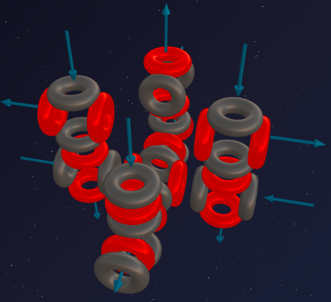
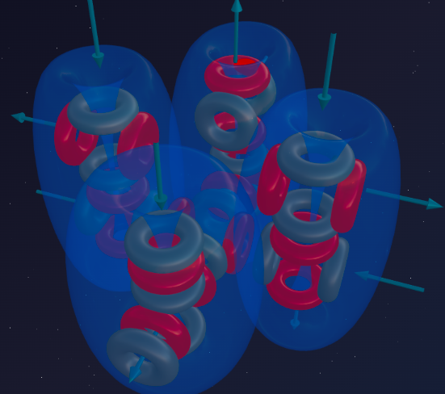

> «Ничто так не заразно, как насилие»
>
> — Виктор Гюго

Сера (8α) продемонстрировала нам триумф архитектурной симметрии, сшив из двух Кислородов (4α+4α) массивный 3D-монолит с ровным набором из 6 воронок. Эта чётная математика казалась незыблемой.

Но, как мы уже убедились, Природа не терпит статики. Как только конструкция становится слишком идеальной, в неё вклинивается «возмутитель спокойствия».

Встречайте **Хлор** — элемент, который своим удушливым зелёным дыханием сеял смерть в газовых атаках Первой мировой, и который каждый день спасает миллионы жизней, очищая для нас воду. Хлор — это химический сверххищник третьего периода. И его непреодолимая ярость напрямую вытекает из асимметрии всего одного тритона.

---

## 📐 Инженерный анализ ядра

**Хлор-35** — основной изотоп хлора (около 76% в природе).

**Состав:** 17 протонов + 18 нейтронов = 35 нуклонов.

**Разложение на блоки:**
- 32 нуклона = **8 альфа-частиц** (база Серы);
- Остаток: 3 нуклона = 1 протон + 2 нейтрона = **тритон**.

**Формула:** **³⁵Cl = 8α + t**

Узнаёте старого знакомого?
- **Фтор (4α + t)** — нарушил симметрию Кислорода, породив суперхищника второго периода.
- **Хлор (8α + t)** — нарушил симметрию Серы, породив суперхищника третьего периода.

Оба элемента — галогены. Оба — смертельно опасные газы. Обоими управляет асимметричный тритон (t) на массивной альфа-базе.

---

## 🔬 Построение модели: захват порта

### Шаг 1: Базис Серы
У Серы (8α) была идеально сбалансированная структура: массивный крестообразный каркас с 6 симметричными воронками (4 экваториальные и 2 полярные).

### Шаг 2: Атака тритона
Тритон (1p + 2n) цепляется к одной из крайних альфа-частиц тяжёлого 8α-каркаса. Протон заставляет эту альфа-частицу провернуться на 90 градусов.

**Что происходит с геометрией?**
1. Массивная 8α-конструкция получает локальный перекос.
2. Повёрнутая альфа-частица **выставляет свою воронку наружу**, разрывая замкнутый внутренний контур базы.
3. Эта торчащая воронка становится «хищной пастью» атома.

---

## 💥 Анатомия хищника

Давайте сравним двух хищников:
- **Фтор (4α + t):** Торчащая воронка на базе лёгкого скелета Кислорода. Это похоже на юркого и ядовитого убийцу-шмеля.
- **Хлор (8α + t):** Такая же торчащая воронка, но её база **в два раза массивнее** (8α против 4α).

Огромная база Серы работает как гигантский эфирный насос. Вся эта мощь фокусируется в одной открытой асимметричной воронке. Хлор — это уже не шмель. Это медведь с бензопилой.

Его всасывающая мощь (электроотрицательность) настолько велика, что он агрессивно срывает эфирные потоки с чужих атомов. Попадая в дыхательные пути в виде газа (Cl₂), он яростно вырывает водород из влажной ткани лёгких, образуя соляную кислоту (HCl). Ткани сгорают без огня. В этом и заключается суть галогена: огромная база, сфокусированная в единственном открытом клапане тритона.

---

## 🔮 Прогнозы модели и реальность

### Прогноз №1: валентность 7

Пересчитаем воронки Хлора:
- **6 воронок** зафиксированы в перекрёстном 8α-каркасе Серы.
- **1 воронка** торчит наружу из-за повёрнутого тритоном блока.
- Итого: 6 + 1 = **7 воронок**.

**Реальность:** Максимальная валентность Хлора — 7:
- HClO₄ (хлорная кислота) — 7 химических связей ✓
- Cl₂O₇ (оксид хлора VII) — каждый атом хлора использует 7 портов ✓

### Прогноз №2: магия нечётных валентностей (1, 3, 5, 7)

Хлор проявляет валентности только по нечётному ряду. Эфиродинамика даёт простое геометрическое объяснение:

1. **Валентность 1 (Старт):** Хлору достаточно его единственной огромной «пасти» от тритона, чтобы захватить поток (например, у Натрия в соли NaCl или у водорода в HCl). Базовые 6 воронок при этом остаются «спящими».
2. **Шаг (+2):** Если Хлор встречается с сильным партнёром (например, Кислородом), тот начинает его «распаковывать». Но базовые воронки 8α-каркаса Серы сцеплены попарно. Они не могут открыться по одной — только парами (верх-низ, лево-право).
3. **Ряд:**
   - 1 («пасть») + 1 открытая пара базы = **3** (HClO₂)
   - 1 («пасть») + 2 пары базы = **5** (HClO₃)
   - 1 («пасть») + все 3 пары базы (6 шт) = **7 связей** (HClO₄).

Нечётный ряд — это сумма «1 асимметричный старт» + «парное раскрытие симметричной базы» — полное совпадение с моделью.

### Прогноз №3: почему Хлор — газ? (Защёлкивание капсулы)

Сера (8α) и Фосфор (7α+t) — твёрдые вещества. Хлор ещё тяжелее, но при этом он — **газ** (Cl₂) при комнатных условиях. Как так?

Ответ в силе той самой «пасти» тритона. Эта воронка настолько агрессивна, что два атома Хлора мгновенно «всасываются» друг в друга открытыми портами. Две пасти сцепляются в сверхпрочный замок (Cl–Cl). При этом сила стяжки перераспределяет внутренние потоки так, что остальные 6 воронок «запираются» внутри. Молекула Cl₂ превращается в гладкую, самодостаточную капсулу, которой нечем цепляться за соседей.

Молекулы Cl₂ просто отталкиваются друг от друга, разлетаясь в пространстве — полное совпадение с моделью.

---

## 🧪 Ядерная алхимия

Ядерные реакции Хлора показывают его родство с Серой и стремление к Аргону.

Если выбить тритон из ядра Хлора, мы обнажим каркас Серы:
> ³⁵Cl + p → ³²S + α

Если же достроить тритон Хлора, добавив один протон, мы получим идеально симметричный Аргон:
> ³⁵Cl + p → ³⁶Ar

---

## 🔑 Итог

Хлор — это спокойная Сера (8α), выведенная из равновесия тритоном. Поворот всего одной альфа-частицы на мощном 8α-каркасе превращает атом в насос чудовищной силы, порождая его легендарную агрессивность.

Математика воронок (6 базовых + 1 выбросовая) безупречно описывает валентность 7 и элегантно распутывает узел нечётного ряда (1, 3, 5, 7), доказывая, что пространственная геометрия первична.

---

## 🔮 Что дальше?

В следующей части мы закроем третий период! — **Аргон:**
- что будет, если тритон Хлора наконец-то достроить до полноценной альфа-частицы;
- почему добавление всего одного протона превращает самый ядовитый газ в абсолютно инертный;
- архитектурная магия 9α.

---

## 🛠️ Создайте свою модель!

Попробуйте построить ядро Хлора-35 в онлайн-конструкторе:

👉 [3d-particles-pi.vercel.app](https://3d-particles-pi.vercel.app/)
