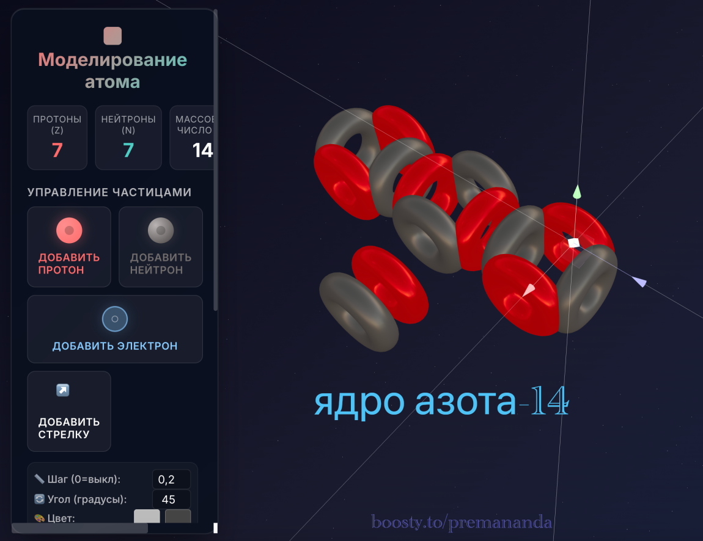
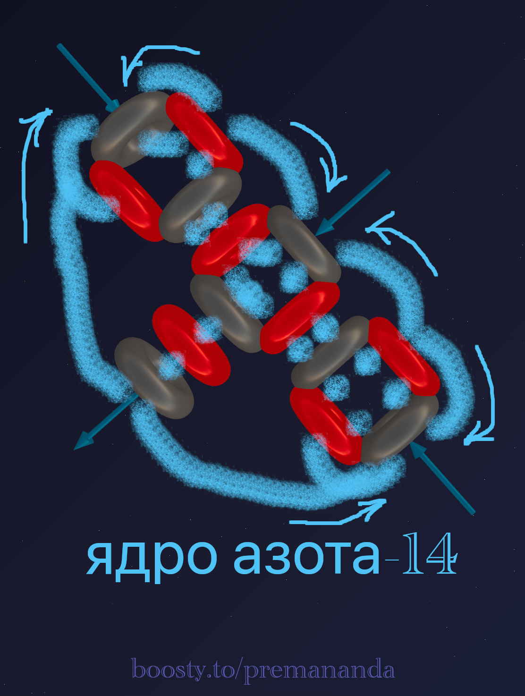
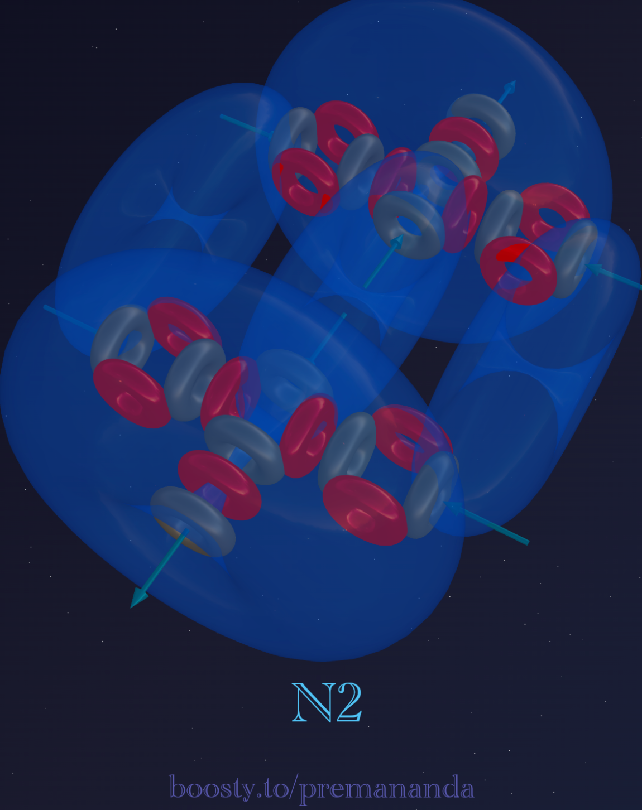

> «Мы до сих пор не знаем и одной тысячной процента того, что открыла нам природа»
>
> — Альберт Эйнштейн

В прошлой части мы восхищались идеальной симметрией Углерода-12. Три альфа-частицы, выстроенные в линию с поворотом центральной части на 90 градусов, создают прочную и гармоничную конструкцию с 4-мя активными портами.

Но природа не стоит на месте. Следующий шаг эволюции материи — **Азот-14**.

---

## 🏗 Состав: Нарушение симметрии

Азот стоит под номером 7 в таблице Менделеева. Его ядро содержит 7 протонов и 7 нейтронов.

Если мы попробуем собрать его из наших любимых «кирпичиков» (альфа-частиц), то получим:
- 3 альфа-частицы (это Углерод-12).
- И... остается «хвостик»: 1 протон и 1 нейтрон.

Эта пара (протон + нейтрон) называется **Дейтрон** (ядро дейтерия). Получается, что Азот — это **Углерод + Дейтрон**.

Создадим модель ядра Азота:

---

## 📐 Геометрия: Углерод + «Рюкзак»

Как видно на модели, дейтрон не встает в конец очереди, удлиняя атом. Он крепится сбоку к центральной альфа-частице. Это меняет всё:

1.  **Основа:** У нас остается жесткая линейная ось из трех альфа-частиц (как у Углерода).
2.  **Надстройка:** Появляется перпендикулярный выступ — тот самый дейтрон.

---

## ⚡ Эфиродинамика: Откуда берутся 5 электронов?

В официальной химии у Азота 5 валентных электронов. Давайте посчитаем активные зоны в нашей модели:

- **Края (4 зоны):** Как и у Углерода, торцы нашей основы активны. Там работают 4 протона (по 2 с каждой стороны).
- **Центр (1 зона):** Присоединенный сбоку дейтрон — это пятый активный элемент. Его протон создает мощный поток, направленный перпендикулярно основной оси.

**Итого: 4 + 1 = 5 активных зон.** Это идеально совпадает с таблицей Менделеева!

---

## ⚓ Гибкие связи и загадка Аммиака (NH₃​)

Азот образует аммиак (NH₃​), который имеет форму треугольной пирамиды. Почему? Здесь нам помогает **принцип гибкой связи**.

Электронная связь — это не жесткая палка. Это вихревой шнур, на котором присоединенный атом (например, водород) может смещаться, ища положение с наименьшей энергией.

В случае с аммиаком происходит следующее:
1.  Три атома водорода присоединяются к активным зонам Азота.
2.  Но у Азота есть тот самый боковой дейтрон (в химии — «неподеленная электронная пара»). Он создает мощный поток эфира, который занимает много места.
3.  Этот поток давит на атомы водорода. Поскольку связи гибкие, водороды «уплывают» вниз, подальше от этого давления.

В итоге они выстраиваются в пирамиду не потому, что ядро — пирамида, а потому что они самоорганизуются под давлением потоков ядра, натянув свои «поводки».

---

## 🛡 Броня Азота (N₂): Тайна тройной связи

Почему газообразный азот (N₂) так трудно разорвать? Почему это инертный газ? Здесь работает тот же принцип вихревых шнуров.

Когда встречаются два атома Азота, они протягивают друг другу свои эфирные потоки (электроны). У каждого атома есть 3 наиболее активных потока, готовых к сцепке. Эти потоки встречаются в пространстве между ядрами и попарно объединяются.

Представьте это не как жесткую перемычку, а как сплетенный канат. Три вихревых шнура от одного атома переплетаются с тремя шнурами от другого. Образуется мощнейшая **тройная связь**.

Именно поэтому азот инертен: его «руки» крепко заняты друг другом. Чтобы разорвать этот тройной эфирный канат и заставить азот реагировать с чем-то еще, нужна колоссальная энергия (например, разряд молнии).

---

## 🌟 Итог

Азот-14 показывает, как конструкция ядра влияет на свойства:
- **Асимметрия:** Добавление дейтрона сбоку создает уникальные свойства и «неподеленную пару».
- **Пять активных зон:** 4 на торцах + 1 на боковом дейтроне = валентность 5.
- **Гибкость связей:** Электроны — это потоки, которые могут изгибаться.
- **Тройная связь:** В молекуле N₂ три вихревых потока мощно удерживают два ядра азота.

**Вывод:** Природа создает сложность не через нагромождение частиц, а через умную геометрию их расположения!

---

## 🔮 Что дальше?

В следующей части мы рассмотрим:
- Как устроен **Кислород-16**.
- Как превратить «рюкзак» в «корону».
- Почему кислород такой реактивный элемент.
