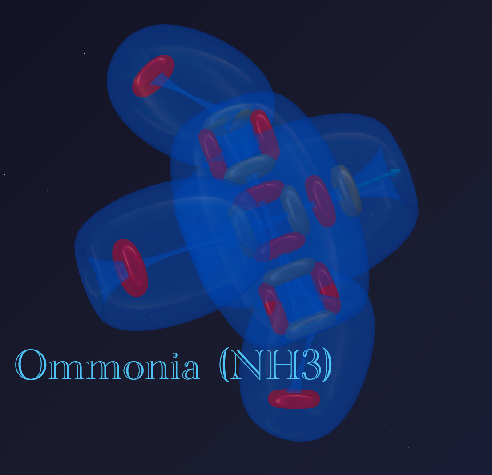

> «Мы до сих пор не знаем и одной тысячной процента того, что открыла нам природа»
>
> — Альберт Эйнштейн

В прошлой части мы разобрали идеальную симметрию углерода-12. Три альфа-частицы, выстроенные в линию с поворотом центральной части на 90 градусов, создают прочную и гармоничную конструкцию с 4-мя активными портами.

Но природа не стоит на месте. Следующий шаг эволюции материи — **азот-14**.

---

## 📐 Состав: нарушение симметрии

Азот стоит под номером 7 в таблице Менделеева. Его ядро содержит 7 протонов и 7 нейтронов.

Если мы попробуем собрать его из наших любимых «кирпичиков» (альфа-частиц), то получим:
- 3 альфа-частицы (это углерод-12);
- и «хвостик»: 1 протон и 1 нейтрон.

Эта пара (протон + нейтрон) называется **дейтрон** (ядро дейтерия). Получается, что азот — это **углерод + дейтрон**.

Создадим модель ядра азота:

---

## 📐 Геометрия: углерод + «рюкзак»

Как видно на модели, дейтрон не встаёт в конец очереди, удлиняя атом. Он крепится сбоку к центральной альфа-частице. Это меняет всё:

1. **Основа:** у нас остаётся жёсткая линейная ось из трёх альфа-частиц (как у углерода).
2. **Надстройка:** появляется перпендикулярный выступ — тот самый дейтрон.

На виде сбоку хорошо видно, как дейтрон «торчит» перпендикулярно основной оси, создавая асимметрию всей конструкции:

---

## ⚡ Эфиродинамика: откуда берутся 4 активные зоны?

В официальной химии азот проявляет валентность **3** в большинстве соединений (NH₃, амины) и **4** в ионе аммония (NH₄⁺). Давайте посчитаем активные зоны в нашей модели:

- **Края (3 зоны):** торцы линейной основы дают 3 активных порта, участвующих в химических связях.
- **Центр (1 зона):** присоединённый сбоку дейтрон — четвёртая активная зона. Его протон создаёт мощный поток, направленный перпендикулярно основной оси. В химии эта зона соответствует **«неподелённой электронной паре»**.

**Итого: 3 + 1 = 4 активные зоны**, что точно отражает химическое поведение азота:
- Валентность **3** — три торцевых зоны участвуют в обычных связях (NH₃).
- Валентность **4** — все четыре зоны задействованы через донорно-акцепторный механизм (NH₄⁺).

---

## ⚓ Гибкие связи и загадка аммиака (NH₃)

Азот образует аммиак (NH₃), который имеет форму треугольной пирамиды. Почему? Здесь нам помогает **принцип гибкой связи**.

Электронная связь — это не жёсткая палка. Это вихревой шнур, на котором присоединённый атом (например, водород) может смещаться, ища положение с наименьшей энергией.

В случае с аммиаком происходит следующее:

1. Три атома водорода присоединяются к трём активным торцевым зонам азота.
2. Боковой дейтрон («неподелённая электронная пара») создаёт мощный поток эфира, который занимает много места.
3. Этот поток давит на атомы водорода. Поскольку связи гибкие, водороды «уплывают» вниз, подальше от этого давления.

В итоге они выстраиваются в пирамиду не потому, что ядро — пирамида, а потому что самоорганизуются под давлением потоков ядра, натянув свои «поводки».

---

## 🛡️ Броня азота (N₂): тайна тройной связи

Почему газообразный азот (N₂) так трудно разорвать? Почему это инертный газ? Здесь работает тот же принцип вихревых шнуров.

Когда встречаются два атома азота, они протягивают друг другу свои эфирные потоки (электроны). Три торцевых активных потока каждого атома встречаются в пространстве между ядрами и попарно объединяются. Боковой дейтрон при этом остаётся незадействованным — именно он сохраняет «неподелённую пару» даже в молекуле N₂.

Представьте это не как жёсткую перемычку, а как сплетённый канат. Три вихревых шнура от одного атома переплетаются с тремя шнурами от другого. Образуется мощнейшая **тройная связь**.

Именно поэтому азот инертен: его «руки» крепко заняты друг другом. Чтобы разорвать этот тройной эфирный канат и заставить азот реагировать с чем-то ещё, нужна колоссальная энергия (например, разряд молнии).

---

## 🌟 Итог

Азот-14 показывает, как конструкция ядра влияет на свойства:

- **Асимметрия:** добавление дейтрона сбоку создаёт уникальные свойства и «неподелённую пару».
- **Четыре активные зоны:** 3 на торцах + 1 на боковом дейтроне = валентность 3 (обычная) или 4 (донорно-акцепторная).
- **Гибкость связей:** электроны — это потоки, которые могут изгибаться.
- **Тройная связь:** в молекуле N₂ три вихревых потока мощно удерживают два ядра азота, а неподелённая пара остаётся свободной.

**Вывод:** природа создаёт сложность не через нагромождение частиц, а через умную геометрию их расположения.

---

## 🔮 Что дальше?

В следующей части мы рассмотрим:
- как устроен **кислород-16**;
- как два дейтрона вокруг ядра меняют геометрию — от «рюкзака» к «короне»;
- почему кислород такой реактивный элемент.