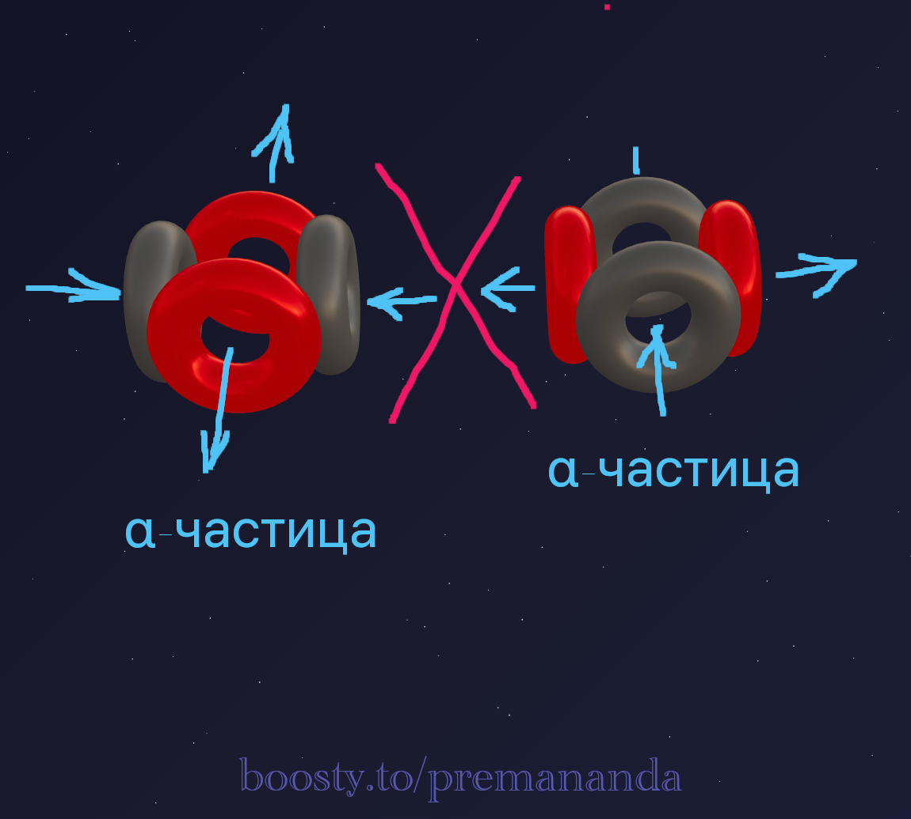
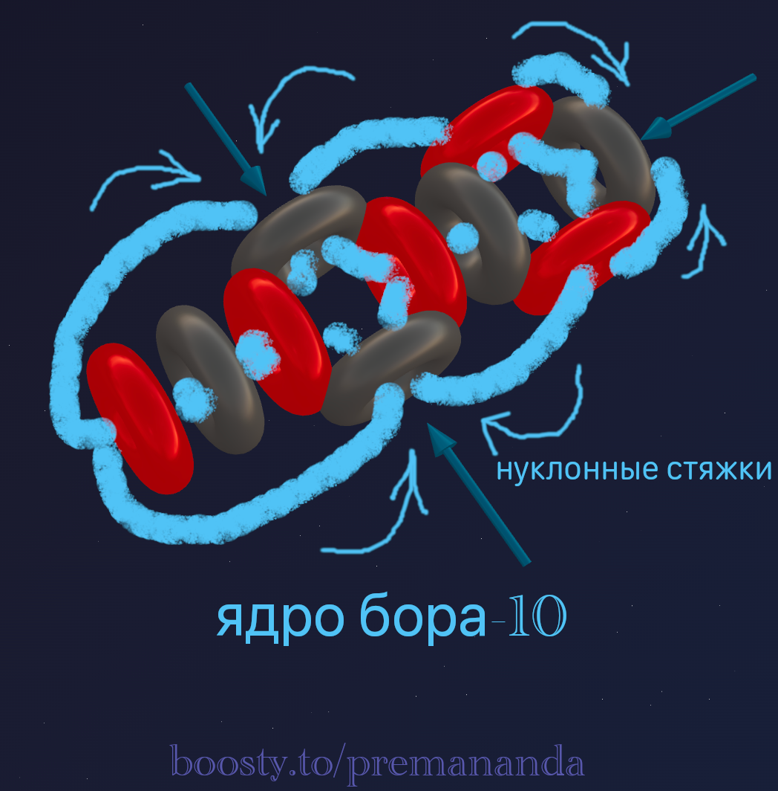
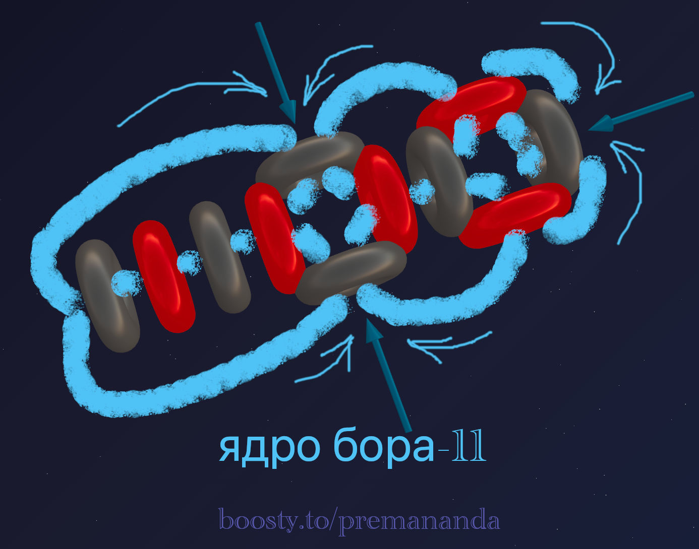
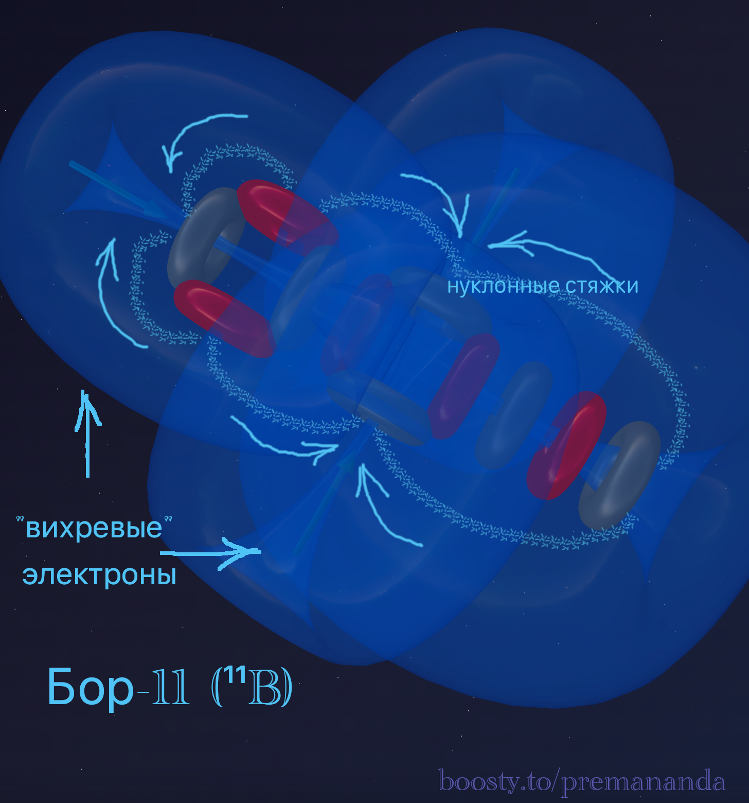

> «Природа — это самосогласованная система. Если ваша модель противоречит хотя бы одному эксперименту — она неверна»
>
> — Ричард Фейнман

---

**Важно**: Представленная методология — это **рабочий инструмент**, который развивается по мере накопления данных. Она не претендует на окончательность, но предлагает систематический подход к пониманию структуры ядер.

---

## 🎯 Цель статьи

До сих пор мы описывали отдельные ядра: Гелий, Углерод, Азот, Кислород. Но как мы узнаём, что наша модель правильная? 

Сегодня мы:
1. Сформулируем **принципы проектирования** ядер.
2. Разработаем **методы верификации** — способы проверить, что модель не противоречит экспериментам.

---

## 🔧 Нуклонные стяжки — основа конструкции

В прошлой статье мы ввели понятие эфирных стяжек. Теперь назовём их точнее — **нуклонные стяжки**.

### Что это такое?

Когда протоны и нейтроны сближаются, их эфирные потоки образуют замкнутые контуры циркуляции. Эти контуры работают как **гидродинамические стяжки**:

- **Протон** выбрасывает эфир с высокой скоростью.
- **Нейтрон** пропускает эфир через себя под действием разности давлений.
- **Стяжка** — поток эфира, который нанизывает нуклоны в «гирлянду».

**Результат**: Стяжка из эфира давит на нуклоны, сжимая их в единую конструкцию.

---

## 🧱 Строительные блоки ядер

Прежде чем строить, нужно знать свои «кирпичи»:

### 1. Альфа-частица (α) — основной блок
- **Состав**: 2 протона + 2 нейтрона.
- **Структура**: Протоны на одной оси, нейтроны на перпендикулярной (крест).
- **Свойства**: Исключительно стабильна, образует 4 нуклонные стяжки.

### 2. Дейтрон (d) — минимальный блок
- **Состав**: 1 протон + 1 нейтрон.
- **Свойства**: Слабо связан, часто служит «хвостиком» или надстройкой.

### 3. Отдельный нуклон
- **Нейтрон**: при добавлении получаются изотопы.
- **Протон**: при добавлении получаются другие элементы.

---

## 📐 Принципы проектирования ядер

### Принцип 1: Компактность
**Ядро стремится занять минимальный объём.** Альфа-частицы укладываются максимально плотно. Длинные «рыхлые» цепочки нестабильны.

### Принцип 2: Ортогональность осей
**Соседние альфа-частицы повёрнуты друг относительно друга на 90°.** Это позволяет нейтронам одной α-частицы «состыковаться» с протонами соседней.

*Пример*: В Углероде-12 центральная α-частица повёрнута на 90° относительно крайних.

### Принцип 3: Нейтроны как прокладки для стыковки
**Нейтроны служат «входами» для эфирных потоков.** Протоны выбрасывают эфир, через нейтроны поток втягивается. При сборке ядра протоны должны чередоваться с нейтронами.

*Механизм*: Выброс из протона → вход в нейтрон соседа → создание стяжки.

### Принцип 4: Асимметрия создаёт функциональность
**Добавление «лишних» нуклонов или их перестройка определяет химические свойства.**

*Примеры*:
- **Углерод (3α)** — симметричный → 4 валентных электрона.
- **Азот (3α + d)** — боковой дейтрон → валентность 3/4 + неподелённая пара.
- **Кислород (4α в Т-форме)** — асимметрия → мощный окислитель.

---

## 🔬 Методы верификации моделей

Как проверить, что наша 3D-модель ядра правильная? Вот 3 независимых теста:

### Тест 1: Ядерные реакции
**Принцип:** Известные ядерные реакции (в том числе распад) показывают, какие нуклоны «торчат» снаружи и как ядро делится на блоки.

- *Пример 1 — Реакция Резерфорда (1919):* `¹⁴N + α → ¹⁷O + p`
  **Анализ:** Альфа-частица выбивает «слабый» протон дейтрона. Если бы протона не было снаружи ядра Азота, реакция бы не пошла так легко.
- *Пример 2 — Распад Бериллия-9:* `⁹Be + α → ¹²C + n`
  **Анализ:** При добавлении альфа-частицы «балансирующий» нейтрон становится лишним и вылетает. Это подтверждает, что он не был частью жёсткого каркаса альфа-частиц.

**Вывод:** Ядро — это конструктор. Мы можем понять его детали, смотря на то, как оно ломается или перестраивается при столкновениях.

### Тест 2: Валентность
**Принцип:** Количество активных «воронок» (зон всасывания эфира) равно химической валентности элемента.

*Как это работает:*
1. Постройте 3D-модель ядра.
2. Найдите все «воронки», направленные наружу и доступные для внешних атомов.
3. Подсчитайте их количество — это число должно совпадать с валентностью.
*(Почему это работает: Вихревой электрон может войти только в сильную воронку. Сколько сильных воронок — столько и связей).*

### Тест 3: Геометрия молекул
**Принцип:** Пространственная форма ядра определяет углы связей в молекулах.
- **Вода (H₂O):** Угол 104.5° — предсказан давлением «короны» (верхней α-частицы) Кислорода-16.
- **Аммиак (NH₃):** Пирамида — предсказана давлением бокового потока Азота-14.
- **Метан (CH₄):** Тетраэдр — предсказан 4-мя равноудалёнными потоками Углерода-12.

---

## 🔄 Алгоритм проектирования ядра

1. **Определи состав:** Сколько протонов и нейтронов в изотопе?
2. **Раздели на блоки:** Сколько полных α-частиц можно собрать? Есть ли остаток (d, p, n)?
3. **Собери каркас:** Расположи α-частицы с учётом компактности и ортогональности.
4. **Добавь надстройки:** Прикрепи дейтроны и отдельные нуклоны к свободным портам.
5. **Верифицируй:** Прогони полученную модель через 3 теста (ядерные реакции, валентность, углы молекул).

---

## 🧪 Пример: Проектирование ядра Лития

Применим алгоритм на практике. Литий (Li) — элемент №3, имеет два стабильных изотопа.

### Литий-6 (⁶Li)
- **Шаг 1. Состав:** 3 протона + 3 нейтрона = 6 нуклонов.
- **Шаг 2. Разделение:** 6 нуклонов = 1 α-частица + остаток (1p + 1n). Остаток — это дейтрон! Формула: `⁶Li = α + d`.
- **Шаг 3. Сборка:** Альфа-частица — центральный блок. Нейтрон α-частицы смотрит на протон дейтрона. Дейтрон присоединяется сбоку.

*Верификация (Ядерные реакции)*: `⁶Li + n → ⁴He + ³H (тритий)`
Нейтрон попадает в ядро → дейтрон захватывает его → превращается в тритий (1p + 2n) → отрывается от α-частицы. Модель подтверждена!

### Литий-7 (⁷Li)
Добавление протона к ⁷Li «достраивает» его до второй α-частицы, что подтверждается реакцией Кокрофта-Уолтона (1932): `⁷Li + p → 2α`.

---

## 📐 Бериллий: почему нейтрон стабилизирует ядро?

**Бериллий-8 (⁸Be = 2α)** — крайне нестабилен. Две α-частицы просто отталкиваются друг от друга.

**Бериллий-9** (`⁹Be = 2α + n`) — 100% стабилен!
*Ключ к стабильности — дополнительный нейтрон:*
1. Две α-частицы расположены в линию и повёрнуты по-разному.
2. Дополнительный нейтрон находится на той же оси, утяжеляя конструкцию.
3. Протон левой α-частицы выбрасывает поток → он входит в добавленный нейтрон → образуется направленная стяжка, намертво связывающая обе α-частицы.

---

## 💎 Бор: расширение модели Лития

Бор (B) — это две альфы и «хвостик».

**Бор-10 (¹⁰B = 2α + d)**:

**Бор-11 (¹¹B = 2α + t)**:

*Верификация*: `¹¹B + p → 3α` — протон достраивает тритон до α, ядро распадается на три стабильные альфа-частицы.

---

## 🌟 Итог

Структура ядра — это не хаотичный набор частиц, а выверенная инженерная конструкция. Знание геометрии ядра позволяет нам:
1. Понимать причины стабильности или радиоактивности изотопов.
2. Предсказывать химические свойства и форму молекул.
3. Объяснять редкие ядерные реакции.

**Вместе мы создаём инженерную периодическую таблицу!**