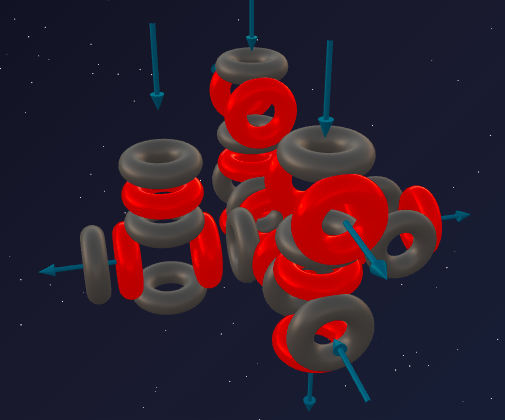
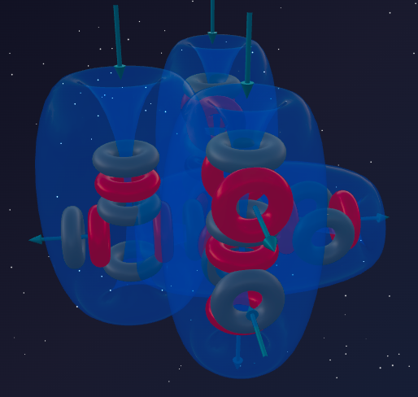

> «Тот, кто зажигает свет, должен быть готов сгореть сам»
>
> — Виктор Гюго

Кремний (7α) продемонстрировал абсолютный триумф жёсткой 3D-архитектуры: идеально сбалансированный монолит с четырьмя направленными наружу портами. Симметрия сделала его твёрдым камнем.

Но природа не любит застывать в камне навечно. Чтобы двигаться дальше, нужно снова прибегнуть к проверенному инструменту эволюции — **взлому**.

И снова на сцену выходит наш старый знакомый — тритон (1p + 2n). Он атакует монолитную крепость Кремния, рождая **Фосфор** — элемент, чьё название переводится как «несущий свет».

---

## 📐 Инженерный анализ ядра

**Фосфор-31** — единственный стабильный изотоп Фосфора (100% в природе).

**Состав:** 15 протонов + 16 нейтронов = 31 нуклон.

**Разложение на блоки:**
- 28 нуклонов = **7 альфа-частиц** (база Кремния);
- Остаток: 3 нуклона = 1 протон + 2 нейтрона = **тритон**.

**Формула:** **³¹P = 7α + t**

Узнаёте паттерн третьего периода?
- Натрий (5α + t) — нарушитель симметрии Неона.
- Алюминий (6α + t) — нарушитель симметрии Магния.
- **Фосфор (7α + t) — нарушитель симметрии Кремния.**

Фосфор — третий элемент в периоде, ядро которого имеет тритонный «хвостик».

---

## 🔬 Построение модели: тритон на базе Кремния

### Шаг 1: идеальная база Кремния

Кремний (7α) — массивная конструкция: основа (5α) с двумя боковыми α-частицами. Вся она выдаёт наружу **4 активных порта**, жёстко фиксируя атомы в алмазной решётке. Внутренние узлы перегружены — там нет места для новых связей.

### Шаг 2: удар тритона по «колонне»

Тритон не может втиснуться в центр — там монолит. Он находит место на одной из внешних боковых альфа-частиц. Протон из тритона цепляется к ней и **заставляет её повернуться на 90°**.

**Что происходит с архитектурой?**

1. Идеальная симметрия Кремния **разрушена**.
2. Повернувшийся вихрь, который раньше участвовал во внутренней стяжке, теперь **разворачивается наружу в виде фонтана**.
3. Возникает мощнейший локальный перекос давления. Огромная масса 7α-монолита давит на эту единственную повёрнутую точку, выдавливая через неё «лишний» эфирный поток.

---

## 💥 Анатомия горючести

### 1. Пять активных вихрей

В отличие от Кремния с его четырьмя стабильными портами, у Фосфора активно работают **пять вихрей**:
- **4 базовых порта** — остались от кремниевого каркаса (стабильные связи).
- **1 асимметричный мощный фонтан сброса** — появился из-за повёрнутой альфа.

### 2. Эффект переполненного котла

У Натрия (5α + t) тоже был один выбросовой фонтан, но база была лёгкой. База Фосфора гораздо тяжелее и жёстче (7α). Давление эфира внутри этого каркаса колоссально. Пятый фонтан работает как предохранительный клапан на перегретом паровом котле. Атом Фосфора непрерывно стравливает эфир через этот фонтан, пытаясь вернуться к идеальной симметрии Кремния.

---

## 🔮 Прогнозы модели и реальность

### Прогноз №1: валентность 5 (и 3)

Количество открытых наружу активных вихрей определяет возможные связи. У Фосфора их 5 (4 базовых порта + 1 фонтан сброса).

**Реальность:** Фосфор образует пять связей:
- PCl₅ — 5 связей ✓
- P₂O₅ — 5 связей у каждого атома ✓
- H₃PO₄ (фосфорная кислота) — 5 связей ✓

Кроме того, если базовые 4 порта не задействованы, Фосфор может проявлять **валентность 3** (PCl₃, фосфин PH₃) — полное совпадение с моделью.

### Прогноз №2: свечение и горючесть (тайна белого фосфора)

Откуда знаменитое жуткое бледно-зелёное свечение белого фосфора в темноте? Откуда его склонность к самовоспламенению?

**Свечение (хемилюминесценция):**
Из-за колоссального внутреннего давления тяжёлого 7α-монолита эфирный поток срывается с пятого фонтана настолько резко и под таким огромным давлением, что работает как квантовый свисток — заставляет высокочастотно вибрировать окружающую эфирную среду. Эту вибрацию мы воспринимаем как видимый свет. Фосфор буквально светится от собственной геометрической асимметрии.

**Красный фосфор и спички:**
Из-за этого напряжения белый фосфор нестабилен и ядовит. При умеренном нагреве в закрытой колбе атомы перестраиваются в длинные полимерные цепи — **красный фосфор**: выбросовые фонтаны цепляются друг за друга, взаимно стравливая давление. Свечение прекращается.

Но стоит чиркнуть спичкой о шероховатую поверхность — трение разрывает компенсирующую цепь, пятый фонтан оголяется в атмосфере Кислорода, и происходит **мгновенная вспышка огня** — полное совпадение с моделью.

### Прогноз №3: Азот vs Фосфор (газ против твёрдого тела)

Оба в пятой группе, оба дают 5 связей. Но Азот — инертный газ, а Фосфор — твёрдое горючее вещество. Почему?

- **Азот (3α + d):** база лёгкая (3α) — линейная цепочка. Два атома легко сближаются и прячут все вихри в тройную связь N₂. Снаружи гладко → **газ**.
- **Фосфор (7α + t):** база громоздкая (7α) — тяжеловесный 3D-монолит. Двум таким громадинам физически невозможно подойти достаточно близко, чтобы закрыться тройной связью. Фосфор вынужден строить пирамидки P₄ или полимерные цепи → **твёрдое вещество**.

**Реальность:** N₂ — газ при комнатной температуре. P₄ — твёрдое тело с температурой плавления 44°C — полное совпадение с моделью.

---

## ⚔️ Паттерн тритонных элементов третьего периода

| Элемент | Формула | База | Активных вихрей | Валентность |
|---|---|---|---|---|
| Натрий | 5α + t | Неон (5α) | 1 | 1 |
| Алюминий | 6α + t | Магний (6α) | 3 | 3 |
| **Фосфор** | **7α + t** | **Кремний (7α)** | **5** | **5** |

---

## 🧪 Ядерная алхимия: доказательство структуры

Фосфор (7α + t) — это трамплин к следующему идеальному альфа-элементу.

Протон достраивает тритон (1p + 2n) до полноценной альфа-частицы (2p + 2n), которая отлетает, обнажая каркас Кремния:

> ³¹P + p → ²⁸Si + α

Альфа-частица врезается в Кремний, теряет один протон при ударе и превращается в тритон, который «приваривается» к каркасу:

> ²⁸Si + α → ³¹P + p

Обе реакции подтверждают формулу **P = 7α + t**.

---

## 🌱 Философия жизни: Фосфор как батарейка

Жизнь строится на углеродном каркасе (3α). Азот (3α + d) своей асимметрией «изгибал» углеродные цепочки, заставляя белки сворачиваться в 3D-спирали.

Но чтобы передавать **энергию** (АТФ) и строить прочный остов ДНК, понадобился Фосфор (7α + t). Своим колоссальным донорским фонтаном он работает в живой клетке как крошечная пружина. Разрыв фосфорной связи в молекуле АТФ высвобождает удерживаемую энергию выбросового фонтана, питая наши мышцы и мозг.

**Светящийся элемент оказался идеальной батарейкой для углеродной жизни.**

---

## 🌟 Итог

Фосфор — это Кремний, выведенный из равновесия.

Тритон зацепился за одну из боковых альфа-частиц симметричного 7α-монолита и развернул её вихрь наружу. Конфликт между огромным внутренним давлением 7α-базы и узким открытым пятым фонтаном порождает знаменитое свечение (эфирный «свисток»), ядовитость и горючесть.

Пять активных вихрей объясняют валентность 5 и открывают роль Фосфора как энергетического аккумулятора для всего живого на планете.

---

## 🔮 Что дальше?

В следующей части — **Сера (8α):**
- как 8-я альфа-частица возвращает симметрию (частично);
- почему Сера горит синим пламенем, но не светится в темноте;
- откуда берутся загадочные валентности 2, 4 и 6 у одного элемента.

---

## 🛠️ Создайте свою модель!

Попробуйте построить ядро Фосфора-31 в онлайн-конструкторе:

👉 [3d-particles-pi.vercel.app](https://3d-particles-pi.vercel.app/)
