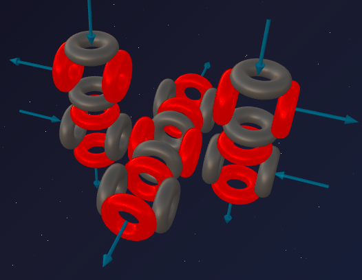
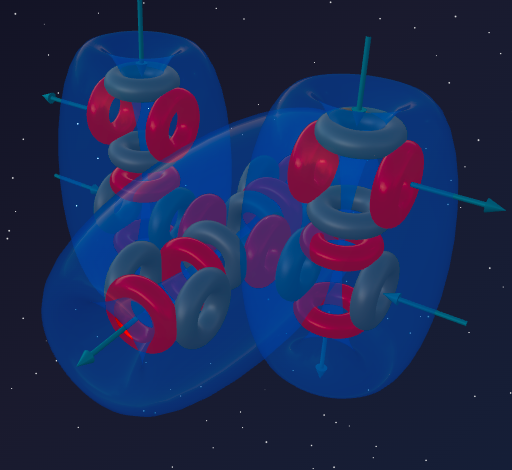

> «Кристалл — это застывшая математика»
>
> — Иоганн Кеплер

Мы подошли к экватору третьего периода. Натрий (5α + t) и Алюминий (6α + t) выступали в роли «взломщиков», раскачивающих стабильные конструкции с помощью асимметричного тритона.

Но что будет, если к асимметричному Алюминию добавить всего один протон? Тритон немедленно достраивается до полноценной альфа-частицы. Ловушка захлопывается. Асимметрия исчезает.

Перед нами **Кремний** — архитектурный шедевр симметрии. Элемент, который стал твёрдой основой нашей планеты и мозгом всей современной цивилизации.

---

## 📐 Инженерный анализ ядра

**Кремний-28** — основной стабильный изотоп Кремния (92,2% в природе).

**Состав:** 14 протонов + 14 нейтронов = 28 нуклонов.

**Разложение на блоки:**
- 28 нуклонов = ровно **7 альфа-частиц** (7 × 4 = 28);
- Остаток: **0** — никаких незавершённых строительных лесов!

**Формула:** **²⁸Si = 7α**

Кремний, как и Углерод (3α), Магний (6α) и Неон (5α), состоит исключительно из целых альфа-блоков. Но его форма уникальна.

---

## 🔬 Построение модели: симметричный монолит

Проследим пространственную эволюцию:
- **Углерод (3α)** — линейная структура: две альфа-частицы по сторонам от центральной.
- **Магний (6α)** — база (5α), к которой прикрепилась одна альфа-частица, начав строительство «второго этажа».

Как формируется Кремний (7α)?

Если бы 7 альфа-частиц образовали пространственный крест (центральная и 6 вокруг), атом был бы химически инертен. К тому же центральная альфа-частица физически может удержать **максимум 4** соседа, а не 6.

Поэтому седьмая альфа-частица цепляется **с противоположной стороны** от той, где началось строительство «второго этажа» в Магнии. Атом уравновешивается: по центру — мощная основа (5α), по бокам симметрично прикреплены две α-частицы.

---

## 🏛️ Архитектура жёсткости

### 1. Идеальный баланс: 4 воронки и 4 фонтана

У Углерода (3α) было 4 стабильные связи. Кремний (7α) повторяет этот паттерн на новом уровне. Седьмая альфа-частица уравновешивает всю структуру, и массивная конструкция выдаёт наружу **4 активные воронки и 4 сбрасывающих фонтана**, оптимально разнесённых в пространстве. Этот баланс 50/50 образует 4 полноценные вихревые петли — основу прочной тетраэдрической решётки.

### 2. Сверхжёсткая сцепка

В отличие от асимметричного Алюминия (6α + t), где эфирные каналы были подвержены излому, Кремний (7α) имеет идеально сбалансированные порты. Атомы кремния впиваются друг в друга «мёртвой хваткой», образуя алмазную решётку.

---

## 🔮 Прогнозы модели и реальность

### Прогноз №1: валентность 4

Симметричная монолитная основа 7α выдаёт наружу 4 пары портов (4 воронки и 4 фонтана), образующих 4 сверхпрочные двусторонние химические связи.

**Реальность:** Кремний четырёхвалентен в большинстве соединений:
- SiCl₄ — 4 связи ✓
- SiO₂ (песок, кварц) — каждый атом Si связан с 4 атомами кислорода в трёхмерной полимерной сети ✓
- SiC (карборунд) — 4 связи ✓

Полное совпадение с моделью.

### Прогноз №1а: почему возможна валентность 6 (и почему у Углерода её нет)

Иногда Кремний образует **6 связей** — например, SiF₆²⁻ (гексафторсиликат-ион), широко применяемый в промышленности.

В модели 7α это объяснимо. Массивный монолит устроен сложнее, чем лёгкая цепочка Углерода (3α). Четыре основных порта обслуживают внешние связи, но внутри плотной конструкции есть **вторичные воронки**, которые обычно участвуют во внутренних стяжках между альфа-частицами. При атаке предельно агрессивного хищника — Фтора (абсолютного чемпиона по электроотрицательности) — эти вторичные порты могут быть вынужденно вскрыты, давая ещё две дополнительные связи.

У Углерода (3α) такого резерва нет — лёгкая линейная конструкция не имеет скрытых внутренних портов. Поэтому Углерод **строго** ограничен 4 связями, а Кремний в экстремальных условиях может давать 6.

**Реальность:** SiF₆²⁻ существует и устойчив. CF₆²⁻ — не существует никогда — полное совпадение с моделью.

### Прогноз №2: феномен полупроводника

Почему Алюминий — гибкий металл и отличный проводник, а Кремний (всего на один протон больше) — хрупкий неметалл и изолятор, проводящий ток только при нагреве?

- **У металлов (Алюминий):** Из-за асимметрии тритона фонтаны доминируют над воронками. Атомы образуют широкие, гибкие каналы, по которым эфир течёт как вода по широкой трубе.
- **У Кремния (7α):** Симметричные блоки цепляются друг за друга идеально ровно. 4 фонтана безупречно входят в 4 воронки соседей. Эфир заперт внутри мёртвой хватки. Тока нет. При низких температурах Кремний — **изолятор**.

**Как включить проводимость?** Нужно **нагреть** кристалл. Тепло — это вибрация эфира. Когда каркасы Кремния начинают вибрировать, жёсткая сцепка чуть-чуть «раскачивается» и эфир начинает просачиваться сквозь каналы.

**Реальность:**
- При нагреве сопротивление металлов *растёт*.
- Сопротивление Кремния при нагреве **резко падает**.
- На этом принципе построены все транзисторы в вашем компьютере — полное совпадение с моделью.

### Прогноз №3: тугоплавкость и основа каменного мира

- **Углерод (3α):** линейная, маневренная база — легко образует двойные связи (С=С). Идеален для ДНК, белков, гибкой органики.
- **Кремний (7α):** массивный монолит из трёх «колонн». Физически невозможно согнуться для двойной связи (Si=Si крайне редки). Строит надёжные жёсткие 3D-сети из одинарных связей.

**Реальность:**
- Земная кора на 27% состоит из Кремния (песок, кварц, гранит, базальт).
- Температура плавления Кремния: **1414°C** — разорвать жёсткую 7α-сцепку невероятно трудно — полное совпадение с моделью.

---

## ⚔️ Углерод vs Кремний: два архитектора

| Параметр | Углерод C (3α) | Кремний Si (7α) |
|---|---|---|
| **Форма** | Линейная цепочка | Симметричный монолит |
| **Связи** | 4 (гибкие, в т.ч. двойные) | 4 (жёсткие, только одинарные) |
| **Роль** | Основа жизни | Основа каменного мира |
| **Проводимость** | Нет (алмаз) / Да (графит) | Полупроводник |

---

## 🧪 Ядерная алхимия: доказательство структуры

Ядро Кремния (7α) настолько совершенно, что мы можем проверить его блочность с двух сторон.

### Фотодиссоциация

Гамма-квант ударяет по симметричному монолиту. Отлетает одна балансировочная альфа-частица, обнажая каркас Магния-24:

> ²⁸Si + γ → ²⁴Mg + α

### Звёздный синтез (горение кислорода)

Откуда во Вселенной так много Кремния? Из недр массивных звёзд. Кислород-16 — это Т-образная структура (4α). Два атома Кислорода врезаются друг в друга на огромной скорости:

> ¹⁶O + ¹⁶O → ²⁸Si + α

4α + 4α = 8α. Ядро мгновенно перестраивается в прочный 7α-каркас Кремния-28, а лишняя альфа-частица вылетает наружу, унося избыток энергии.

Обе реакции подтверждают формулу **Si = 7α**.

---

## 🌟 Итог

Кремний — это аналог Углерода в третьем периоде.

Он взял асимметричный Алюминий (6α + t) и, добавив один протон, достроил тритон до 7-й альфа-частицы, закрепив её симметрично с противоположной стороны ядра. Эта зеркальная балансировка дала Кремнию 4 воронки и 4 фонтана по краям — усовершенствованный химический аналог Углерода (3α).

Но из-за массивной структуры «колонн» порты стали стационарными, а связи невероятно жёсткими. Эфирные потоки оказались зажаты в тисках кристаллической решётки, что остановило свободную проводимость и породило феномен **полупроводника**.

Гибкий, маневренный Углерод создал нас с вами. Жёсткий, неповоротливый Кремний создал землю, по которой мы ходим, и компьютеры, на которых мы пишем.

---

## 🔮 Что дальше?

В следующей части — **Фосфор:**
- что произойдёт, если к монолиту (7α) добавить лишний протон;
- как первый «взломщик» нового уровня порождает свечение и горючесть;
- откуда берутся 5 связей Фосфора.

---

## 🛠️ Создайте свою модель!

Попробуйте построить ядро Кремния-28 в онлайн-конструкторе:

👉 [3d-particles-pi.vercel.app](https://3d-particles-pi.vercel.app/)
