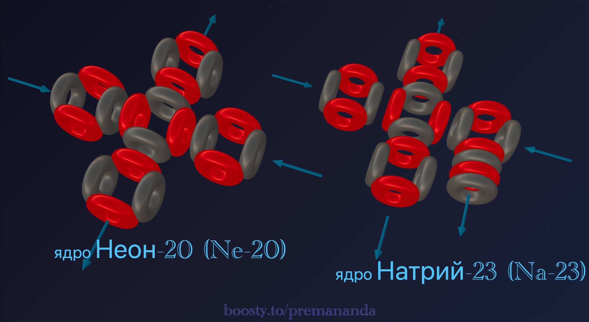
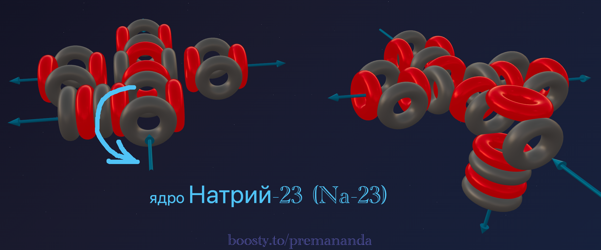
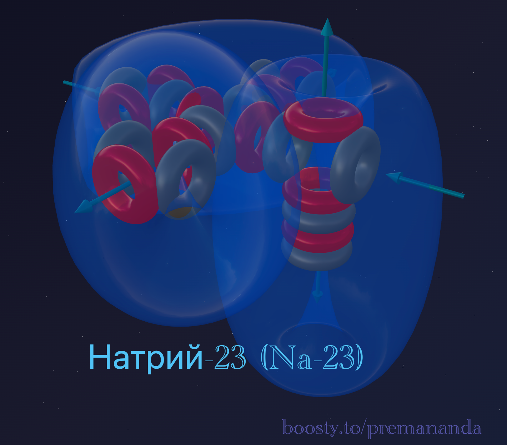

> «Достаточно одного камня, чтобы разрушить плотину»
>
> — Народная мудрость

В прошлой статье мы любовались Неоном — архитектурным шедевром симметрии. Пять альфа-частиц, идеально упакованных в «крест», создали герметичную крепость, сквозь которую не мог пробиться ни один химический реагент.

Но что произойдёт, если мы попытаемся добавить к этой совершенной форме ещё один кирпичик?

Добро пожаловать в третий период. На сцену выходит **Натрий**.

---

## 📐 Инженерный анализ ядра

**Натрий-23** — единственный стабильный изотоп Натрия.

**Состав:** 11 протонов + 12 нейтронов = 23 нуклона.

**Разложение на блоки:**
- 20 нуклонов = **5 альфа-частиц** (как у Неона);
- остаток: 3 нуклона = 1 протон + 2 нейтрона (**тритон**).

**Формула:** **²³Na = 5α + t**

Тритон здесь играет роль «взломщика» — он нарушает совершенную симметрию базовой структуры Неона.

---

## 🔬 Построение модели: «вскрытие крепости»

### Шаг 1: ядро Неона как фундамент

Основа Натрия — это замкнутый крест из 5 альфа-частиц. Внутри этого каркаса эфирные потоки закольцованы и стабильны.

### Шаг 2: добавление тритона и поворот α-частицы

Тритон (1p + 2n) не просто прикрепляется снаружи. Чтобы удержаться на плотной структуре, он цепляется к одной из боковых альфа-частиц.

Принимая дополнительный нуклон, эта альфа-частица **поворачивается на 90° вокруг своей оси**. Это критический момент:

1. замкнутый контур нарушается;
2. один «фонтан» (выходящий поток) теперь смотрит **наружу**;
3. в герметичной крепости Неона появляется **брешь**.

---

## 🌪️ Механика металлического состояния

Почему Натрий — это металл, а Неон — газ? Ответ кроется в развёрнутом наружу «фонтане».

### Открытые потоки

У Неона все потоки замкнуты внутри — атомы не «видят» друг друга и разлетаются. У Натрия каждый атом выставляет наружу один бьющий фонтан. Когда атомы собираются вместе, эти фонтаны образуют общие каналы — **электронный газ**, который склеивает атомы в мягкий металлический кристалл.

### Проводимость

По этим открытым каналам эфир течёт свободно, что и обеспечивает высокую электропроводность Натрия.

---

## ⚔️ Натрий vs Фтор: зеркальные близнецы

У Фтора (4α + t) и Натрия (5α + t) одинаковый «хвостик» (тритон), но они антиподы:

- **Фтор (хищник):** его ядро (4α) — незавершённая Т-форма. Тритон там пытается закрыть дыру, создавая тягу эфира **внутрь**. Фтор хочет забрать чужое.
- **Натрий (донор):** его ядро (5α) уже завершено. Тритон для него — **лишний балласт**. Повернутая альфа-частица создаёт избыточное давление, которое Натрий стремится **сбросить**.

**Аналогия:** Фтор — это голодный хищник (пылесос). Натрий — это переполненный сосуд (открытый кран).

---

## 🧪 Ядерная алхимия: доказательство структуры

Ядерные реакции подтверждают формулу **Na = 5α + t**.

Протон достраивает тритон (1p + 2n) до альфа-частицы (2p + 2n), и она отлетает, обнажая чистый Неон:

> ²³Na + p → ²⁰Ne + α

Альфа-частица врезается в Неон, теряет один протон при ударе и превращается в тритон, который «приваривается» к каркасу:

> ²⁰Ne + α → ²³Na + p

---

## 🔮 Прогнозы модели и реальность

### Прогноз №1: валентность 1

Только один «фонтан» повёрнут наружу — только одна точка, через которую возможен обмен эфирным потоком с соседним атомом.

**Реальность:** Натрий строго одновалентен во всех соединениях: NaCl, NaOH, Na₂O — полное совпадение с моделью.

### Прогноз №2: экстремальная мягкость

Атомы держатся друг за друга только слабыми «хвостами», металлическая решётка очень гибкая.

**Реальность:** Натрий можно резать обычным ножом — полное совпадение с моделью.

### Прогноз №3: низкий потенциал ионизации

«Лишний» электрон от повёрнутой альфы выталкивается всей мощью Неонового каркаса.

**Реальность:** вырвать электрон из Натрия в 4 раза легче, чем из Неона — полное совпадение.

### Прогноз №4: низкая температура плавления

Слабая связь между ядрами легко разрушается тепловым движением.

**Реальность:** Натрий плавится всего при 97,8°C — ниже температуры кипения воды — полное совпадение.

---

## 💣 Почему Натрий взрывается в воде?

Это встреча «переполненного сосуда» (Натрий) с «мощным пылесосом» (кислород в воде). Натрий мгновенно сбрасывает свой лишний поток в воронки кислорода. Этот лавинообразный процесс выделяет энергию, которая разрывает связи в воде и высвобождает водород.

---

## 🌟 Итог

Натрий — это **взломанная крепость**. Один лишний нуклон разворачивает целую секцию ядра, превращая благородную инертность в яростную металлическую активность.

---

## 🔮 Что дальше?

В следующей части — **Магний:**
- как симметрия возвращается через парность;
- почему магний двухвалентен и откуда берётся его прочность.

---

## 🛠️ Создайте свою модель!

Попробуйте построить ядро Натрия-23 в онлайн-конструкторе:

👉 [3d-particles-pi.vercel.app](https://3d-particles-pi.vercel.app/)